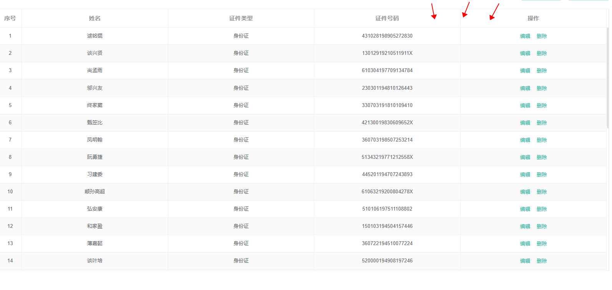
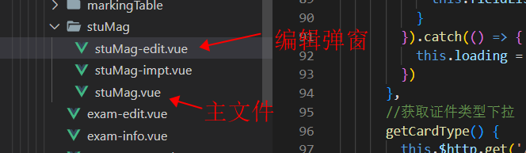
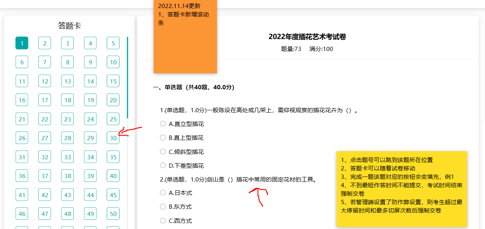

# 在线考试系统管理端


## 1.新增编辑详情三合一

一般，我们都会选择将新增页面和编辑页面和详情页面写在同一个组件页面中，因为他们三个个有页面的**内容基本上一致**（除了一些特殊业务要求）。

不同的是：

一：页面打开时的区别

新增：页面打开时没有数据

编辑和详情：页面打开时有数据


二：提交时接口的区别

新增：提交时没有传递字段中**没有`id`**

编辑和详情：提交时传递字段中**包含`id`**


解决方式：

区别一：打开区别的解决方式：

在打开界面时，根据是否传递`ID`来判断是否调用详情接口

```js
activated() {
  //页面激活时获取考试id
  this.dataForm.id = this.$route.query.examId
  
  // 这里判断是否传递id，如果传递了，调用详情接口
  if (this.dataForm.id) {
    // 清空表单验证
    this.$nextTick(() => {
      this.$refs.dataForm.resetFields();
    });
    
    // 调用详情接口
    this.getExamInfo(); // 调用获取考试信息
  }
}
```


区别二：提交的解决方式

在提交时，也是通过id来进行判断来选择提交的接口

```js
dataFormSubmit() {
			// 如果考试id存在，则是编辑
			this.$refs.dataForm.validate(valid => {
				if (!valid) {
					return;
				}
				this.loading = true;
				//将字段的，排序重新整理一下
				this.dataForm.zxksFieldRos.forEach((item, index) => {
					item.sort = index;
				});
				//如果有id为编辑，没有为新增（这里进行url的判断）
				var url = '';
				if (this.dataForm.id) {
					url = '/zxks/exam/upd';
				} else {
					url = '/zxks/exam/add';
				}
				this.$http.post(url, this.dataForm).then(({data: res}) => {
					this.loading = false;
					if (res && res.code === 0) {
						this.$message({
							message: '操作成功',
							type: 'success',
							duration: 500
						});
						//关闭标签
						closeTab();
					} else {
						this.$message.error(res.msg);
					}
				});
			});
		},
```


## 2.`template`模板中的数据并非只是data中的，也可以是methods的返回结果

有时候，有些数据我们想简单加工一下，又不想使用`computed`，我们就可以直接利用methods的方法，来直接绑定

>注意：这是一个不适用computed的解决思路而已，其实我建议还是使用计算属性的

示例：

```vue

<template>
<!--例如一个一个表格数据我们需要简单加工一下-->
<el-table :data="getFieldRows()" stripe style="width: 100%">
</el-table>
</template>

<script>
	export default {
    data() {
      return {
        
      }
    },
   	methods: {
      //获取字段，分为固定部分和动态部分
      getFieldRows() {
        return xxx...;
      }
    }
  }
</script>
```


## 3.固定字段的处理方式

例如现在有以下需求：

表格前三行字段不能修改为固定字段(不一定非要在表格中，其他的一些类似业务也是这样的)，每次提交时都会带着这三个字段


姓名，证件类型，证件号码不能修改，并且每次提交时都携带着：


这种处理，一般都是，我们会自己在data中声明好固定的数据，例如上面的姓名，证件类型，证件号码

示例：
```vue
<script>
	export default {
    data() {
      return {
        //固定的字段（我们自己创建好）
        fixedFieldRos: [
          {
            name: '姓名'
          },
          {
            name: '证件类型'
          },
          {
            name: '证件号码'
          }
        ]
      }
    }
  }
</script>
```


## 4.表格额外列的处理方式（列需要后端返回）

遇到的这样一种需求，就是表格列除了有三个固定列之外，剩余的列是由用户进行设置的，后端一般会将有额外列的表格数据以这种格式返回：

```js
[{
  date: '2016-05-02',
  name: '王小虎',
  address: '上海市普陀区金沙江路 1518 弄',
  fieldList: [ // 这些时候后面的动态添加列值和id
    {
      id: '123',
      value: '1'
    }
  ]
}, {
  date: '2016-05-04',
  name: '王小虎',
  address: '上海市普陀区金沙江路 1517 弄',
  fieldList: [
    {
      id: '123',
      value: '1'
    }
  ]
}]
```


例如一个表格如下：

>红色箭头处，可能会有后续列追加进来，不过此时没有而已




解决方式：

一般我们会将动态列，也就是上面那种数据格式，转换一次，转换成`id:value`这样子的键值对，来供table使用

示例：

```vue
<template>
<lyl-table slot="table" slot-scope="{ tableHeight: tableHeight }" :max-height="tableHeight" :data="getDataList()"
      v-loading="dataListLoading" @selection-change="selectionChangeHandle" @sort-change="sortChangeHandle">
      <el-table-column prop="name" label="姓名" header-align="center" align="center"></el-table-column>
      <el-table-column prop="credentialsTypeNm" label="证件类型" header-align="center" align="center">
      </el-table-column>
      <el-table-column prop="credentialsNum" label="证件号码" header-align="center" align="center">
      </el-table-column>
  
  		<!--这里是动态列的部分-->
      <el-table-column :prop="item.id" v-for="(item, index) in fieldList" :key="index" :label="item.name"
        header-align="center" align="center"></el-table-column>
      <el-table-column label="操作">
        <template slot-scope="scope">
          <el-button size="small" type="text" @click="editHandle(scope.row.id)">编辑</el-button>
          <el-button size="small" type="text" @click="delHandle(scope.row.id)">删除</el-button>
        </template>
      </el-table-column>
    </lyl-table>
</template>

<script>
	export default {
    data() {
      fieldList: [
        {	// 示例数据
          id: '123', 
          name: '性别',
          value: 'xxx'
        }
      ], // 这个是额外列 是要请求一下的
      dataList: [] // 表格数据
    },
    methods: {
      //获取考生额外的字段
      getFieldList() {
        this.$http.get('/zxks/field/list?examId=' + this.dataForm.examId).then(({
          data: res
        }) => {
          //因为是隐性请求，所以不需要抛出错误
          if (res.code == 0) {
            this.fieldList = res.data.list
          }
        }).catch(() => {})
      },
      //因为获取到考生数据需要二次处理
      getDataList() {
        this.dataList.forEach((item) => {
          //数据额外属性可能没有，判断一下，防止异常
          if (item.fieldList) {
            item.fieldList.forEach((field) => {
              item[field.id] = field.value
            })
          }
        })
        return this.dataList
      },
    }
  }
</script>
```


之后就会把上面返回的表格格式加工成以下格式进行返回：

**加工后表格数据**

```js
[{
  date: '2016-05-02',
  name: '王小虎',
  address: '上海市普陀区金沙江路 1518 弄',
  '123': '1', // id:value格式的数据
  fieldList: [ // 这些时候后面的动态添加列值和id
    {
      id: '123',
      value: '1'
    }
  ]
}, {
  date: '2016-05-04',
  name: '王小虎',
  address: '上海市普陀区金沙江路 1517 弄',
  '456': '2', // id:value格式数据
  fieldList: [
    {
      id: '456',
      value: '2'
    }
  ]
}]

// 加工成这样我们就可以在el-table中使用了
```


## 5.详情，新增，编辑，导入dialog弹窗的封装

如果要是把一个页面的所有内容都丢在一个文件中时，这样会导致文件非常的臃肿，过于庞大，所以一般都会将详情、编辑、新增...等dialog分装起来，封装成下图这种格式：



>例如：详情：`主文件名-info.vue`、新增：`主文件名-add.vue`等


这样封装好，主要怎么触发dialog是个问题，公司的处理方式，是利用`this.$nextTick()`函数，来获取封装组建的实例，然后再触发封装的`init`方法来触发弹窗


例如：

`stuMag-edit.vue`编辑弹窗组件代码：

```vue
<template>
<!--这里的lyl-dalog和el-dialog是一样的-->
<lyl-dialog v-loading.fullscreen.lock="loading" :mode="dataForm.id?'upd':'add'" :visible.sync="visible"
    @dataFormSubmit="dataFormSubmit()">
  xxx中间内容
</lyl-dialog>
</template>
<script>
  export default {
    data() {
      return {
        visible: false,
        loading: false,
        fieldList: [], //额外字段
        cardType: [], //存放证件类型
        dataForm: {
          id: '',
          examId: '',
          name: '',
          credentialsTypeCd: '',
          credentialsNum: '',
          fieldList: [], //{id,value}
        }
      }
    },
    methods: {
      // 父组件将要触发的init方法
      init(examId, id) {
        this.visible = true
        //特殊处理一下，一次性重置掉
        this.dataForm = {
          id: '',
          examId: '',
          name: '',
          credentialsTypeCd: '',
          credentialsNum: '',
          fieldList: [], //{id,value}
        }
        this.dataForm.examId = examId
        this.dataForm.id = id
        this.$nextTick(() => {
          this.$refs['dataForm'].resetFields()
          this.getFieldList()
          this.getCardType()
          if (this.dataForm.id) {
            this.getInfo()
          }
        })
      },
    }
  }
</script>
```


父组件写法（**也就是主文件**）：

```vue
<template>
  <lyl-main>
		<!-- 中间的内容我删掉了，就留了当前问题比较关键的位置-->
    <!--这里使用组件-->
    <edit ref="edit" @refreshDataList="listData()"></edit>
    <impt ref="impt" @refreshDataList="listData()"></impt>
  </lyl-main>
</template>
<script>
  import edit from './stuMag-edit'
  import impt from './stuMag-impt'
  export default {
    components: {
      edit,
      impt
    },
    methods: {
      //携带考生id,后续判断就是有考生id,为编辑，没有就是新增
      editHandle(id) {
        // console.log("this.dataForm.examId",this.dataForm.examId)
        //考试不存在，不能弹窗
        if (!this.dataForm.examId) {
          return
        }

        this.$nextTick(() => {
          // 这里使用了$nextTick函数，来获取到edit的dom，然后使用他身上的init方法
          this.$refs.edit.init(this.dataForm.examId, id)
        })
      },
      imptHandle() {
        this.$nextTick(() => {
          this.$refs.impt.init(this.dataForm.examId)
        })
      }
    }
  }
</script>
```


# 在线考试系统用户端


## 1.home页的巧妙设计(不断关闭，重新打开home然后重新跳转)

核心：

通过关闭跳转页，让程序回到home页，每当home页面被重新激活时，重新获取状态，并跳转至指定页面。

核心函数：`activated()`

>注意点：注意奥，这里我们的home页面是被`<keep-alive></keep-alive>`标签包裹的，是缓存组件


适用条件：

**登录后多状态的程序，如果一个程序登陆后，需要根据不同的状态去跳转指定页面（注意：这里还可能会多次跳转），那么可以使用这种思路方式**

>多次跳转：多次跳转指，跳转到页面后经过简单操作后，再次跳转到其他页面


home页面：

```vue
<script>
export default {
	data() {
		return {
			loading: false,
			//考试相关的信息
			dataForm: {
				name: '', //考试名称
				onlineStartTm: '', //在线考试开始时间
				onlineEndTm: '', //在线考试结束时间
				answerTime: '', //作答次数(-1表示不限次数)
				answerQuestionTimes: '', //已经作答次数
				examState: 0, //考试状态(0:未参加过考试,1:考试中,2:已交卷)
				paperId: '' //试卷id(第一次进来该值为空)
			}
		};
	},
	components: {},
	activated() {
		console.log('home页面被重新激活', this.$route.params);
		//每次页面激活的时候，读取一下考试最新的数据
		this.getInfo();
	},
	created() {},
	mounted() {},
	methods: {
		//处理数据，根据考试状态确定要跳转什么页面
		dataHandle() {
			if (this.dataForm.examState == 0) {
				this.$router.replace({
					name: 'login-info'
				});
				return;
			}
			// 进入考试页面(重新考试)
			if (this.dataForm.examState == 1 && this.dataForm.paperId) {
				this.$router.replace({
					name: 'exam',
					params: {
						paperId: this.dataForm.paperId
					}
				});
				return;
			}

			// 查看成绩单
			if (this.dataForm.examState == 2 && this.$route.params.isScore) {
				this.$router.replace({
					name: 'exam',
					params: {
						paperId: this.dataForm.paperId,
						isScore: this.$route.params.isScore
					}
				});
				return;
			}

			// 进入结果页面
			if (this.dataForm.examState == 2) {
				this.$router.replace({
					name: 'result'
				});
				return;
			}
		},
		//查询考试最新信息
		getInfo() {
			this.loading = true;
			this.$http
				.get('/zxks/user/v1/getLatestExam/' + this.$getUserInfo('examId') + '/' + this.$getUserInfo('examineeId'))
				.then(({data: res}) => {
					this.loading = false;
					if (res.code == 0) {
						this.dataForm = res.data;
						//处理数据
						this.dataHandle();
					} else {
						this.$message.error(res.msg);
					}
				})
				.catch(() => {
					this.loading = false;
				});
		} 
	}
};
</script>
```


就写一下第一个状态跳转的页面：`login-info`页面

**其他思路一致，就是跳转后关闭页面，然后让home重新激活，获取最新状态，再进行页面跳转**

```vue
<template>
	<lyl-main v-loading="loading">
		<div class="loginInfo-card">
			<div class="card-head">
				<div class="title">
					{{ dataForm.name }}
				</div>
				<div class="time">考试时间:{{ dataForm.onlineStartTm }}至{{ dataForm.onlineEndTm }}</div>
			</div>

			<div class="card-main">
				<div class="title">
					考试须知:
				</div>
				<div class="tips">{{ dataForm.examNotice }}</div>
			</div>

			<div class="card-footer">
				<div class="card-button">
					<el-checkbox style="margin-bottom:10px" v-model="checked">我已阅读考试须知</el-checkbox>
					<el-button type="primary" @click="begin()">
						进入考试
					</el-button>
				</div>
			</div>
		</div>
	</lyl-main>
</template>

<script>
export default {
	data() {
		return {
			loading: false,
			checked: false,
			//考试相关的信息
			dataForm: {
				name: '', //考试名称
				onlineStartTm: '', //在线考试开始时间
				onlineEndTm: '', //在线考试结束时间
				examNotice: '' //考试须知
			}
		};
	},
	components: {},
	activated() {
		//每次页面激活的时候，读取一下考试最新的数据
		this.getInfo();
	},
	created() {},
	mounted() {},
	methods: {
		//查询考试最新信息
		getInfo() {
			this.loading = true;
			this.$http
				.get('/zxks/user/v1/getLatestExam/' + this.$getUserInfo('examId') + '/' + this.$getUserInfo('examineeId'))
				.then(({data: res}) => {
					this.loading = false;
					if (res.code == 0) {
						this.dataForm = res.data;
						if (this.dataForm.examState != 0) {
							this.$closeTab();
						}
					} else {
						this.$message.error(res.msg);
					}
				})
				.catch(() => {
					this.loading = false;
				});
		},
		//开始考试
		begin() {
			if (!this.checked) {
				this.$message.warning('请先阅读考试须知并同意');
				return;
			}
			this.loading = true;
			this.$http
				.post('/zxks/user/v1/getIntoExam', {
					examId: this.$getUserInfo('examId'),
					examineeId: this.$getUserInfo('examineeId')
				})
				.then(({data: res}) => {
					this.loading = false;
					if (res && res.code === 0) {
						// 接口调用成功，用户的状态就会改变，关闭当前页面，回到home页面重新获取状态，就会跳转到其他状态对应的页面了
						this.$closeTab();
					} else {
						this.$message.error(res.msg);
					}
				});
		}
	}
};
</script>


```


## 2.浏览器关闭和切换监听

核心事件：`visibilitychange`

这个事件可以去MDN官网上查一下，就是监听事件是否关闭，页面的打开和收起会改变一个叫做`visibilityState`的状态


具体思路：

页面挂载时，我们监听`visibilitychange`方法，卸载时取消监听`visibilitychange`，然后每当页面触发这个方法时，我们做一些操作即可


代码：

```vue
<script>
	export default {
  mounted() {
		document.addEventListener('visibilitychange', this.handleVisiable);
	},
	beforeDestroy() {
		// console.log("考试被销毁")
    // 注意如果，页面被keep-alive包裹，这个生命周期是不会走的
		document.removeEventListener('visibilitychange', this.handleVisiable);
	},
  methods: {
    //监听页面进入前后台时间
		handleVisiable(e) {
			if (this.$route.path != '/exam') {
				//由于框架机制，不会销毁页面，很临时的修改一下
				document.removeEventListener('visibilitychange', this.handleVisiable);
				return;
			}
			if (e.target.visibilityState !== 'visible') {
				// 要执行的方法
				// console.log("隐藏")
			} else {
				// console.log("显示")
				//切屏次数加一
				this.dataForm.changeTime = this.dataForm.changeTime + 1;
				//提交接口+1 因为这里我们要做后台保存的，所以提交一次接口
				this.$http
					.post('/zxks/user/v1/switchScreen', {
						paperId: this.dataForm.id
					})
					.then(({data: res}) => {});
				if (this.dataForm.maxChangeTime) {
					//存在最大切屏次数
					if (this.dataForm.maxChangeTime < this.dataForm.changeTime) {
						this.$alert('由于您已超过最大切屏次数，系统已完成自动交卷。', '温馨提示', {
							confirmButtonText: '确认',
							callback: action => {}
						});
						//超出最大切屏次数，自动交卷
						this.submit(true);
					}
				}
			}
		},
  }
  }
</script>
```


## 3.点击答题卡进行跳转

核心思路：

1.	计算点击的题目距离顶部的高度`element.offsetTop`

2. 调用`window.scroll`方法直接进行滚动

3. 要用一种方式，让答题卡的选项，和题目要对应起来（id，或者index都行），反正是要对应起来，**好知道你点击答题卡题目后，获取对应的题目dom**





讲解：

一：我们给每一道题目都绑定一个`id`

```vue
<template>
	<!--简单思路demo -->
	<ul>
    <!--li就是题目-->
    <li v-for="(item, index) in topicList" :key="item.id" :id="item.id"></li>
  </ul>
</template>
```


二：给旁边答题卡的选项绑定写好的scroll函数

```js
// scroll核心函数
scroll(item) {
  const x = document.getElementById(item.id).offsetTop;
  // console.log('题目dom', document.getElementById(item.id));
  window.scroll({
    top: x,
    left: 0,
    behavior: 'smooth'
  });
}
```


>注意点：这里答题卡中传过来的item，中的item.id一定要和题目绑定的id是对应上的，否则答题卡和题目是构不成联系的
