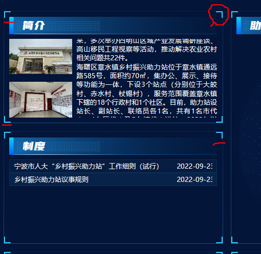
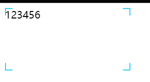

# 漳水大屏


## `CSS`部分

### 1.指定行数文字超出隐藏

之前，我都是只写过这样子的奥，就是让文字只展示一行，超出的用`...`替代。

实现方式：

```css
/*  让他们1行显示，超出隐藏  */
	width: 100px; /*一定别忘了指定宽度，否则无效*/
  white-space: nowrap;
  overflow: hidden;
  text-overflow: ellipsis;
```


另一种高级的方式，可以指定限制内容行数，超出的自动隐藏（**更加灵活，无论是一行，还是两行，甚至多行都可以**）

实现方式：

```css
width: 200px; /*也是，别忘了指定宽度*/
overflow: hidden;
text-overflow: ellipsis;
display: -webkit-box;
-webkit-line-clamp: 2; /*指定是多少，就是展示多少行文字内容*/
-webkit-box-orient: vertical;


/*和上面实现方式，展示1行多的省略...*/
width: 100px;
overflow: hidden;
text-overflow: ellipsis;
display: -webkit-box;
-webkit-line-clamp: 1; /*设置成1就行了*/
-webkit-box-orient: vertical;
```


>注意：这几个属性必须同时设置上，否则无效（就是上面代码里的，text-overflow目前我测试的是好像可有可无，最好还是带着吧）


### 2.渐变border

用到两个关键的`css`属性：

1. `border-image`：
2. `linear-gradient`：线性渐变


实现方式：

```css
/* 边框 */
.blockBorder {
  border: 1px solid;
  border-image: linear-gradient(180deg, rgba(51, 107, 174, 0.18), rgba(51, 107, 174, 0.60)) 1;
}

```


**如果是在scss中，可以通用，可以设置为@mixin或者使用@extend**

示例：

```scss
// 在box中要一个渐变边框
.blockBorder {
  border: 1px solid;
  border-image: linear-gradient(180deg, rgba(51, 107, 174, 0.18), rgba(51, 107, 174, 0.60)) 1;
}
.box {
	@extend .blockBorder;
}


// mixin写法
@mixin gradientBorder {
  border: 1px solid;
  border-image: linear-gradient(180deg, rgba(51, 107, 174, 0.18), rgba(51, 107, 174, 0.60)) 1;
}

.box {
  @include gradientBorder;
}
```


简单解释一下`border-image`：

是一个简写属性，主要使用来设置边框的图片以及效果的

1. 第一个参数：`border-image-source`表示图片路径（线性渐变，径向渐变都是图片）
2. 第二个参数：`border-image-slice`表示图片的分割形式，这个属性可以查一下MDN
3. 但是注意（2参数和3参数之间还有）border-image-width和border-image-outset属性，这两个属性通过`/`和2，3参数隔开
4. 第三个参数：`border-image-repeat`定义图片如何填充border


示例：

```css
list {
    overflow: clip;    
}
input:active {
    border-image: linear-gradient(rgba(0,0,0,.05), rgba(0,0,0,.05)) 1 fill / / 100vw;
  /*
  这里设置了 border-image-source， border-image-slice fill是特殊的，100vw是outset
  */
}
```


### 3.平行四边形背景（或者其他背景）

核心：`transform: skewX(-15deg);`

倾斜函数


示例：

```scss
/* 平行四边形背景 */
.skewX {
  &:before {
    content: '';
    width: 100%;
    height: 100%;
    position: absolute;
    top: 0;
    left: 0;
    transform: skewX(-15deg);
    border-radius: .02rem;
  }
}

// 别的地方如果要用，就可以直接
.box {
  @extend .skewX;
  &:before {
    background: linear-gradient(90deg, rgba(37, 208, 244, 0.20), rgba(38, 221, 254, 0.04));
    // 在设置一个渐变背景
  }
}
```


**注意：这只是一个思路，设置背景的一个思路，以后无论是三角，圆形等等我们都可以这样设置**

例如一个圆形的背景：

```css
.round {
  &:before {
    content: '';
    width: 100%;
    height: 100%;
    position: absolute;
    top: 0;
    left: 0;
    // transform: skewX(-15deg);
    border-radius: 50%;
  }
```


### 4.四角border

如图片的效果：






具体的实现方式：（但是为什么我还不太清楚）

```scss
/* 角标 （需要额外自己设置大小 例如：background-size:12px 12px;）*/
.subscript {
  background: linear-gradient(
    to bottom,
    #33cdfa 0px,
    #33cdfa 2px,
    transparent 0px,
    transparent 100%
  ) left top no-repeat,
    linear-gradient(
      to right,
      #33cdfa 0px,
      #33cdfa 2px,
      transparent 0px,
      transparent 100%
    ) left top no-repeat,
    linear-gradient(
      to bottom,
      #33cdfa 0px,
      #33cdfa 2px,
      transparent 0px,
      transparent 100%
    ) right top no-repeat,
    linear-gradient(
      to left,
      #33cdfa 0px,
      #33cdfa 2px,
      transparent 0px,
      transparent 100%
    ) right top no-repeat,
    linear-gradient(
      to top,
      #33cdfa 0px,
      #33cdfa 2px,
      transparent 0px,
      transparent 100%
    ) left bottom no-repeat,
    linear-gradient(
      to right,
      #33cdfa 0px,
      #33cdfa 2px,
      transparent 0px,
      transparent 100%
    ) left bottom no-repeat,
    linear-gradient(
      to top,
      #33cdfa 0px,
      #33cdfa 2px,
      transparent 0px,
      transparent 100%
    ) right bottom no-repeat,
    linear-gradient(
      to left,
      #33cdfa 0px,
      #33cdfa 2px,
      transparent 0px,
      transparent 100%
    ) right bottom no-repeat;
}


// 例如一个box中需要使用
.box {
  width: 200px;
  height: 100px;
  background-size:12px 12px; // 大小自己定
	@extend subscript; //设置border
}
```


>注意：如果想要四个小点点在周围，其实也可以把background-size设置的非常小