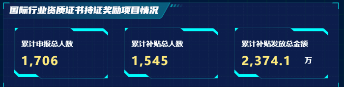

#  CountUp数字跳动插件

概述：

该插件可以给数值增长的过程添加一个流畅，生动，且美妙的增长效果，我一般都会在大屏项目中去使用它


效果：




## 基本使用

>安装：

```
npm install countup.js
npm install vue-countup-v2
```


> 组件封装：
>
> 我一般会自己把他封装一下，方便后续统一配置和使用


`countUp-card.vue`

>注意：这里我封装的是一个卡片的效果，后面还有单位，如果不需要完全不需要进行封装

```vue
<template>
	<div class="countUpCard">
		<div class="title"><slot> </slot></div>
		<div class="number">
			<ICountUp :delay="delay" :endVal="endVal" :options="options" v-on="$listeners" />
      <!-- 这里我添加了一个单位的效果在后面 -->
			<div v-if="unit" class="unit">{{ unit }}</div>
		</div>
	</div>
</template>

<script>
import ICountUp from 'vue-countup-v2';
export default {
	mixins: [config],
	props: {
		endVal: {
			type: Number,
			default: 0
		},
		unit: {
			type: String,
			default: ''
		},
		delay: {
			type: Number,
			default: 1000
		},
		options: {
			type: Object,
			default: () => {
				return {
					useEasing: true,
					useGrouping: true,
					separator: ',',
					decimal: '.',
					prefix: '',
					suffix: ''
				};
			}
		}
	},

	components: {
		ICountUp
	}
};
</script>

<style lang="scss" scoped>
.countUpCard {
	width: 100%;
	height: 100%;
	display: flex;
	flex-direction: column;
	justify-content: center;
	.title {
		font-size: 16px;
		font-family: Microsoft YaHei, Microsoft YaHei-Semibold;
		font-weight: 600;
		text-align: left;
		color: #ffffff;
		line-height: 21px;
		margin-bottom: 10px;
	}

	.number {
		font-family: Roboto, Roboto-Black;
		font-weight: 700;
		text-align: left;
		color: #ffeb7b;
		line-height: 30px;
		letter-spacing: 2px;
		display: flex;
		.unit {
			color: #fff;
			align-self: flex-end;
			margin-left: 15%;
			font-size: 16px;
		}
		span {
			font-size: 26px;
		}
	}
}
</style>

```


>组件使用：

```vue
<template>
	<div>
    <countUpCard
      :options="CustomCountUpOptions"
      :end-val="endVal"
      unit="万"
    >累计补贴发放总金额</countUpCard
  </div>
</template>

<script>
export default {
  name: '',
  data() {
    return {
      // 由于金额需要小数，所以我们自己写一个options
			CustomCountUpOptions: {
				useEasing: true,
				useGrouping: true,
				separator: ',',
				decimalPlaces: '1', //小数保留1位
				decimal: '.',
				prefix: '',
				suffix: ''
			},
      endVal: 123.1
    }
  }
}
</script>
```

