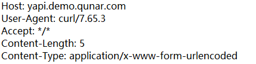
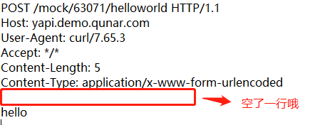
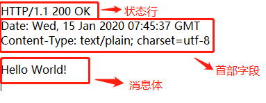
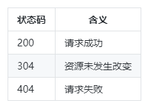

# HTTP协议

http协议最主要内容：定义了请求报文和响应报文的格式以及各个字段的含义

### 请求报文

请求报文结构:

**请求行**的三个部分由空格隔开，依次为：

**请求方法 请求地址 协议版本**

请求方法一些常见取值：

1. GET(请求体是空的)

2. POST(请求体可空可不空)

3. PUT

4. DELETE

   

**第二大行为首部字段数据**

一个首部字段占一行，以键值对的形式表示，键与值之间用冒号分隔。

**最后是消息体部分**

消息体部分与首部字段之间空了一行。

### 响应报文

响应报文的实际结构：

与请求报文唯一区别就是第一行不同，状态行也是由三个字段和空格分隔构成，依次是：

**协议版本、状态码、状态码对应的文本描述**

常见的状态码取值和对应含义：

