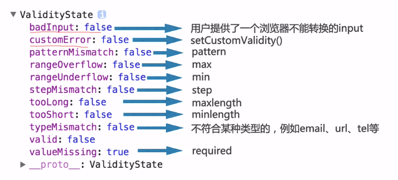

# 表单验证

## input中的新内容（属性）

**required**：必填属性，让该input框必须填写

**placeholder**：input框中的显示文字

**pattern**：后面可以跟正则表达式

**autocomplete**:自动提示框，提示曾经输入过的内容

**autofocus**：表单自动获取焦点

**novalidate和formnovalidate**：表单中设置了必填，但是提交又不想验证设置该属性

novalidate写在form标签中，formnovalidate写在form标签内的其他元素上例如button，input等...

**list属性**：list属性需要配合<dataList>标签使用，这样可以有个下拉菜单可以选择的输入框

```html
<input type="text" list="tips">
<dataList id="tips">
  <option value="qwe1"></option>
  <option value="qwe2"></option>
  <option value="qwe3"></option>
</dataList>
```

## From表单内label元素

`<label for="xxx"></label>`

label元素，表单元素的标题（常常和input一起使用）

主要是for属性中，可以绑定一个input的id，可以当点击label时，input元素也会被选中

```html
当点击文字男或者女时，单选按钮也会被选中
<label for="man">男</label>
<input type="radio" name="sex" id="man">
<label for="women">女</label>
<input type="radio" name="sex" id="women">
```


### 表单

格式：`<form>内容</form>`

**form的常用属性**


表单内元素：

* input：单行文本输入框，单选框，复选框，按钮
* textarea：多行文本框
* select、option：下拉选择框（组合元素）
* button：按钮
* label：表单元素的标题（常常和input一起使用）
* fieldset：表单元素组
* legend：fieldset的标题

input中的type属性：


去除input选中时候的选框：


textarea中的选框设置：


表单提交的值是一组一组的键值对，而表单中的name和value就是键和值，当用户能够输入时，用户输入的数据就是value。当用户不能输入时value值需要自己填写例如radio、checkbox等。

**表单的两种请求方式GET和POST**

get和post的区别：

（1）get提交数据加在地址栏的后面，而post不会，如果这些数据时中文数据而且是非敏感数据，那么使用get；如果用户输入的数据不是中文字符而且包含敏感数据，那么就使用post
（2）get提交相对不安全；post提交相对安全
（3）get提交有大小限制最多只有1024字节，根据浏览器的不同而不同，post不限制大小
（4）get是从服务器上获取数据，post是向服务器传送数据
（5）在客户端，get方式在通过URL提交数据，数据在URL中可以看到；post方式，数据放置在HTML HEADER内提交
（6）对于get方式，服务器Request.QueryString 获取变量的值，post方式，服务器端用Request.Form获取提交的数据。
（7）get限制form表单的数据集必须为ASCII字符，post支持整个ISO10646字符集。默认是SO-8859-1编码

### 表单验证

表单的验证可以利用jQuery-validate来验证表单输入的格式

jq-validate详情操作请自行查找(●'◡'●)

## html5约束验证API

1、willValidate属性

2、validity属性

3、validationMessage属性

4、checkValidity()方法

5、setCustomValidity()方法

## validity属性

```html

<input type="text" id="username" name="user" placeholder="请输入用户名" required autofocus>

let username = document.getElementById('username')
console.log(username.validity)
```



