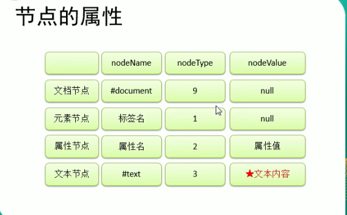

# JavaScript

## 现代模式或者叫严格模式

在JavaScript文件开头添加"use strict"开启（确保在最顶部使用）

一旦进入严格模式就没有回头路了

## 常量的大小写

通常用大写字母表示“硬编码”的常量也就是被写入代码前就知道值的大小了，这时候我们采用全大写字母来表示常量 

例如：const AGE = '19990325';

若事先并并不知道大小需要计算（通过种种手段）才知道则使用小写

例如：const age = someCode(AGE);

## 属性，innerHTML 与 innerText的区别

innerHTML是获取一个标签里的内容，就连标签也能获取到，如果是单标签则会出错。

innerText是获取一个标签内文本内容，不包括标签，如果是单标签则会出错。

## DOM（Document Object Model）

## 分类

### 文档(document)

文档表示的就是整个HTML网页文档

### 对象

对象表示将网页中的每一部分都转换为一个对象

### 模型

使用模型来表示对象之间的关系，这样方便我们获取对象


### 节点 node

节点是构成我们网页的最基本的组成部分，网页中的每一个部分都是一个节点。

例如：html标签，文本，注释，属性等等

虽然都是节点，但是实际上他们的具体类型不同。

例如：标签可以成为元素节点，属性为属性节点、文本时文本节点、文档为文档节点，节点类型的不同使用方法也不同。

节点属性：

**我们可以使用节点身上的nodeType属性，来判断它到底是哪一种类型的节点**



### 事件

事件就是文档或浏览器窗口中发生的一些特定的交互瞬间。

**当事件的响应函数被触发时，浏览器每次都会将一个事件对象作为实参传如响应函数中**

例如：a.onclick = function(event) {

​	event是自己写入的形参来接收外部浏览器的事件对象

}

给节点设置类名属性——className  例：变量.className = '类名'

#### 事件冒泡问题(Bubble)（重要）

所谓的冒泡指的是事件的向上传导，当后代元素上的事件被触发时，其祖先元素事件也会被触发。（向上传递）

大部分情况冒泡事件还挺有用的.

注意：**必须是且是相同事件**

##### 取消冒泡方式

如果不希望发生冒泡问题可以通过事件对象取消冒泡

这个事件对象就是上面那个event

event.cancelBibble = true; 取消冒泡

event.stopPropagation();

#### 事件的委派（重要）

指将事件统一绑定给元素的共同祖先元素，这样后代元素上的事件上的事件触发时，会一直冒泡到祖先元素，从而通过祖先元素的响应函数来处理。


事件委派：是利用冒泡原理体现的。

#### 事件的绑定

##### 方法一：对象.事件 = function() {}

事件监听：

**通过on+事件名儿，这种类型的事件绑定叫做DOM0事件**

事件触发：

- 事件的触发：触发事件时候运行绑定的处理函数

这种方式只能为一个元素的一个事件绑定一个响应函数，特殊情况下比较单一。

```js
const dom = document.get...;
dom.onclick = function() {
	xxx
}
```


##### 方法二：对象.addEventListener(参数1，参数2，参数3) 

首先DOM2级事件是，DOM0级事件的优化，同一个文档对象同一个事件，支持绑定多个事件处理程序，还能控制执行阶段。

**对象.addEventListener(）就是DOM2级事件**

参数1：事件字符串"click" ->标准事件(内置事件)

参数2：回调函数 function(){}

参数3：是否在捕获阶段触发事件，需要一个布尔值，一般为false（默认为冒泡阶段）

使用方法二可以同时为一个元素的相同事件同时绑定多个响应函数。

注意：不支持ie8，addEventListener中的this是绑定事件对象。

还有一个问题：利用该方法不能使用return false；取消默认行为，**要使用event.preventDefault()来取消默认行为(ie8不支持)**。

```js
const dom = document.get...;
dom.addEventListener('click', callback);
```


##### 方法三：对象.attachEvent(参数1，参数2)

**对象.attachEvent(）也是DOM2级事件**

参数1：绑定事件名字符串

参数2：回调函数

这个方法也可以同时绑定多个处理函数，不同的是它后绑定的先执行，和addEventListerner相反

注意：只能ie使用，attachEvent中的this是window。

所以综合绑定函数bind

```js
 function bind(obj, eventStr, callback) {


            if(obj.addEventListener) {

                obj.addEventListener(eventStr, callback, false);

            } else {

                // 怎样修改this值


                obj.attachEvent("on"+eventStr, function() {

                   // 调用时将this指向obj

                    callback.call(obj);

                });

            }

                    // // 大部分浏览器兼容方式

                    // obj.addEventListener(eventStr, callback, false);


                    // // ie8及一下

                    // obj.attachEvent("on"+eventStr, callback);

        }
```


#### 事件的传播

ie8及一下没有事件的捕获。

微软认为事件的传播是从内往外传（从下往上）,就是当事件触发时，应该先触发当前元素上的事件在向当前元素的祖先元素上传播，也就是事件应该在冒泡阶段执行。

网景公司认为事件因该由外向内传播的，当事件触发时，应该先触发当前元素的祖先元素，再向内传播给后代元素。

W3C综合了两个公司的方案，将事件传播分成了三个阶段

**1.捕获阶段**

在捕获阶段时从最外层的祖先元素，向目标元素进行事件的捕获，但是默认时不会触发事件。

**2.目标阶段**

事件捕获到目标元素，捕获结束开始在目标元素上触发事件。

**3.冒泡阶段**

事件从目标元素向外传递，一次触发祖先元素上的事件。

**如果想要捕获阶段触发事件，可以将addEventListener()的第三个参数设置为true**

### DOM事件

一个事件的触发流程

1. 找到事件触发点（例如按钮）
2. 监听按钮上的触发事件
3. 写触发【点击】事件之后的逻辑
4. 找到按钮
5. 跟随逻辑改变

事件有很多例如（**单击双击，键盘，滚轮，鼠标移入移出**等等）


### 常用的节点操作方法

1. 创建节点：**document.createElement（tagName）**
2. 添加节点：**element.appendChild（子节点）** *element 是父节点名称*
3. 删除节点：**element.removeChild（要删子节点）** *element 是父节点名称*
4. 查找节点：**document.getElementById（）、document.getElementsByClassName（）、document.querySelector（）、document.querySelectorAll（）**

## 操作节点属性

与属性相关的 DOM 方法 主要有 3 个：getAttribute()、setAttribute()和 removeAttribute()。

获取：element.getAttribute("属性名");

返回值：`string/null`

修改：element.setAttribute("属性名","属性值");

移除：element.removeAttribute("属性名");

示例：

```js
let div = document.getElementById("myDiv"); 
alert(div.getAttribute("id")); // "myDiv" 
alert(div.getAttribute("class")); // "bd" 
alert(div.getAttribute("title")); // "Body text" 
alert(div.getAttribute("lang")); // "en" 
alert(div.getAttribute("dir")); // "ltr" 
```

>注意：属性名不区分大小写，因此"ID"和"id"被认为是同一个属性（但是我建议都写小写）


## 获取节点类名


## 创建节点

### 用于创建一个元素节点，会根据tagName创建元素节点对象

document.createElement（tagName）

tagName:是一个字符串(例如"div")

示例：

```js
let div = document.createElement("div");

// 然后把它添加到文档树中
document.body.appendChild(div);
```


### 创建一个文本节点对象

document.createTextNode(name);

name:是一个文本字符串(例如："广州")


示例：

```js
let element = document.createElement("div"); 
element.className = "message"; 
let textNode = document.createTextNode("Hello world!"); 
element.appendChild(textNode); 
document.body.appendChild(element);
// 创建了一div元素节点，和一个textNode文本节点，然后将文本节点添加进div节点中
```


## 获取节点

## document.querySelector()

需要一个选择器的字符串作为参数，可以根据一个css选择器来查询一个元素节点对象！（好用的呀匹）

注意：只能获取1个，如果没有返回null

## document.querySelectorAll()

上面的孪生进版，可以获取一组的符合条件的标签，需要传如一个选择器字符串

注意：只有一个符合条件的元素也是返回一个类数组

### 通过document对象调用

#### 1 通过id属性获取一个元素节点对象

document.getElementById（）

> 注意：如果页面中存在多个具有相同 ID 的元素，则 getElementById()返回在文档中出现的第一个元素。

示例：

```html
<div id="id1">
 123
</div>
<script>
	let div1 = document.getElementById('id1');
</script>
```


#### 2 通过标签名获取一组元素节点对象（一组类数组）

document.getElementsByTagName()

当标签只有一个时可以且只想要一个document.getElementsByTagName()[0]


>注意：对于 document.getElementsByTagName()方法，虽然规范要求区分标签的大小 写，但为了最大限度兼容原有 HTML 页面，实际上是不区分大小写的。如果是在 XML 页 面（如 XHTML）中使用，那么 document.getElementsByTagName()就是区分大小 写的。


#### 3 通过name属性获取一组元素属性（一组类数组）

document.getElementsByName()


示例：

```html
 
<script>
let myImage = document.getElementsByTagName('myImage')
</script>
```


#### 4 通过类获取一组元素属性（一组类数组）

document.getElementsByClassName()


## 获取元素节点的子节点

### 通过具体的元素节点调用

#### 方法，返回当前节点的指定标签后代节点

getelementsByTagName()

#### 1属性，获取当前节点的所有子节点

语法：当前节点.childNodes 

此属性会获取包括文本节点在内的所有节点，甚至标签之间的空白都会当作节点。

注意：在ie8及以下的浏览器中，不会将空白文本当成子节点

#### 2属性，获取当前节点所有的元素子节点

当前节点.children 此属性只会获取元素节点（所有子元素）

#### 3属性，获取当前节点的第一个子节点

当前节点.firstChild 此属性也会把空白的文本节点获取

#### 4属性，获取当前节点的第一个元素子节点

当前节点.firstElementChild 只会获取元素标签

#### 5属性，获取当前节点的最后一个子节点

当前节点.lastChild 此属性也也会把空白的文本节点获取

## 获取父节点和兄弟节点

#### 属性，表示当前节点的父节点

当前节点.parentNode 

#### 1属性，表示当前节点的前一个兄弟节点

当前节点.previousSibling 此属性也会获取到**空白文本节点**

#### 2属性，获取当前节点的前一个兄弟元素节点

当前节点.previousElementSibling 缺陷ie8及一下浏览器不支持

#### 3属性，表示当前节点的后一个兄弟节点

当前节点.nextSibling 此属性也会获取**空白文本节点**

#### 4属性，表示当前节点的后一个兄弟元素节点

当前节点.nextElementSibling 缺陷ie8及一下浏览器不支持

## 插入节点

### 向一个父节点添加一个新的子节点

父节点.appendChild(子节点)

注意：必须得到父节点


一些小知识点：

**即使 DOM 树通过各种关系指针维系，一个节点也不会在文档中同时出现在两个或更多个地方。**

所以：如果已经存在的节点，通过调用appendChild()方法只会将节点转移，而不会重新创建


### 在指定的子节点前插入新的子节点

父节点.insertBefore(新节点, 指定旧节点)

注意：必须得到父节点

## 替换节点

### 将指定旧子节点替换为新子节点

父节点.replaceChild(新子节点, 旧子节点);

示例：

```js
// 替换第一个子节点
let returnedNode = someNode.replaceChild(newNode, someNode.firstChild); 
// 替换最后一个子节点
returnedNode = someNode.replaceChild(newNode, someNode.lastChild);

// 返回的是被替换的节点
```


小知识：**要替换的节点会被返回并从文档 树中完全移除，要插入的节点会取而代之。**


## 删除子节点

### 获取指定节点的父节点

指定节点.parentNode

当手头里只有儿子，可以通过儿子去找爸爸

**只有得到父节点才能区删除子节点**

### 删除**子**节点

父节点.removerChild(子节点)

注意：需要得到父节点

示例：

```js
// 删除第一个子节点
let formerFirstChild = someNode.removeChild(someNode.firstChild); 
// 删除最后一个子节点
let formerLastChild = someNode.removeChild(someNode.lastChild); 

// 返回的是被删除的节点
```


# document全局文档对象

document全局文档对象中，放着很多可能会用到的一些属性

## 获取URL

document有一个URL属性，可以获取地址栏中的URL

示例：

```js
// 取得完整的 URL 
let url = document.URL; 
```


## 获取域名

示例：

```js
// 取得域名
let domain = document.domain; 
```

在很老的版本中，还在使用<iframe>标签的时候。

当页面中包含来自某个不同子域的窗格（）或内嵌窗格（<iframe>）时，设置
document.domain 是有用的

因为跨源通信存在安全隐患，所以不同子域的页面间无法通过 JavaScript 通信。此时，在每个页面上把 document.domain 设置为相同的值，这些页面就可以访问对方的 JavaScript 对象了。比如，一个加载自` www.wrox.com `的页面中包含一个内嵌窗格，其中的页面加载自 p2p.wrox.com。这两个页面的 document.domain 包含不同的字符串，内部和外部页面相互之间不能 访问对方的 JavaScript 对象。如果每个页面都把 document.domain 设置为 wrox.com，那这两个页面 之间就可以通信了。（来自JavaScript高级程序设计）


> 注意：浏览器对 domain 属性还有一个限制，即这个属性一旦放松就不能再收紧。比如，把 document.domain 设置为"wrox.com"之后，就不能再将其设置回"p2p.wrox.com"，后者会导致错 误，

示例：

```js
// 页面来自 p2p.wrox.com 
document.domain = "wrox.com"; // 放松，成功
document.domain = "p2p.wrox.com"; // 收紧，错误！
```


## 获取body标签

全局文档对象document上专门放了一个body属性，是来指向body标签的


示例：

```js
let body = document.body; // 取得对<body>的引用
```


## 获取html根标签

获取html根标签有几种方法，第一个是 documentElement 属 性，始终指向 HTML 页面中的元素

第二个：document全局文档对象的第一个子节点就是html

示例：

```js
let html = document.documentElement; // 取得对<html>的引用
alert(html === document.childNodes[0]); // true 
alert(html === document.firstChild); // true
```


## js修改元素的样式

### 通过js修改样式

语法：元素.style.样式名 = 样式值

这种方式**读取和设置**的都是**行内样式**，优先级比较高，如果通过这种方式修改样式发现无效！观察样式中是否有!important

注意：元素是上面获得的对象object，样式值必须是一个字符串

还有一些样式名和原来css样式名不一样

注意：**如果css的样式名中含有“-”的名称在js中都是不合法的，在js中去掉减号(-)改成驼峰写法**

例如：background-color 改成 backgroundColor

### 获取元素当前的样式

getComputedStyle(参数1，参数二)

参数1：要获取样式的元素

参数2：可以传递一个伪元素，一般写null

该方法会返回一个对象，改对象封装了该元素当前的样式，通过**对象.样式名**来获取。

例子： var obj = getComputedStyle(box1,null);

获取宽度=>obj.width;

获取高度=>obj.height;

注意：**该方法只能读取不能修改**。


## 三大家族之offset(只读)

offset可以读取到css中的样式，但是只能读取，不能修改

### 读取宽度：

element.offsetWidth

注意：获取元素宽度 = 内容区 + 内边距 + 边框

### 读取高度：

element.offsetHeight

注意：获取元素高度 = 内容区 + 内边距 + 边框

### 读取左边位移量：

element.offsetLeft

指当前元素**相对其定位父元素**的水平偏移量

### 读取上面位移量: 

element.offsetTop

指当前元素**相对其定位父元素**的垂直偏移量

### 获取当前元素的定位父元素

element.offsetParent

注意：就近原则，获取最近的定位祖先元素


## 三大家族之client(只读)

### 读取可见宽度：

element.clientWidth

注意：返回的是数值，可直接参加运算

此宽度返回的值是：内容区+内边距(padding)

### 读取可见高度：

element.clientHeight

注意：返回是数值 

此高度返回的值是：内容区+内边距(padding)


## 三大家族之scroll(只读)

### 读取滚动宽度：

element.scrollWidth

注意：此属性能获取元素整个滚动区域的宽度。

获取滚动宽度 = 内容区 + 内边距


>注意：没有滚动条出现时，元素内容的总宽度。

### 读取滚动高度：

element.scrollHeight

注意：此属性能获取元素**整个**滚动区域的高度。

获取滚动高度 = 内容区 + 内边距


>注意：没有滚动条出现时，元素内容的总高度。

### 读取水平滚动条滚动的距离：

element.scrollLeft

>注意：
>
>内容区左侧隐藏的像素数，设置这个属性可以改变元素的滚动位置。


### 读取垂直滚动条滚动的距离

element.scrollTop

>注意：
>
>内容区顶部隐藏的像素数，设置这个属性可以改变元素的滚动位置。


小栗子：如果不在顶部则滚到顶部

```js
function scrollToTop(element) { 
 if (element.scrollTop != 0) { 
 element.scrollTop = 0; 
 } 
} 
```


### 奇妙的等式

注意：chrome计算出来有小数指需要向上取整一下

Math.ceil(scrollHeight - scrollTop)

Math.ceil(scrollWidth - scrollLeft)

1 :当满足scrollHeight - scrollTop == clientHeight

**说明垂直滚动条滚动到底了**


2:当满足scrollWidth - scrollLeft == clientWidth

**说明水平滚动条滚动到底了**


## 确定尺寸的方法getBoundingClientRect()

浏览器在每个元素上都暴露了 getBoundingClientRect()方法，返回一个 DOMRect 对象，包含 6 个属性：left、top、right、bottom、height 和 width。

这些属性给出了元素在页面中相对于**视 口**的位置。

方法.PNG)


## BOM (Browser Object Model)

bom就是浏览器提供的一个对象，是用来操作浏览器的，例如用js让浏览器**跳转页面**，再比如，**操作浏览器储存一些数据，操作页面的前进后退**等等。

### BOM核心对象window window中的六大核心模块

1. document：文档对象
2. frames： 窗口中所有命名的框架
3. history：当前页面历史记录
4. location：当前页面地址信息
5. navigator：浏览器相关信息
6. screen：用户显示屏幕相关属性

