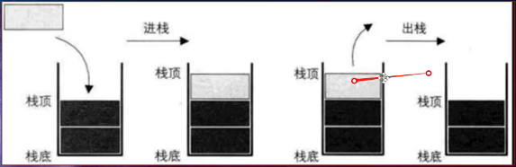

# 栈

一种受限的数据结构

就只有一个出口（栈顶），**后进先出（LIFO）**，只能再栈顶进行操作。

1. 向一个栈插入新元素称作：**进栈、入栈、压栈**等，就是将新元素放到栈顶。
2. 从栈中删除一个元素称为**出栈**，就是将栈顶元素移除，相邻元素成为新栈顶

## 函数调用栈

像现在有三个函数，A,B,C其中，A中调用了B，B中调用了C

在执行函数时就会生成一个函数调用栈，1.执行函数A时，将A压入栈底，2.之后会执行B，然后将B函数进栈,3最后函数C进栈，之后依次按顺序C->B->A出栈

## 数组实现栈

