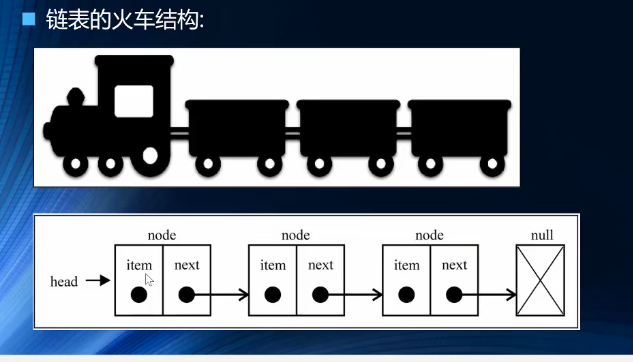
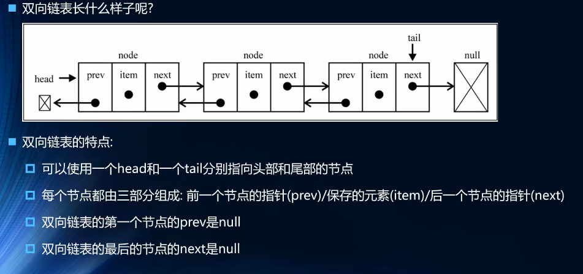

# 链表

**链表**和数组一样，可以用于存储**一系列的元素**，但是链表和数组的实现机制是完全不同的。

数组的缺点：

1. 申请需要一系列连续的空间，如果空间不够，需要扩容
2. 数组在开头或者中间部位的插入开销较大

链表优势：

1. 首先链表在内存中**不必是连续的空间**
2. 每一个元素由一个**存储元素本身的节点**和**指向下一个元素的引用**
3. 链表在插入和删除数据时，时间复杂度可以达到O(1)，相对于数组效率高很多

链表缺点：

1. 获取元素效率较低，链表访问任何一个元素的位置时，都需要从头开始访问.(无法跳过第一个元素访问任意一个)

   

   

   链表结构：

   

## 双向链表

单向链表有个缺点就是，只有一个方向只能**从头到尾**，不能**从尾往前**

双向链表的优点：

1. 既可以从头到尾，也可以从尾到前

缺陷：

1. 处理更麻烦，删除或者插入需要处理4个引用

