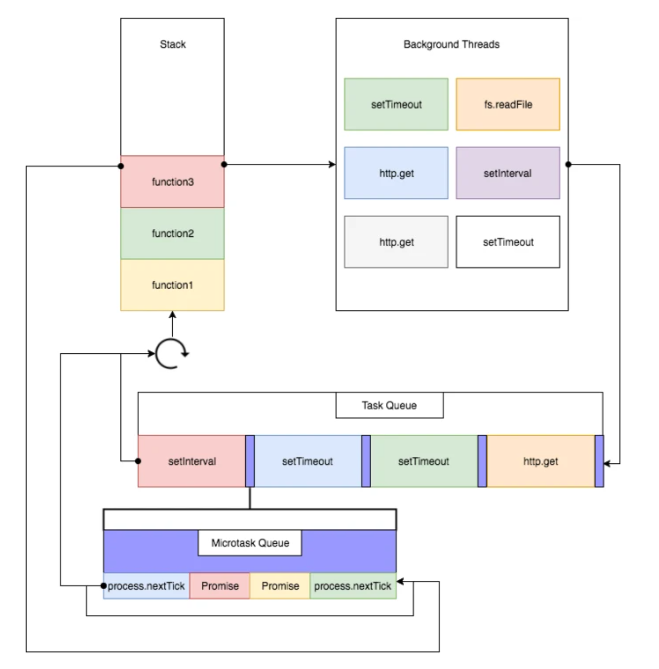
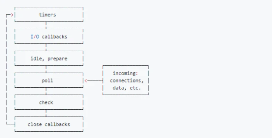
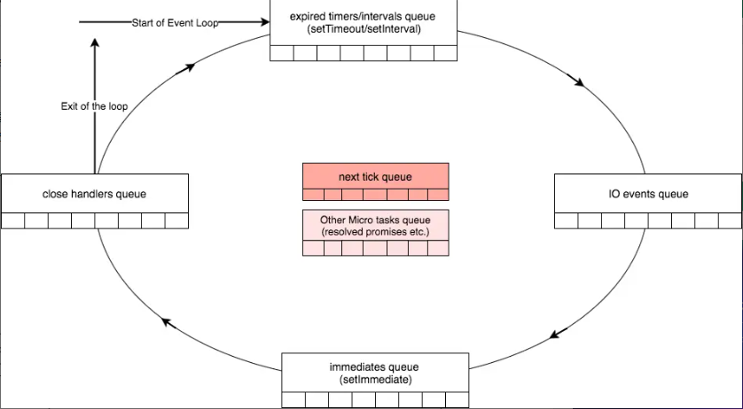
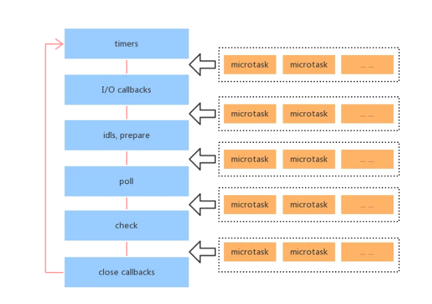

# Event Loop轮回模型

定义：**event loop是一个执行模型，在不同的地方有不同的实现。浏览器和NodeJS基于不同的技术实现了各自的Event Loop。**


## 宏任务队列与微任务队列

宏队列：macrotask 也称为tasks。一些异步任务的回调会依次进入macro task queue，等待后续被调用，这些异步任务包括：

- setTimeout
- setInterval
- setImmediate (Node独有)
- requestAnimationFrame (浏览器独有)
- I/O
- UI rendering (浏览器独有)

**微队列，microtask，也叫jobs。** 另一些异步任务的回调会依次进入micro task queue，等待后续被调用，这些异步任务包括：

- process.nextTick (Node独有)
- Promise
- Object.observe
- MutationObserver


## 浏览器的Event Loop



图片讲述了JavaScript的具体执行流程。

1. 执行全局代码，有同步，有异步的；
2. 全局Script代码执行完毕，调用栈stack清空；
3. 从微队列microtask queue中取出位于队首的回调任务，放入调用栈Stack中执行，执行完后microtask queue长度减1；
4. 继续取出位于队首的任务，放入调用栈Stack中执行，以此类推，直到直到把microtask queue中的所有任务都执行完毕。**注意，如果在执行microtask的过程中，又产生了microtask，那么会加入到队列的末尾，也会在这个周期被调用执行**；
5. microtask queue中的所有任务都执行完毕，此时microtask queue为空队列，调用栈Stack也为空；
6. 取出宏队列macrotask queue中位于队首的任务，放入Stack中执行；注意：**宏任务阶段产生的微任务，重新加入microtask queue 并且重新激活微任务队列**
7. 执行完毕后，调用栈Stack为空；
8. 重复3-7这个步骤....


重点：

1. **宏任务一次只会取出队列（macro queue）中的一个任务进行执行，执行完毕检查微任务队列是否为空**
2. **微任务队列会依次将任务取出执行，直至微任务队列（micro queue）为空**
3. 图中没有画UI rendering的节点，因为这个是由浏览器自行判断决定的，但是只要执行UI rendering，它的节点是在执行完所有的microtask之后，下一个macrotask之前，紧跟着执行UI render。


练习题：

```js
console.log(1);

setTimeout(() => {
  // 这个定时器回调callback1
  console.log(2);
  // promise回调callback2
  Promise.resolve().then(() => {
    console.log(3)
  });
});

new Promise((resolve, reject) => {
  console.log(4)
  // resolve导致的promise回调callback3
  resolve(5)
}).then((data) => {
  console.log(data);
})

setTimeout(() => {
  // 定时器回调callback4
  console.log(6);
})

console.log(7);
```


> 第一步执行，执行所有同步代码，并将对应任务加到对应的队列中：

macrotask queue：callback1、callback4

microtask queue：callback3

输出：1、4、7

> 第二步执行，清空microtask任务队列

macrotask queue：callback1、callback4

microtask queue：null

输出：1、4、7、5


> 第三步执行，逐个清空macro task任务队列：

macrotask queue：callback4

microtask queue：callback2

注意：**由于宏任务队列中的callback1执行完毕后又创建了一个微任务，下面要执行微任务队列**

输出：1、4、7、5、2


> 第四步,清空微任务队列

macrotask queue：callback4

microtask queue：null

输出：1、4、7、5、2、3


>最后一步，取出宏任务队头执行：

macrotask queue：null

microtask queue：null

输出：1、4、7、5、2、3、6

**执行完毕。**


## Node环境的Event loop

NodeJS中的Event Loop，它更复杂一些，机制也不太一样。

### NodeJS中的宏队列和微队列

node环境中，宏队列分为**6个阶段**



各个阶段执行的任务如下：

- **timers阶段**：这个阶段执行setTimeout和setInterval预定的callback
- **I/O callback阶段**：执行除了close事件的callbacks、被timers设定的callbacks、setImmediate()设定的callbacks这些之外的callbacks
- **idle, prepare阶段**：仅node内部使用
- **poll阶段：获取新的I/O事件**，适当的条件下node将阻塞在这里
- **check阶段**：执行setImmediate()设定的callbacks
- **close callbacks阶段**：执行socket.on('close', ....)这些callbacks


综上所述：Node的回调事件主要位于4个macro queue中：（执行时也是按顺序执行的）

1. Timer queue
2. I/O callback queue
3. Check queue
4. Close callbacks queue

**这4个都属于宏队列，但是在浏览器中，可以认为只有一个宏队列，所有的macrotask都会被加到这一个宏队列中，但是在NodeJS中，不同的macrotask会被放置在不同的宏队列中。**


**NodeJS中的微任务队列主要有2个**

1. Next Tick Queue：是放置process.nextTick(callback)的回调任务的
2. Other Micro Queue：放置其他microtask，比如Promise等


4个宏任务和2个微任务队列：




嗦以大体上NodeJS的Event loop过程如下：

1. 执行全局Script的同步代码
2. 执行microtask微任务，先执行所有Next Tick Queue中的所有任务，再执行Other Microtask Queue中的所有任务
3. **新版本Node中，宏任务执行机制和在浏览器的Event Loop中是一致的**，是只取宏队列的第一个任务出来执行，每一个阶段的macrotask任务执行完毕后，开始执行微任务，也就是步骤2
4. Timers Queue -> 步骤2 -> I/O Queue -> 步骤2 -> Check Queue -> 步骤2 -> Close Callback Queue -> 步骤2 -> Timers Queue ......



练习题：

```js
console.log('1');

setTimeout(function() { // callback 1
    console.log('2');
    process.nextTick(function() { // callback 2
        console.log('3');
    })
    new Promise(function(resolve) {
        console.log('4');
        resolve();
    }).then(function() {// callback 3
        console.log('5')
    })
})

new Promise(function(resolve) {
    console.log('7');
    resolve();
}).then(function() {// callback 4
    console.log('8')
})
process.nextTick(function() {// callback 5
  console.log('6');
})

setTimeout(function() {// callback 6
    console.log('9');
    process.nextTick(function() {// callback 7
        console.log('10');
    })
    new Promise(function(resolve) {
        console.log('11');
        resolve();
    }).then(function() {// callback 8
        console.log('12')
    })
})
```

>步骤1，输出同步代码，将不同的异步代码加入不同队列中

宏队列：

Timers Queue: [callback 1,callback 6]

IO Callback Queue： []

Check Queue: []

Close Callback Queue: []

微队列：

Next Tick Queue: [callback 5]

Other Microtask Queue: [callback 4]

输出：1、7


>步骤2：清空微队列，从next tick queue开始

Timers Queue: [callback 1,callback 6]

IO Callback Queue： []

Check Queue: []

Close Callback Queue: []

微队列：

Next Tick Queue: []

Other Microtask Queue: []

输出：1、7、6、8


>步骤3：执行第一个Timers 宏队列中的callback1

Timers Queue: [callback 6]

IO Callback Queue： []

Check Queue: []

Close Callback Queue: []

微队列：

Next Tick Queue: [callback 2]

Other Microtask Queue: [callback 3]

输出：1、7、6、8、2、4


>步骤4：再次执行微队列直至将微队列清空

Timers Queue: [callback 6]

IO Callback Queue： []

Check Queue: []

Close Callback Queue: []

微队列：

Next Tick Queue: []

Other Microtask Queue: []

输出：1、7、6、8、2、4、3、5


>步骤5：执行Timer Queue的callback6

Timers Queue: []

IO Callback Queue： []

Check Queue: []

Close Callback Queue: []

微队列：

Next Tick Queue: [callback 7]

Other Microtask Queue: [callback 8]

输出：1、7、6、8、2、4、3、5、9、11


> 最后再次清空微队列：

Timers Queue: []

IO Callback Queue： []

Check Queue: []

Close Callback Queue: []

微队列：

Next Tick Queue: []

Other Microtask Queue: []

输出：1、7、6、8、2、4、3、5、9、11、10、12


## 总结：

1. 浏览器的Event Loop和NodeJS的Event Loop是不同的，实现机制也不一样，不要混为一谈。
2. 浏览器可以理解成只有1个宏任务队列和1个微任务队列，先执行全局Script代码，执行完同步代码调用栈清空后，从微任务队列中依次取出所有的任务放入调用栈执行，微任务队列清空后，从宏任务队列中只取位于队首的任务放入调用栈执行，注意这里和Node的区别（新版本一样了），只取一个，然后继续执行微队列中的所有任务，再去宏队列取一个，以此构成事件循环。
3. NodeJS可以理解成有4个宏任务队列和2个微任务队列，但是执行宏任务时有6个阶段。先执行全局Script代码，执行完同步代码调用栈清空后，先从微任务队列Next Tick Queue中依次取出所有的任务放入调用栈中执行，再从微任务队列Other Microtask Queue中依次取出所有的任务放入调用栈中执行。**之后和浏览器一致，执行完一个宏任务就检查2个微任务队列，微任务队列中next tick队列先执行**
4. MacroTask包括： setTimeout、setInterval、 setImmediate(Node)、requestAnimation(浏览器)、IO、UI rendering
5. Microtask包括： process.nextTick(Node)、Promise、Object.observe、MutationObserver