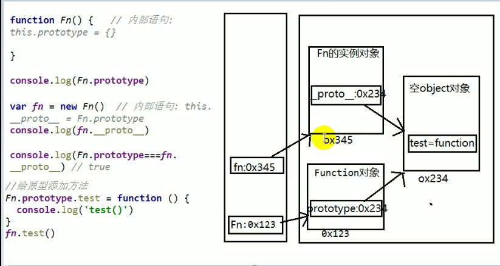
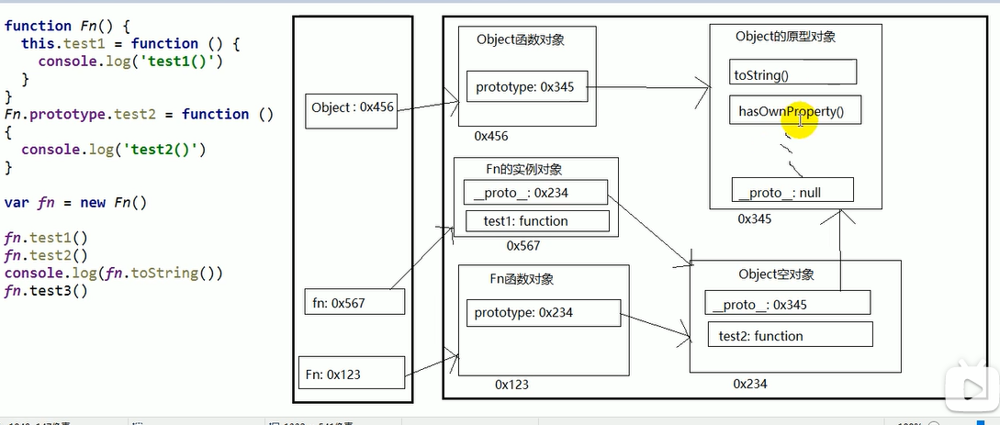
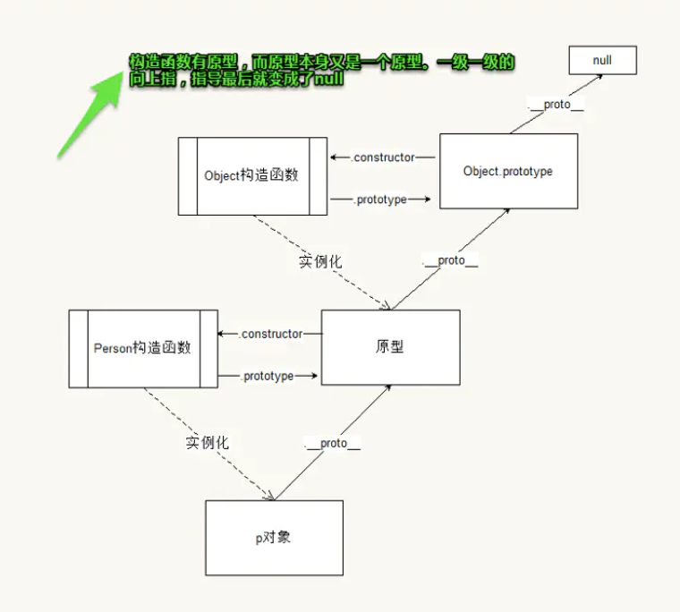
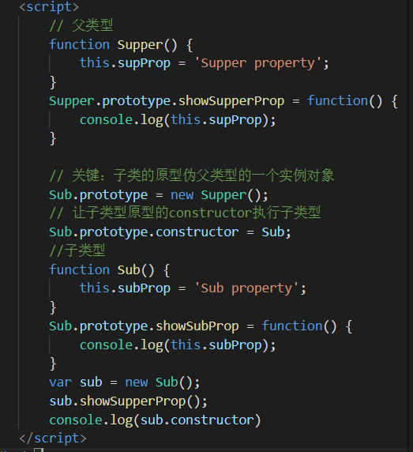

# 原型(prototype)

每个函数都有一个prototype属性，它默认指向一个Object空实例对象（也称为：原型对象）。

Object空对象指的是：**对象中没有我们的属性**

原型对象中有一个constructor，它指向函数对象构造函数

## 使用给原型对象添加的属性(一般是方法)

当给原型对象添加属性后，**函数的所有实例对象拥有原型中的属性(方法)**



# 显示原型(属性)和隐式原型(属性)

每一个函数function都有一个`prototype`称为：显式原型

也有一个`__proto__`隐式原型是指向Function的原型，因为任何函数都是Function的实例对象

例如： function A() {

}

A.方法;    此时的A就是Function的实例对象

**prototype在定义函数时自动添加，默认是一个空Object对象**


每个实例对象都有一个`__proto__`称为：隐式原型

`__proto__`在创建对象时自动添加的，默认值时构造函数的prototype值。

程序员能直接操作显式原型，但不能直接操作隐式原型(ES6之前)


注意：**实例对象隐式原型的值为其对应构造函数的显式原型的值**。


# 原型链

当访问一个对象的属性时，1.先在自身属性中查找，找到返回。2.如果没有，再沿着`__proto__`这条链向上查找，找到返回。3.如果最终都没找到返回undefined。

实用：就是在对象原型上放方法，对象原型是一个公共区域，创建的实例对象也可以直接在这个公共区域拿这个方法来用。




别名：隐式原型链

作用：查找对象的属性(方法)


Object的原型对象时原型链的尽头




## 原型链属性问题

读取对象的属性值时：自动到原型链中查找。

设置对象的属性值时：不会查找原型链，如果当前对象中没有此属性，直接添加此属性并设置其值。


## 原型链继承(重要)

1. 定义父类型构造函数
2. 给父类型的原型添加方法
3. 定义子类型的构造函数
4. 创建父类型的对象赋值给子类型的原型
5. 将子类型的构造属性(constructor属性)设置为子类型
6. 给子类型原型添加方法
7. 创建子类型的对象：可以调用父类型的方法

**关键**：**子类型的原型为父类型的一个实例对象**！




# 问题

## instanceof是如何判断的？

表达式A instanceof B

**如果B函数的显式原型对象在A对象的原型链上，就返回true，否则返回false。**

B只看它的显式原型(prototype)就不动了，a要一步一步来走


## 面试题

网上有一道美团外卖的面试题是这样的：  

```js
Function.prototype.a = 'a';
Object.prototype.b = 'b';
function Person(){};
var p = new Person();
console.log('p.a: '+ p.a); // p.a: undefined
console.log('p.b: '+ p.b); // p.b: b  问为什么？

/*
有不少同学第一眼看上去就觉得很疑惑，p不是应该继承了Function原型里面的属性吗，为什么p.a返回值是undefined呢？
其实，只要仔细想一想就很容易明白了，Person函数才是Function对象的一个实例，所以通过Person.a可以访问到Function原型里面的属性，
但是new Person()返回来的是一个对象，它是Object的一个实例,是没有继承Function的，所以无法访问Function原型里面的属性。
但是,由于在js里面所有对象都是Object的实例，所以，Person函数可以访问到Object原型里面的
属性，Person.b => 'b' 
*/
```

