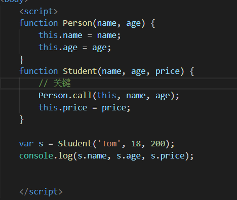

# 继承

## 原型链继承(重要)

1. 定义父类型构造函数
2. 给父类型的原型添加方法
3. 定义子类型的构造函数
4. 创建父类型的对象赋值给子类型的原型
5. 将子类型的构造属性(constructor属性)设置为子类型
6. 给子类型原型添加方法
7. 创建子类型的对象：可以调用父类型的方法

**关键**：**子类型的原型为父类型的一个实例对象**！

`Child.prototype = new Parent();`

还有一个修正语句：

`Child.prototype.constructor = Child;`

## 通过call()实现继承（假继承）

call()语法：`call(参数一, 形参1，形参2....)`

套路：

1. 定义父类型构造函数
2. 定义子类型构造函数
3. 在子类型构造函数中调用父类型构造

**关键**：在子类型构造函数中通过call()调用父类型构造函数。

## 原型链+call()构造函数的组合继承

