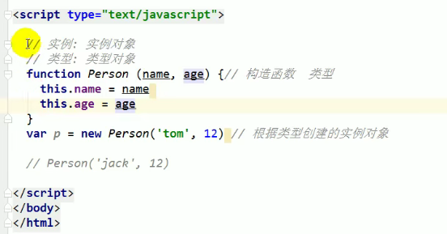

# JS的数据类型

## 基本(值)类型

1. String：任意字符串
2. Number：任意数值（NaN）
3. Boolean：true/false
4. undefined：undefined
5. Null：null（是个对象）
6. Symbol：（ES6新添加的基本类型）
7. Bigint：特大数字，整数末尾直接加n（例如：1n）不支持和Number类型进行混合操作

## 对象类型（引用类型）

1. Object：任意对象
2. Function：一种特别的对象(**可以执行**)
3. Array：一种特别的对象(数值下标，内部数据是有序的)

# 判断类型方法

1. typeof：返回数据类型的字符串表达不能判断null与object、array与object
2. instanceof：判断对象的具体类型 返回结果是布尔值
3. ===/==：利用 === 只能判断null、undefined

## 实例，对象

# 问题

## undefined与null的区别？

undefined是定义了但是未赋值

null是定义了赋值为null

undefined一般用来初始化基本数据类型，null一般用来初始化引用数据类型。

## 什么时候给变量赋值为null？

**初始时：**

初始赋值为null是为了表明这个变量即将被赋值为对象。

例如：var b = null；标识b可能会赋值为对象。

**结束时：**

赋值null是为了清空变量回收内存

例如： var b = null;让b指向对象称为垃圾对象（被垃圾回收器回收）。

## 严格区别变量类型和数据类型？

1数据的类型：

* 基本类型

* 对象类型

2 变量的类型（变量内存值的类型）

* 基本类型：保存的就是基本类型的数据
* 引用类型：保存的是地址值

## 什么是数据？

储存在内存中代表特点信息的"东西",本质上010101...

数据的特点：可传递，可运算

## 什么是内存？

内存条通电后产生的可存储数据的空间（临时的）

内存的产生和死亡：内存条(电路板)==>通电==>产生内存空间==>操作数据==>断电==>内存空间和数据都消失！

内存的分类：

* 栈：全局变量/局部变量
* 堆：对象

## 什么是变量？

一个变量由变量名和变量值组成，每个变量都能对应一个内存空间，变量名用来查找对应的内存空间，变量值就是对应内存空间中保存的数据。

## 内存，数据，变量三者之间的关系

内存用来存储数据的临时空间，变量是内存的标识

## var a = xxx，a内存中保存的是什么？

xxx是基本数据，保存的就是这个数据

xxx如果是对象，保存的是对象的地址值

xxx如果是一个变量，保存的xx的内存内容（可能是基本数，可能是地址值）

## 关于引用变量赋值问题

n个引用变量指向同一个对象，通过一个变量修改对象内部数据，其他所有变量看到的是修改后的数据。

## 在js调用函数时传递变量参数时，时值传递还是引用传递

理解1：传递的是值!!!!!!!!(只是这个值可能是基本数据，也可能是地址)

理解2：可能是值也可能是引用传递(地址值)

## JS引擎如何管理内存？

1 内存的生命周期

分配内存空间(得到使用权)==>存储数据(反复操作)==>释放空间

2 释放内存

* 局部变量：函数执行完自动释放
* 对象：称为垃圾对象后==>垃圾回收器回收

