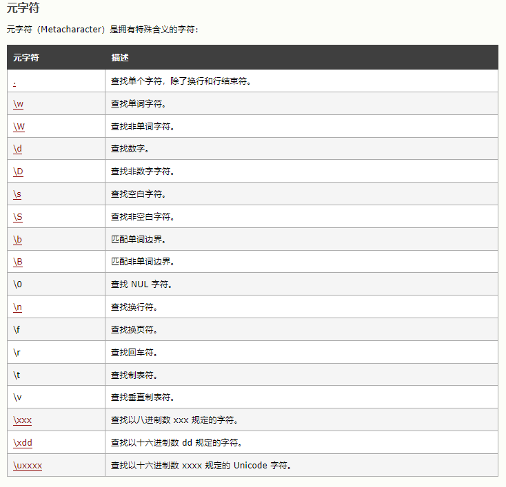
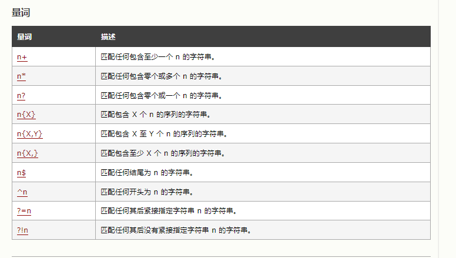

# 正则表达式

用于定义一些字符串的规则。

## 创建一个正则表达式对象

匹配模式：

i：表示忽略大小写(ignore)

g：全局匹配模式(global)

m：执行多行匹配

```js
//创建方式一：构造函数创建法（更加灵活）
let reg = new RegExp("正则表达式","匹配模式");

```

---


```js
//创建方式二: 字面量创建法（更加简单）
let reg = /正则表达式/匹配模式   //注意没有引号'',""
```

## 正则表达式中的符号

|：表示或者`/a|b/表示对比a或b`

[]：里面内容也是或`[ab]表示对比a或b`

[a-z]：表示任意小写字母，其他同理`[0-9],[A-B]...`

[A-z]：表示任意字母

[^xx]：除了xx以外的东西

---

元字符：



---

量词：



## 正则表达式的方法

test()：使用这个方法可以用来检查一个字符串是否符合表达式规则，符合返回true，否则返回false

