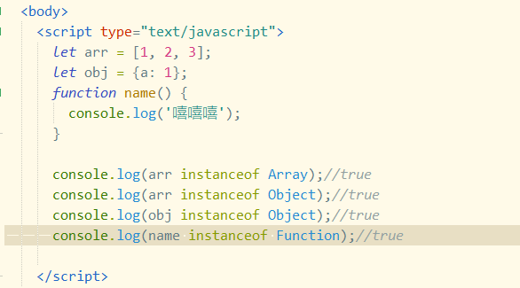

# 判断数据类型

## typeof

`typeof`返回基本数据类型(null除外，null由于设计失误 `tpyeof null`会返回`Object`)和引用数据类型`function`

发现`typeof`只能判断出`number`、`string`、`bigint`、`boolean`、`symbol`、`undefined`、`function`

会将null、数组(Array)、对象(Object)都判断为object

## instanceof

`A instanceof B`会返回一个Boolean值，该关键字用来判断A是否是B的实例，会在原型链上进行查找

所以可以使用`instanceof`来判断引用数据类型

