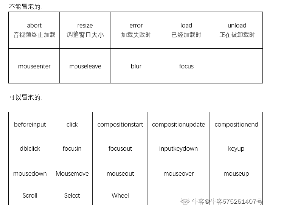

# 事件冒泡

## 事件冒泡问题(Bubble)（重要）

所谓的冒泡指的是事件的向上传导，当后代元素上的事件被触发时，其祖先元素事件也会被触发。（向上传递）

大部分情况冒泡事件还挺有用的.

注意：**必须是且是相同事件**

### 取消冒泡方式

如果不希望发生冒泡问题可以通过事件对象取消冒泡

这个事件对象就是上面那个event

event.cancelBibble = true; 取消冒泡

event.stopPropagation();

## 能够进行冒泡的事件

