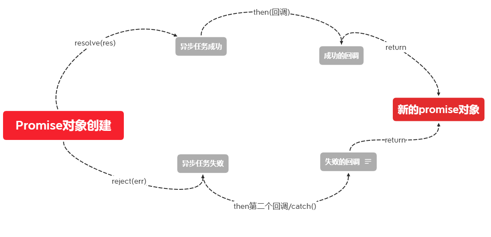

# Promise

抽象表达：

1. Promise 是一门新的技术(ES6 规范)

2. **Promise 是JS中进行异步编程的新解决方案**

   ​	旧解决方案：单纯利用回调函数

具体表达：

1. 从语法上来说：Promise是一个构造函数
2. 从功能上来说：Promise对象是用来封装一个异步操作并可以获取其成功/失败的结果值

异步编程：

* fs文件操作

```js
//原来回调的解决方案
require('fs').readFile('./index.html', (err,data)=>{/*回调函数*/})
```


* 数据库操作


* AJAX

```js
$.get('/server', (data)=>{/*回调函数*/})
```


* 定时器

```js
setTimeout(()=>{/*回调函数*/},2000)
```


**从上面这几个异步操作来看，在没有`Promise`之前，异步操作都需要回调函数来解决**

## Promise作用

### 1首先支持链式调用(重要，面试考)，可以解决回调地狱问题

回调地狱：回调函数嵌套调用，外部回调函数异步执行的结果是嵌套的回调执行的条件。

```js
//回调地狱
asyncFunc1(otp,(...args1)=>{
  asyncFunc2(opt, (...args2)=>{
  	asyncFunc3(opt, (...args3)=>{
  	  ....
  	})
  })
})
```


回调地狱缺点：1.不便于阅读。2.不便于异常处理（要对每一个回调写错误处理，就会有重复性）

解决方案：Promise链式调用

## 2 指定回调函数的方式更加灵活

旧的：必须在启动异步任务前指定。

Promise：启动异步任务 => 返回Promise对象 => 给Promise对象绑定回调函数(甚至可以在异步任务结束之后指定多个)

# promise实例对象的属性()

## promise 的状态(重要)

promise的状态是promise实例对象中的一个属性。

叫：*[[PromiseState]]*

属性值是：

* pending 未决定的
* resolved/ fulfilled 成功
* rejected 失败

**promise的状态改变只有两种**

1 **pending 变为 resolved**

2 **pending 变为 rejected**

并且 promise 状态 **只能改变一次**

成功的结果一般为value，失败结果一般为reason


## promise 的对象值

promise的结果值也是一个对象叫：*[[PromiseResult]]*

**在新创建的对象中，如果没有调用resolve()或者reject()则，状态为pending**

**其中保存着异步任务【成功/失败】的结果。**再次强调，是异步任务成功或失败的结果。

只能通过：

​	resolve()和reject()修改

# 一、构造函数语法

/Promise 构造函数：Promise(excutor)

1. excutor**函数**：执行器 (resolve, reject)=>{}
2. resolve**函数**：内部定义成功时=>我们调用的函数 value => {}
3. reject**函数**：内部定义失败时=>我们调用的函数 reason => {}

注意：**executor 会在promise内部立即调用执行==>也就是同步的**，异步操作在执行器中执行。

---

`resolve()`会将`promise`对象状态设置为成功

`reject()`会将`promise`对象状态设置为失败

```javascript
const p = new Promise((resolve, reject)=>{
    //包裹一个异步任务
    setTimeout(()=>{
      if(成功){
          resolve(res);//成功时调用的方法(还可以传递参数)
      }else {
          reject(err);// 失败时调用的方法(可以传递参数)
      }
    },1999)
});
// then方法里面放置成功后要执行的回调，或失败时要执行的回调
p.then((value)=>{},(reason)=>{});
//then有两个参数，第一个为成功的回调函数，
//第二个时失败的回调函数
```


### 构造函数中的resolve和reject函数

`resolve`函数和`reject`函数还可以传递参数，能够将参数传递到对应的回调函数中，reject的参数一般是err，也就是错误信息，resolve函数除了能够传递正常的值之外，还能够传递另一个`Promise`实例。

```js
const p1 = new Promise((resolve, reject) => {
    ...
})
const p2 = new Promise((resolve, reject) => {
    resolve(p1);
})
```

像以上代码这样，注意，这时`p1`的状态就会受到`p2`的影响，也就是`p1`来决定`p2`的状态。如果`p1`的状态是`pending`，那么`p2`的回调函数就会等待`p1`的状态改变；如果`p1`的状态已经是`resolved`或者`rejected`，那么`p2`的回调函数将会立刻执行。

```js
const p1 = new Promise((resolve, reject) => {
    //3s后p1状态为rejected
    setTimeout(() => reject(new Error('fail')), 3000)
})
const p2 = new Promise((resolve, reject) => {
    //1后变为成功状态，但是由于返回一个promise对象，所以成功状态失效，又等待2s，p1变为失败，p2也跟着变为失败
    setTimeout(() => resolve(p1), 1000)
})

p2
.then(res => {
  console.log(res);
})
.catch(err => {
  console.log(err);
})

```


# async

async可以加在一个函数前，让他返回的值是一个promise对象，返回的promise规则和then()方法一致。

## await 表达式

1. await右侧的表达式一般为promise对象，但也可以是其它的值
2. 如果表达式是promise对象，await返回的是promise成功的值
3. 如果表达式是其他值，直接将此值1作为await的返回值

注意：1）**await必须写在async函数中，但async函数中可以没有await**。

2）如果await的promise失败了，就会抛出异常，需要通过try...catch捕获异常

