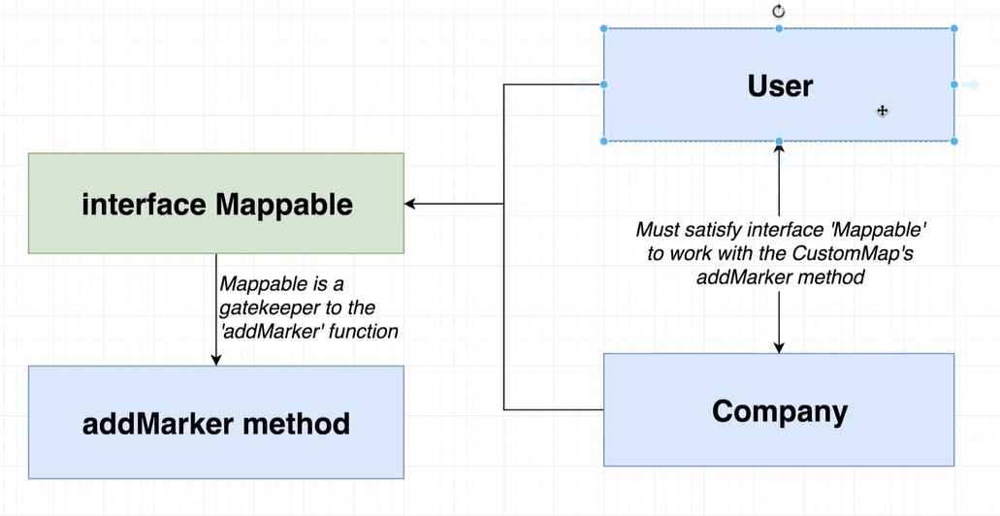

# TS代码坏的书写方式


## 看代码


分析：首先这种书写方式不好的点：

1. 需要引入多个模块(如果模块非常多，需要不断引入)，代码冗余
2. 类型之间耦合性很高，必须是类型之间公有的属性才能进行使用


这种编码的依赖关系：**我们主类依赖者各个引入的模块，Map依赖着User、Park、Company...（我依赖各个模块）**


示例：

```ts
import { User } from './User';
import { Company } from './Company';

export class CustomMap {
	private googleMap: google.maps.Map;

	constructor(divId: string) {
		this.googleMap = new google.maps.Map(document.getElementById(divId), {
			zoom: 1,
			center: {
				lat: 0,
				lng: 0
			}
		});
	}

	addMarker(mappable: User | Company): void {
		// 这样会检查TS会检查User和Company中公有的属性，公有的属性才能使用

		new google.maps.Marker({
			map: this.googleMap,
			position: {
				lat: mappable.location.lat,
				lng: mappable.location.lng
			}
		});
	}

}
```


## 解决办法：使用`interface`



创建一个接口：让你们所有模块满足我需要的内容即可

这种方式代码的依赖：**让各个模块依赖着我的接口，让模块依赖着我，而不是我依赖着模块**（依赖反转了）

优势：

1. 减少代码书写
2. 获得一个完全独立的模块（**不再依赖任何模块**）

示例：

```tsx
interface Mappable {
	location: {
		lat: number;
		lng: number;
	};
}

export class CustomMap {
	private googleMap: google.maps.Map;

	constructor(divId: string) {
		this.googleMap = new google.maps.Map(document.getElementById(divId), {
			zoom: 1,
			center: {
				lat: 0,
				lng: 0
			}
		});
	}

	addMarker(mappable: Mappable): void {
		// 只要一个接口就行

		new google.maps.Marker({
			map: this.googleMap,
			position: {
				lat: mappable.location.lat,
				lng: mappable.location.lng
			}
		});
	}

	// addCompanyMarker(company: Company): void {
	// 	new google.maps.Marker({
	// 		map: this.googleMap,
	// 		position: {
	// 			lat: company.location.lat,
	// 			lng: company.location.lng
	// 		}
	// 	});
	// }
}
```


## 实现任意类型排序(`interface+class`)


> 一：创建`Sorter.ts`

```tsx
// 这里有我们要实现的接口
interface Sortable {
	length: number;
	compare(leftIndex: number, rightIndex: number): boolean;
	swap(leftIndex: number, rightIndex: number): void;
}

export class Sorter {
	constructor(public collection: Sortable) {}

	sort(): void {
		const { length } = this.collection;
		for (let i = 0; i < length - 1; i++) {
			for (let j = 0; j < length - i - 1; j++) {
				if (this.collection.compare(j, j + 1)) {
					this.collection.swap(j, j + 1);
				}
			}
		}
	}
}

```


>二：创建`NumberCollection.ts`

```tsx
// 该类专门处理number[]
export class NumberCollection {
	// 这样写length不太好的一点，可以被修改
	// length: number = this.data.length;

	// 利用函数加get关键字，使用时不必调用函数，并且无法修改length
	get length(): number {
		return this.data.length;
	}
	constructor(public data: number[]) {}

	// 交换函数
	swap(leftIndex: number, rightIndex: number): void {
		const leftHand = this.data[leftIndex];
		this.data[leftIndex] = this.data[rightIndex];
		this.data[rightIndex] = leftHand;
	}

	// 对比函数
	compare(leftIndex: number, rightIndex: number): boolean {
		return this.data[leftIndex] > this.data[rightIndex] ? true : false;
	}
}

```


三：创建`CharactersCollection.ts`

```tsx
// 该类用来专门处理字符串

export class CharactersCollection {
	constructor(public data: string) {}

	get length(): number {
		return this.data.length;
	}

	// 对比
	compare(leftIndex: number, rightIndex: number): boolean {
		// 全部比较小写
		return this.data[leftIndex].toLowerCase() > this.data[rightIndex].toLowerCase();
	}

	// 交换
	swap(leftIndex: number, rightIndex: number): void {
		// 先变成数组
		const characters = this.data.split('');

		// 交换
		const leftHand = characters[leftIndex];
		characters[leftIndex] = characters[rightIndex];
		characters[rightIndex] = leftHand;

		// 再变成字符串
		this.data = characters.join('');
	}
}

```


>四：最后创建`index.ts`

```tsx
import { Sorter } from './Sorter';
import { NumberCollection } from './NumberCollection';
import { CharactersCollection } from './CharactersCollection';

// 数组
const numbersCollection = new NumberCollection([1, -5, -3, 0, 20, 10]);
// 字符串
const charactersCollection = new CharactersCollection('gFAdbce');

const sorter = new Sorter(numbersCollection);
// 
const sorterString = new Sorter(charactersCollection);

sorter.sort();

sorterString.sort();
console.log(numbersCollection.data);
console.log(charactersCollection.data);

```


优势：

1. 我们都不需要太关注算法(算法基本框架已经书写完毕)，只用写出最简单的交换即可
