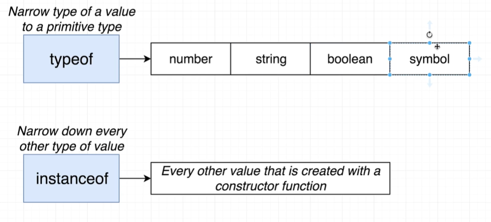
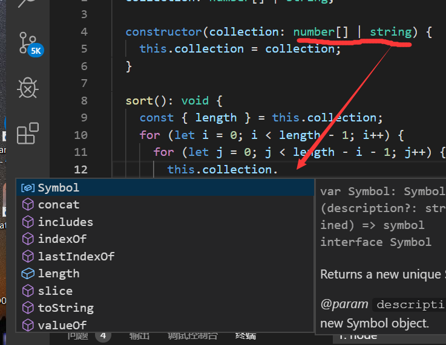
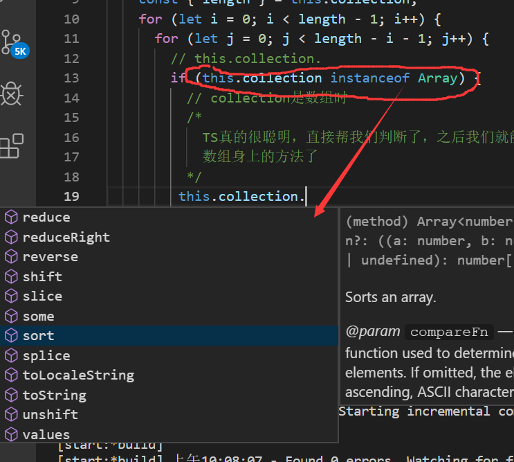
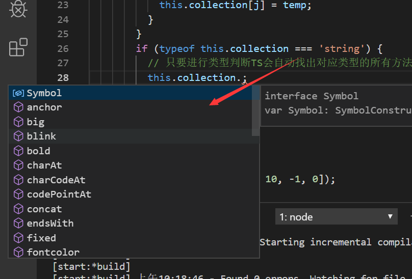

# TS中的type guard

作用：

`type guard`可以让`TS`在一个作用域中恢复该类型方法的使用权限。

示例：

首先这个构造函数可传入两种类型的值，之后再作用域中，`collection`只能使用**数组类型**，和**string类型**身上共有的方法。

**如果我们使用type guard，对类型进行判断之后，在这个if块内，就可以恢复数组所有的方法供我们使用**

**同理，字符串类型也是一样的:**

