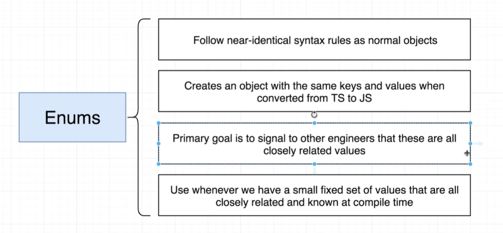

# enum-TS中的新东西(不是很重要)

enum：本意为枚举的意思。

概念：用来表示一些联系非常密切变量的集合。

基本语法：

```ts
enum 名称 {
  xxx = '值1',
  xxx = '值2'...
}
  
// 使用：
名称.xxx
```

默认语法：

```tsx
enum 名称 {
 	red, // 默认自动从0开始
  green, // 1
  blue	// 2
}

```




作用：使用枚举并不会提升性能（转换成`js`时是一个对象），**主要的功能是它在TS中是向其他工程师给予提示这些变量具体的作用，来帮助工程师来阅读代码的**。


## 何时使用它

一些值它不常变化，并且值本身的含义比较难理解，我们可以用enum来描述一下。

```ts
// 例如 有时
// HomeWin指主场胜利，AwayWin指客场胜利，Draw是平局
enum MatchResult {
	HomeWin = 'H',
	AwayWin = 'A',
	Draw = 'D'
}

let manUnitedWins = 0;
for (let match of matches) {
  // 原本这里判断写的是 match[5] === 'H' 这样就不好理解这句代码具体的含义是什么
	if (match[1] === 'Man United' && match[5] === MatchResult.HomeWin) {
		manUnitedWins++;
	} else if (match[2] === 'Man United' && match[5] === MatchResult.AwayWin) {
		manUnitedWins++;
	}
}
```


## 增长枚举(数字枚举)

枚举中的元素默认是以+1的方式自增的，如果不定义值，默认从0开始一个一个的+1，如果我们定义了第一个枚举值，那么下面的枚举值都会在以第一个为基础开始自增

示例：

```tsx
enum Color {
  red = 5,
  green,
  blue
}

console.log(Color.red) // 5
console.log(Color.green) // 6
console.log(Color.blue) // 7
```


## 字符串枚举

示例：

```tsx
enum Color {
  red =	'red',
  green =	'green',
  blue = 'blue'
}
```

注意：如果用字符串枚举，建议每一个都要自己手动赋值，以免出现不必要的错误。


## 异构枚举

就是字符串，和数字枚举一起穿插着定义

示例：

```tsx
enum right {
	yes = 1,
  no = 'no'
}
```


##  接口枚举

就是interface和enum一起结合使用

示例：

```tsx
enum Color {
  red = 1,
  green,
  blue
}


interface A {
  name: Color.red
}

let obj: A = {
  // name: 1, // 这也写1也是可以的
  name: Color.red  
}
```


## const枚举

枚举前面可以放一个声明，只能用const，用let、var都会报错

const枚举的特点：利用const声明的枚举，TS编译器编译的时候，会直接把它编译成对应的值，而不是一个对象。

原来的enum枚举类型，都是编译成一个对象

示例：

```tsx
const enum Types {
  success,
  fail
}


console.log(Types.success);
// 编译后

console.log(0); // 直接就是0
```


普通的enum：

```tsx
enum Types {
  success,
  fail
}


console.log(Types.success);

// 编译后

var Types;
(function (Types) {
    Types[Types["success"] = 0] = "success";
    Types[Types["fail"] = 1] = "fail";
})(Types || (Types = {}));
console.log(Types.success); // 发现没有，编译成一个对象了
```


## 反向映射

数字枚举中包含了正向映射（name —> value），也包含了反向映射（value —> name）

> 注意：**只有数字枚举有反向映射**

示例：

```tsx
// 反向映射
enum Types {
  success
}


let success:number = Types.success
// 正向
console.log('name->value:', success) // 0
// 反向
let key:string = Types[0]
console.log('value->name', key) // success
```

