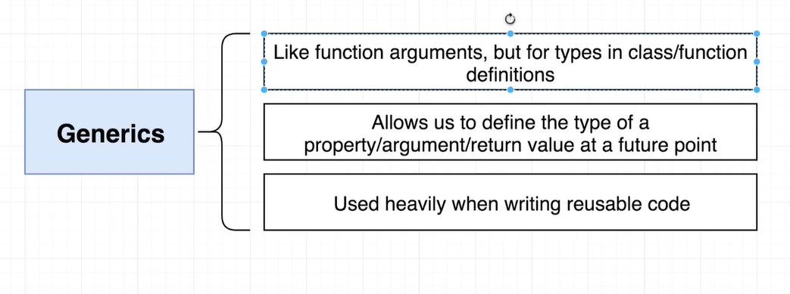

# 泛型-Generics




示例：

```ts
// 特别像函数的参数，要传递的是类型
class HoldAnything<TypeOfData> {
  data: TypeOfData
}
// 规定类型为number
let numberData = new HoldAnything<number>();
/*
	类变为：
	class HoldAnything<number> {
    data: number
  } 
*/

// 规定类型为string
let stringData = new HoldAnything<string>();
/*
	类变为：
	class HoldAnything<string> {
    data: string
  } 
*/

```


作用：从上面的示例中我们就可以看出，泛型可以让类变得非常灵活，可以极大的提高类的复用概率。


## 小栗子

实例：

### 类使用泛型的示例：

```ts
// 数组数组类
class ArrayOfNumbers {
  constructor(public collection:number[]) {

  }

  get(index: number):number {
    return this.collection[index];

  }
}
// 字符串数组类
class ArrayOfStrings {
  constructor(public collection:string[]) {
  }

  get(index: number):string {
    return this.collection[index];
  }
}


// 使用泛型generic合并上面两个类
class ArrayOfAnything<T> {
  constructor(public collection:T[]) {
  }

  get(index: number):T {
    return this.collection[index];
  }
}
// 如果想要number类型的数组
const numberArr = new ArrayOfAnything<number>([1,2,3,4,5]);
// 如果想要string类型的数组
const stringArr = new ArrayOfAnything<string>(['one','two','three','four','five']);
```


### 函数使用泛型的示例

```jsx
// 带有函数的泛型

function printStrings(arr: string[]) {
  for(let i = 0; i < arr.length; i++) {
    console.log(arr[i]);
  }
}

function printNumbers(arr: string[]) {
  for(let i = 0; i < arr.length; i++) {
    console.log(arr[i]);
  }
}

// 使用泛型合并上面两个函数
function printAnything<T>(arr: T[]) {
  for(let i = 0; i < arr.length; i++) {
    console.log(arr[i]);
  }
}
printAnything<string>(['a', 'b', 'c']);
```


## 泛型的约束（interface+extends）

通过使用`interface`可以约束泛型传入的参数


示例：

```jsx
class House {
  print() {
    console.log('我是一个房子');
  }
}

// 接口和泛型共同使用，通过接口来约束泛型
interface Printable {
  print(): void;
}

// 约束传入的值必须携带print()方法
function printHousesOrCars<T extends Printable>(arr: T[]) {
  for(let i = 0; i < arr.length; i++) {
    arr[i].print();
  }
}

printHousesOrCars([1,2,3,4]);//这里就会报错

printHousesOrCars<House>([new House(), new House()]);
printHousesOrCars<Car>([new Car(), new Car()]);
```


## 泛型约束2（Object + extends + keyof）

前置知识：

1. 在TS中，一个字符串也能当作类型

```ts
type 'name';
// name 可以是一个类型
```


第二种约束，可以约束泛型的类型是对象的一个**键名儿**

```ts

export class Attributes<T>{
  constructor(private data: T) {}
	/*
		解释：K只能是T的键名类型
		get函数返回的类型，是T[k]对应值的类型
	*/
  get<K extends keyof T>(key: K):T[K]{
    return this.data[key];
  }

  set(update: T):void {
    this.data = {...this.data, ...update};
  }
}

/*
	例如：T是一个对象(也可以是一个interface)
	T = {
		name: '123',
		age: 01,
		id: 1
	}
	那么K就只能是 name类型，或者age类型，id类型
	T[K]对应的就是string，number，number
*/
```

