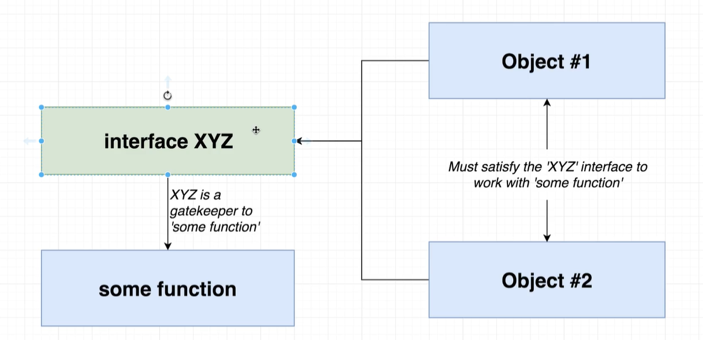
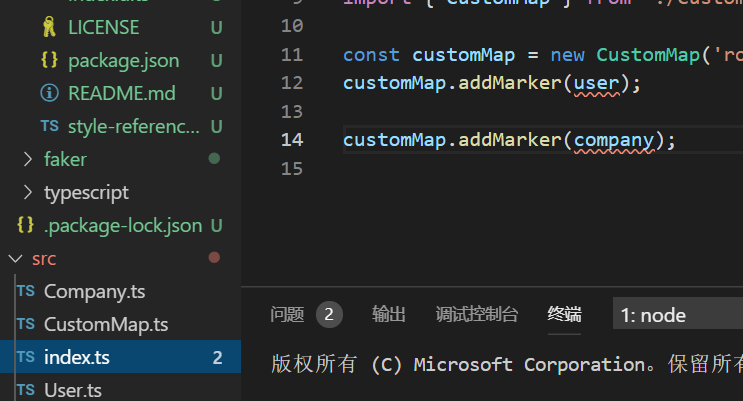
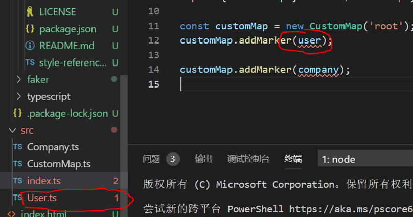

# TypeScript的基本类型

## 一、类型声明

类型声明是`TS`的一个非常重要的特点，通过类型声明可以给变量声明类型


## 两种类型

比较特殊的：

1. `any`（尽力避免any）

`any`类型就是ts不能帮我们进行类型推断，也不能帮我们查找出错误，常见在一些函数中，一些函数根据不同输入值，会有不同的返回值，`ts`这时就会将这个函数的返回值当作`any`类型

2. `void`

`void`一般表示一个函数没有返回值，当函数返回`undefined`或者`null`时，也不会报错

示例：

```tsx
let u:void = undefined;
let n:void = null;

// 函数
function fnVoid():void {
  return 123; // 这样就会报错，因为返回的是void是空值
  
  console.log(123); // 这样写，不写return 函数默认是返回undefined就不会报错
}

// 注意点：void注释的值，是不能给别人赋值的（和undefined,null类型的区别）
let v:void = undefined;
let str:string = '123';

str = v; // 这里就会报错，报void类型不能赋给str

let un:undefined = undefined;
let str2:string = '321';

str2 = un; // 这样就没问题，不会报错
```


**void和undefined、null的区别**：void注释的变量不能赋值给别人，而undefined和null是可以的。


3. `never`

`never`也是修饰函数的一种类型，表示这个函数永远不会执行到底部，也就是中途会报错呀等等，只有我们真正的不希望函数返回东西，才需要`never`

```tsx
const throwError = (message: string): never => {
	throw new Error(message);
  

};

// 或者这样
function loop(): never {
  whild(true) {
    
  }
}
```

>注意：任何类型的值赋值给never标注的变量好像都会报错

应用场景：

就是帮助我们排除错误的，如果一个值在正常约束情况下无论如何都不能到达，突然进行修改后，能到达，就会提示错误

```ts
interface A {
  type: '保安'
}

interface B {
  type: '草莓'
}

// 1.假如又新加了一个interface
interface C {
  type: '西瓜'
}

type All = A | B | C; // 2.联合进All

function type (val: All) {
  
  switch (val.type) {
    case '保安':
      break
    
    case '草莓':
      break
		
    case '西瓜': // 4、我们在这里补上interface C的约束
      break
      
    default:
      // 3.这里立马就会报错，提示check不能赋值，
      const check:never = val; // 由于参数被ALL限制，经过上面的case,永远不会走到default
      break
  }
}
```


1. 一种原始数据类型：`number`、`boolean`、`string`、`void`、`undefined`、`null`、`symbol`、

2. 另一种引用类型：`funcitons`、`arrays`、`classes`、`objects`


类型的作用：

1. 可以让typescript的编译器识别出代码中的错误
2. 能让程序员更好的理解变量在各个模块之间的流动，让代码更易懂


# 特殊的顶级类型(any、unknown)

这里我在重新写一遍，由于特别特殊。

`any`：表示任意的意思，就是有这个类型标识时，任何类型的值都可以进行赋值操作。


`unknown`：unknown本身的意思是不知道的意思，它也是任意类型的值都可以进行赋值操作。


但是这两个之间有很大的区别：

1. unknown修饰的对象，是不能够调用对象中的属性和方法的。而any是可以的
2. unkonw修饰的变量，只能当作”父变量“，换句话说，就是不能赋值给别人。注意：如果要想赋值，只支持unknow的和any类型的变量。any类型则随便赋值没有限制


示例：

```ts
let anys:any = '我是qec鸭';
// anys是可以赋值任意类型，像原生js一样
anys = 18;
anys = '123';
anys = {};
anys = [];
anys = Symbol('123');


// 区别1：
let uk:unknown = {a: 123, b: ():number => 123};

uk.a // 报错
uk.b() // 也会报错

let uk:any = {a: 123, b: ():number => 123};
uk.a // 没问题
uk.b() // 也没问题


// 区别2

// 不能够赋值给其他变量
let str:unknown = 'xixi'
let st1:string = 'haha'

str1 = str; // 报错


// 如果想赋值，怎么办？也是只能是any或unknown类型变量
let uk:unknown = 'unknown';
let str2: any = 'any';
let str3: unknown = 'str3';
str2 = uk; // 没问题   any类型
str3 = uk; // 也没问题  unknow类型

```


# never类型

`never`也是修饰函数的一种类型，表示这个函数永远不会执行到底部，也就是中途会报错呀等等，只有我们真正的不希望函数返回东西，才需要`never`

```tsx
const throwError = (message: string): never => {
	throw new Error(message);
  

};

// 或者这样
function loop(): never {
  whild(true) {
    
  }
}
```

>注意：任何类型的值赋值给never标注的变量好像都会报错

应用场景：

就是帮助我们排除错误的，如果一个值在正常约束情况下无论如何都不能到达，突然进行修改后，能到达，就会提示错误

```ts
interface A {
  type: '保安'
}

interface B {
  type: '草莓'
}

// 1.假如又新加了一个interface
interface C {
  type: '西瓜'
}

type All = A | B | C; // 2.联合进All

function type (val: All) {
  
  switch (val.type) {
    case '保安':
      break
    
    case '草莓':
      break
		
    case '西瓜': // 4、我们在这里补上interface C的约束
      break
      
    default:
      // 3.这里立马就会报错，提示check不能赋值，
      const check:never = val; // 由于参数被ALL限制，经过上面的case,永远不会走到default
      break
  }
}
```


# symbol类型

symbol首先就是ES6新增的一种基本类型，对应的TS也有

基本语法：(先回顾一下ES6中如何使用的)

```js
// 支持传递number或者string类型，如果传递其他类型会被.toString()不建议传

let s = Symbol(1);
let s2 = Symbol('1');

// 用的比较多的是把他放到对象里，作为键，独一无二的键
// 声明两个Symbol类型的变量
let sy1 = Symbol('name');
let sy2 = Symbol('age');
let obj = {
  name: "zhangsan",
  age: 12,
  // 属性名是变量名时使用中括号
  [sy1]: 'lisi',
  [sy2]: 18,
  [Symbol('email')]: '1085445531@qq.com'
};
 
// 访问方式,用中括号访问
console.log(obj[sy1]); //lisi
console.log(obj[sy2]); //18
console.log(obj[Symbol('email')]); //undefined
```

上述代码，我们可以使用中括号访问到sy1和sy2，但是访问不到 [Symbol('email')]，这时候我们可以通过**`Object.getOwnPropertySymbols()`**方法来访问该属性值，该方法返回一个包含给定对象所有自有的Symbol值的属性（包括不可枚举的Symbol值属性）组成的数组。

>核心函数：`Object.getOwnPropertySymbols()`

```js
let res = Object.getOwnPropertySymbols(obj)
console.log(res); //[ Symbol(name), Symbol(age), Symbol(email) ]
console.log(obj[res[2]]); //1085445531@qq.com@qq.com
```


方式2：使用`Reflect.ownKeys()`

```ts
let s:symbol = Symbol(1);
let num: symbol = Symbol('1');
let obj = {
  [s]: 'value',
  [num]: 'num',
  name: '钱不二',
  sex: '男'
}

console.log(Reflect.ownKeys(obj)) // [ 'name', 'sex', Symbol(1), Symbol(1) ]
```

> 使用for...in也访问不到symbol值


**那么，在TS中呢，ts中的symbol其实和普通类型一样，使用方式也和原生的大差不差**

示例：

```tsx
let s:symbol = Symbol(1);
let num: symbol = Symbol('1');
let obj = {
  [s]: 'value',
  [num]: 'num',
  name: '钱不二',
  sex: '男'
}

console.log(obj[s]); // value
console.log(obj[num]); // num
```


# 对象类型(interface)

作用：利用`interface`可以创建出一种新类型(`type`，使用就和基础类型一样)，这种新类型用来描述对象的属性名和值的类型


简单来说：`object`类型的类型注释，如果对象属性太多，就会导致类型注释非常非常长而且难看，利用`interface`可以统一的处理属性类型，进而简化


简单使用：

```tsx
interface Vehicle {
	name: string;
	year: number;
	broken: boolean;
}

const oldCivic = {
	name: 'civic',
	year: 2000,
	broken: true
};

// 这里的object类型注释太长了，及不好看又多
// const printVehicle = (vehicle: { name: string; year: number; broken: boolean }): void => {
// 	console.log(`Name: ${vehicle.name}`);
// 	console.log(`Name: ${vehicle.year}`);
// 	console.log(`Name: ${vehicle.broken}`);
// };

// 我们可以创建一个interface来替代
const printVehicle = (vehicle: Vehicle): void => {
	console.log(`Name: ${vehicle.name}`);
	console.log(`Name: ${vehicle.year}`);
	console.log(`Name: ${vehicle.broken}`);
};
printVehicle(oldCivic);

```


## 重名interface

TS中允许定义重名的接口，如果两个接口的名字相同，那么会将interface中的内容合并在一起。**重名的interface会合并**

示例：

```tsx
interface A {
  name: string
}

interface A {
  age: number
}
// 合并为 interface A { name: string, age: number }

// 对象要满足A接口的所有内容
let obj: A = {
  name: 'ec',
  age: 18
}
```


## 可选操作符？

对象中的属性的有无常常是不确定的，所以我们在定义接口的时候，肯定也不是将属性写死的，所以这时候可选操作符的作用就来了。


示例：

```tsx
interface Person {
  name: string,
  age?: number
}

let p:Person = {
  name: '123',
  // age属性可有可无
}
```


## [propName: string]: any属性

这个属性的在接口中的作用是，接下来的对象中有任意个属性，属性名为string，属性值为any类型（注意：**是任意多个**）

这个关键字的使用方式呢，就是你不知道后端返回对象有那些东西，有时候就可以用这个来写道interface中。

示例：

```tsx
interface Person {
  name: string,
  age?: number,
  [propName: string]: any // 除了有name,age之外还有任意个其他类型的属性
}

let p:Person = {
  name: '123',
  // age属性可有可无
  abc:'xixi', // [propName: string]: any如果没有这个属性，下面的都会报错
  bcd: 'hhh',
  efg:'ooo'
}
```


## readonly关键字

只读关键字，可以约束一个属性是只读的，不能进行修改

示例：

```tsx
interface Student {
  readonly name: string,
  age?:number
}

let stu:Student = {
  name: 'qec',
  age: 18
}

stu.name = 'wuhu'; // 这里就会报错，应为name是只读的
```


## 接口追加函数

对象我们往往不只是简单定义一个属性，有时候我们也会定义方法是吧，定义方法的方式也很简单，如下：

示例：

```tsx
interface Student {
  readonly name: string,
  age?:number,
  cb():void // 定义一个函数cb,不返回值
}

let stu:Student = {
  name: 'qec',
  age: 18,
  cb: ()=> {}
}
```


## extends关键字组合使用

interface也是可以组合使用的，也是用extends关键字，就和es6中类继承一样

示例：

```tsx
interface A {
  name: string
}

interface B extends A { // 可以连着extends
  age: number
}

// 这时B接口中，就有两个约束了
let ex: B = {
  name :'123',
  age: 10
}

```


## 高级使用(可重用的interface)

interface接口的检查顺序是，只要对象满足了我接口中的东西即可，其他无所谓。

意思就是我接口中定义的东西，你对象中存在，那么就不会报错（注意**这种检查方式，不适用在普通的类型注释**）

如果是这样：

```tsx
interface P {
  name: '123'
}

// 这样就必须要满足接口P，多一个或者少一个都会报错
let person:P = {
  name: 'xixi'
}
```


作用：这样可以在两个不同的对象中，公用一个`interface`，`TS`提倡我们这样编写不论是编写函数还是编写代码，还是编写`JS`，都应当遵循这种编写模式


示例：

```tsx
interface Vehicle {
	name: string;
	year: Date;
	broken: boolean;
	// 定义个函数，函数返回string类型
	summary(): string;
}

// 可重用的接口
interface Reportable {
	summary(): string;
}

const oldCivic = {
	name: 'civic',
	year: new Date(),
	broken: true,
	summary(): string {
		return `Name: ${this.name}`;
	}
};

const beverage = {
	color: 'brown',
	carbonate: true,
	sugar: 40,
	summary(): string {
		return `Name: ${this.color}`;
	}
};

// 这里的object类型注释太长了，及不好看又多
// const printVehicle = (vehicle: { name: string; year: number; broken: boolean }): void => {
// 	console.log(`Name: ${vehicle.name}`);
// 	console.log(`Name: ${vehicle.year}`);
// 	console.log(`Name: ${vehicle.broken}`);
// };
// 我们可以创建一个interface来替代
// const printVehicle = (vehicle: Vehicle): void => {
// 	console.log(vehicle.summary());
// };

const printSummary = (item: Reportable): void => {
	console.log(item.summary());
};
// 同一个函数不同作用
printSummary(oldCivic);
printSummary(beverage);
```


## 可重用代码的编写方式

在`TS`中编写可重用代码的策略

1. 在创建接收输入参数的函数时，要使用接口
2. 对象或者类能够给定一个满足接口的函数




## `implements`关键字(不是必须要写的，但是有帮助)

在`class`和`interface`共同使用时，`TS`报错信息有时会不完整，就是并没有指明错误地点，我们可以借助`implements`关键字来帮助我们，确保这个类(`class`)，满足我们定义的接口(`interface`)

作用：**如果一个类使用了`implements`关键字，该类就必须要满足接口的所有属性**


示例：

```tsx
// 我们声明了一个接口，接口中的color属性，User类和Company类都没有
export interface Mappable {
	location: {
		lat: number;
		lng: number;
	};
	markerContent(): string;
	color: string;
}
```

报错信息：

`TS`只帮我们找到了这两处有问题，但是没有指出出问题的文件是哪一个




使用`implements`关键字

示例：

```tsx
import faker from 'faker';
// 引入接口
import { Mappable } from './CustomMap';
// 使用implements关键字
export class User implements Mappable {
	name: string;
	location: {
		lat: number;
		lng: number;
	};
	constructor() {
		this.name = faker.name.firstName();
		// 给location初始化
		this.location = {
			// parseFloat()将字符串转换为number
			lat: parseFloat(faker.address.latitude()),
			lng: parseFloat(faker.address.longitude())
		};
	}

	markerContent(): string {
		return `User Name: ${this.name}`;
	}
}

```


注意报错：

使用关键字后，`TS`不仅帮我们提示报错信息，并且还帮助我们直接将有错误的文件标出来了




# 数组类型

数组类型的类型注释，要结合基本类型来进行定义：

## 2种定义方式

1. 基本的定义方式，结合基本类型

```tsx
let arr: number[] = [1, 2, 3];
let arr1: string[] = ['1', '2', '3'];
let arr2: boolean[] = [true, false];
let arr3: any[] = [1, '2', true, {},[]];
```


2. 定义数组类型，我们可以使用泛型的方式来定义

```tsx
// 利用泛型的方式定义数组
let arr: Array<number> = [1, 2, 3];
let arr1: Array<string> = ['1', '2', '3']; 
let arr2: Array<any> = [1, true, {},  []]; 
```


其实还有一种，用的很少，利用interface来定义一个函数

```tsx
interface ArrNumber {
  [index: number]: string
}

// 一个字符数组
let arr: ArrNumber = ['1', '2', '3']
```


## 嵌套数组

如果多层数组的怎么进行定义呢？看下面代码


示例：

```tsx
// 2维数组
let arr2: number[][] = [[1, 2, 3], [4, 5, 6]]; 
// 3维数组
let arr3: number[][][] = [[[1, 2, 3]]];

// 泛型来定义
let arr: Array<Array<number>> = [[1, 2, 3], [4, 5, 6]]; 
```


## 伪数组

TS种有一个关键字专门来定义伪书组类型`IArguments`，这个关键字本身是一个interface来定义的

示例：

```tsx
// 类数组IArguments关键字，内部是通过一个接口定义的，
interface IArguments {
  [index: number]: any;
  length: number;
  callee: Function
}


function Arr(...args:any):void {

  // 类数组IArguments
  let arr:IArguments = arguments;
}
```


# 函数类型

函数，是需要确定2个地方的类型，一个是，这个函数返回值的类型，另一个是函数参数的类型，所以一个函数记住，是要标记2个地方的类型。


示例：

```tsx
// 定义两个类型
const fn = function (name: string, age: number):void {
  console.log(name + age);
}

// 调用
fn('qec', 18);

```


## 结合可选操作符?

参数的地方也是可以结合可选操作符的，就是假如一个参数，可要可不要我们就要用?来操作一下

示例：

```tsx
// 定义两个类型
const fn = function (name: string, age?: number):void {
  console.log(name + age);
}

// 调用
fn('qec'); //不传也可以
fn('qec2', 18); // 传也可以

```

注意：**如果用的可选操作符?，并且还没有传对应的参数，那么该参数为值为undefined**


## 结合interface使用

选项的类型约束，我们也可以结合接口interface来一起使用

示例：

```tsx
interface User {
  name: string,
  age: number
}
// 让参数和函数返回值用interface来约束
const fn2 = (user: User):User => {
  return user
}

let a = fn2({name:'qec', age: 18})
console.log(a)
```


## 函数重载(比较难理解)

函数的重载，指的是函数名字相同，但是参数不同（**返回值的类型可以相同也可以不相同**），这样就会一个函数名，会有两种效果，根据传递的参数个数来进行选择使用哪一个函数

重载分为两个部分：

1. 重载函数（可以理解为定义的类型规则）
2. 操作函数（真正调用的函数）会根据不同参数**个数**，去找上面重载函数定义的类型规则，**调用的时候如果类型对不上就会报错**


2个注意点：

一：如果两个同名的函数，相同参数的类型不同，那么在操作函数种定义参数类型应当定义为any

```tsx
function fn(params: string):void
function fn(params: number, age: number):void
// 上面这俩为重载函数

// 下面这个为操作函数

// 1.params类型不同，所以我们用any，2.第一个没有age，所以我们用可选?
function fn(params: any, age?: number) {
  ...
}
```


二：如果参数的数量不同，操作函数可以将参数用可选操作符?标记


示例：

```tsx
// 重载
function fn(params: number):void
function fn(params: string, params2: number):void

function fn(params:any, params2?:number):void {
  

  console.log(params);
  console.log(params2);
}

fn(1); // 第一种，只传了一个参数TS会自动找到适用规则，即使一个fn

fn(1, 2); // 第二种：传了2个参数TS会用第二套fn的类型规则，这时就第一个参数为string，第二个number
// 这里1会报错
```


## 指定为函数类型

还有一种，是指定一个变量是一个函数类型

示例：

```ts
const express: () => any;
// 指定express是一个返回any的函数类型
```


# 联合类型（|）

有时，一个变量不单单只有一个类型，可能会有多个，这时就需要联合类型操作符出场了，它可以让一个变量有类型标记

示例：

```tsx
// 这样phone有两种类型number和string
let phone: number | string = '123';


// 函数类型转换
function fn(type: number | boolean):boolean {
  // !!强转,可以将数字0，1转换为bool的false，true
  return !!type
}
```


## 交叉类型（&）

这个也是扩大类型的一种方式，

示例：

```tsx
interface Man {
  name: string,
  age: number
}

interface S {
  sex: string
}

// 利用&交叉类型，合并Man和S的两个interface的内容
function fn2(person: Man & S): void {
  console.log(person)
}

// 参数传递需要3个
fn2({
  name: 'qec',
  age: 18,
  sex: 'male'
})
```


## 类型断言（as）

类型断言这个怎么说呢，我觉得用得位置挺少得，或者说我太菜了奥(●'◡'●)

它有两种写法：

```ts
function fn3(item: number | string):void {
  // 这样写，虽然item传了一个字符串进来,仍然会报错
  console.log(item.length);

  // 需要as类型断言
  // 写法1
  console.log((item as string).length) // 这样写就没问题了
  // 写法2
  console.log((<string>item).length); // 也没问题
}

fn3('1234')
```


注意：**类型断言，并不能改变变量原来的类型**
