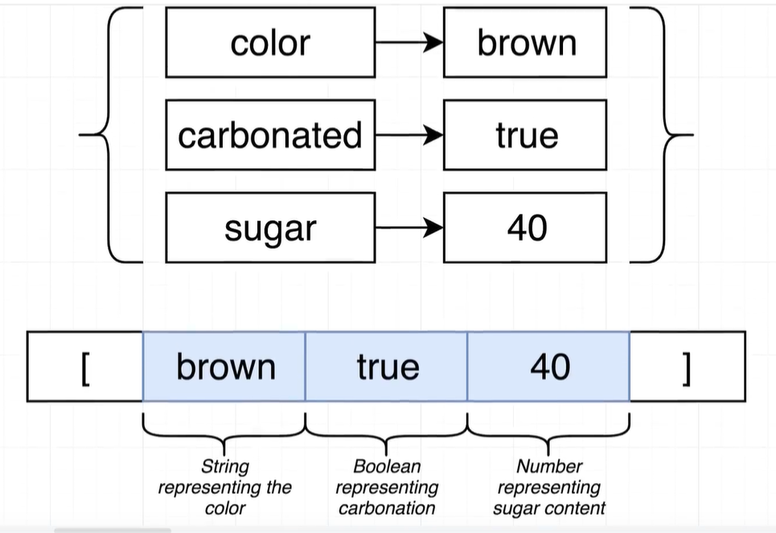

# ts新数据结构Tuple(元组)

##  Tuple类型（类似于数组，叫元组）

概念：Tuple也叫元组，可以说是一种特殊的数组，元组中，元素以固定的顺序进行排列，例如：`[number, string, boolean]`，那进入数组时，第一位只能是`number`类型，第二位只能是`stringe`类型以此类推



示例：

```tsx
const drink = {
	color: 'brown',
	carbonated: true,
	sugar: 40
};
// Type alias :类型别名儿
// 创建一个元组类型，名字叫Drink
type Drink = [string, boolean, number];

// 有一定固定顺序的数组，必须是string,boolean, number
// const pepsi: [string, boolean, number] = ['brown', true, 40];
// 配合创建的类型
const pepsi: Drink = ['brown', true, 40];

const sprite: Drink = ['clear', true, 40];

```


## 元组的一些小问题

元组在开发中实际的使用并不多，应为虽然它能够规定数组以一定的顺序存储元素，但是单单从存储的元素来推断，出它具体指定些什么，还是要付出很大的代价。

示例：

```tsx
// 元组不能直接看出元素数据到底指定的是什么
const carSpecs: [number, number] = [400, 3354];
// 而对象可以直接理解
const carStats = {
	horsepower: 400,
	weight: 3354
};

```

