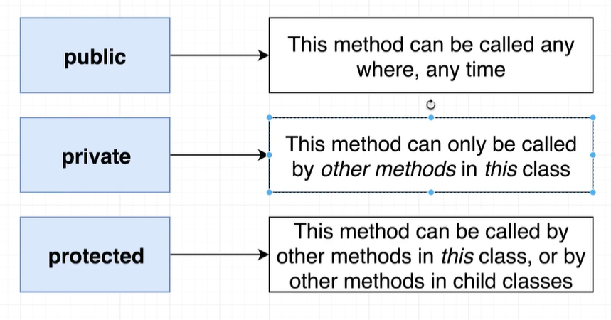
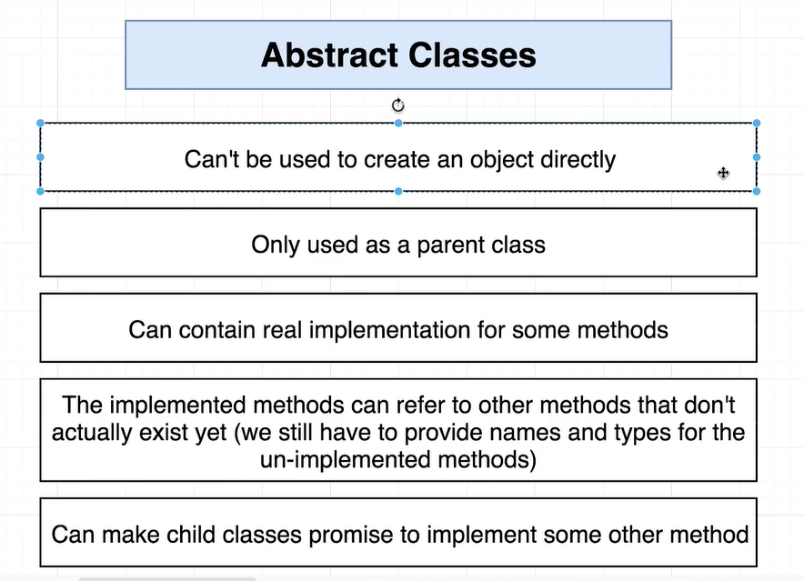
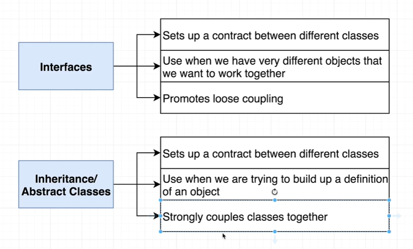

# TS中的Classes

定义：类相当我们可以把他比作是一种蓝图，我们用这个蓝图创建一个对象，该对象中附加了一些不同的字段或者方法

示例：

```tsx
class Vehicle {
	drive(): void {
		console.log('chugga chugga');
	}

	honk(): void {
		console.log('beep');
	}
}

const vehicle = new Vehicle();
vehicle.drive();
vehicle.honk();

```


## TS中定义一个简单的类

ts中的类还是和js中有不小的区别的：

示例：

```tsx
class Person {
  name: String // TS类需要在这里声明一下参数类型
  age: number

  constructor(name: string, age: number) {
    this.name = name;
    this.age = age;
  }
}


new Person('qec', 18)
```


### TS定义类时的一个小问题

就是，你在类中声明一个变量类型时，一定要使用，如果不用就会报错：

示例：

```tsx
class Person {
  name: String // TS类需要在这里声明一下参数类型
  age: number

  constructor(name: string, age: number) {
    this.name = name;
    // 像这样，虽然上面定义了age，但是构造函数中没有用，就会报错。
  }
}


new Person('qec', 18)
```

注意：检查时可能没有标出来错误，但是允许绝对会报错


解决方式：

解决方式也很简单，那就赋值呗，要么给一个初始值，要么就在constructor中赋值一下

示例：

```tsx
class Person {
  name: String // TS类需要在这里声明一下参数类型
  age: number = 0 // 解决方式一：赋初始值

  constructor(name: string, age: number) {
    this.name = name;
    // 像这样，虽然上面定义了age，但是构造函数中没有用，就会报错。
    
    // 解决方式2：赋值
    this.age = age;
  }
}


new Person('qec', 18)
```


## TS与JS中的区别

`TS`的类中有三类关键字：

注意：**这三个关键字不仅可以用于方法，也可以用在属性身上**

1. `public`：(**默认情况不写就是public**)这个方法任何时间任何地点都能被调用
2. `private`：私有的，该方法只允许自己身上的方法去调用它（**也就是只能在自己的类中调用**）
3. `protected`：被保护的，该方法只能被自己的类和自己的子类**中**调用



示例：

```tsx
class Vehicle {
	// public drive(): void {
	// 	console.log('chugga chugga');
	// }
	// 只能在Vehicle和子类Car中调用
	protected honk(): void {
		console.log('beep');
	}
}

class Car extends Vehicle {
	// 私有属性，只能在Car类中调用
	private drive(): void {
		console.log('vroom');
	}

	startDrivingProcess(): void {
		this.drive();
	}
}

const vehicle = new Vehicle();
// vehicle.honk(); // 报错protected的方法只能在Vehicle和Car中调用

const car = new Car();
car.startDrivingProcess();

```


## TS类中的属性

TS类中和JS中有一些不同，直接看代码

```tsx
class Vehicle {
	// ts中要定义出来这个属性，和js不同
	color: string
  // 注意 这里只是声明了对象类型，并没有创建出一个对象
  location: {
		lat: number;
		lng: number;
	};
	constructor(color: string) {
		this.color = color;
    
    // 给location初始化
    this.location = {
      lat: 10,
      lng: 10
    }
    // this.location.lat = 10 //报错 会说undefined不能赋值
	}

	// 只能在Vehicle和子类Car中调用
	protected honk(): void {
		console.log('beep');
	}
}

// 简化版
class Vehicle {
  // 直接加一个public
	constructor(public color: string) {}

	// 只能在Vehicle和子类Car中调用
	protected honk(): void {
		console.log('beep');
	}
}
```


## TS中的继承

`TS`中的继承基本和`JS`没啥区别，主要区别还是constructor传递参数，继承时也是必须要调用`super()`

示例：

```ts
class Vehicle {
	constructor(public color: string) {}

	// 只能在Vehicle和子类Car中调用
	protected honk(): void {
		console.log('beep');
	}
}

class Car extends Vehicle {
	/* 这里color没有添加public，因为不想在Car中重新分配字段
     就是color只属于Vehicle类
  */
	constructor(color: string, public wheels: number) {
		super(color);
	}
	private drive(): void {
		console.log('vroom');
	}

	startDrivingProcess(): void {
		this.drive();
	}
}

const vehicle = new Vehicle('orange');
// vehicle.honk(); // 报错protected的方法只能在Vehicle和Car中调用
vehicle.color;
const car = new Car('red', 4);
car.startDrivingProcess();

```


## 什么时候使用

`interfaces` + `Classes` = 一个无敌强壮且高复用的代码

他俩配合使用`interfaces`让不同的类在一起工作


# 抽象类（！！！）

关键字：`abstract`

定义：



特性：

1. 首先抽象类不能创造实例（也就是`new`不了）
2. 抽象类只能用作父类(超类)，只能别人`extents`它，我们只想让别的类使用它的方法
3. 可以包含一些方法
4. 抽象类中，我们可以实现一些暂时还没有存在的方法（唯一的要求：**我们必须写出这些方法的名称和类型**）
5. 继承抽象类的子类（也叫**派生类**），必须保证实现这些方法（第4点的方法）

注意：**派生类虽然继承了父类，但是父类身上的方法，需要自己实现（注意这条限制是，被abstract修饰过的方法和属性，普通的方法属性和普通的继承一样，都可以用）**

示例：

```tsx
abstract class Father {
  name: string
  constructor (name: string) {
    this.name = name
  }
// 这里只需要方法声明
  abstract getName(): string
	
  // 普通的方法，public默认
  setName(name:string):void {
    this.name = name
  }
}


class B extends Father {
  constructor() {
    super('qec')
  }

  // 派生类实现父类的方法
  getName(): string {
    return this.name
  }
}

// new Father() // 无法实例抽象类
  
let b =  new B()
b.setName('钱不二') // 普通的方法和属性（public修饰的）都继承过来了
console.log(b.getName())
```


示例：

我们实现了一个抽象类，这个抽象类用来进行排序(本质是冒泡排序)

功能：让数组、字符串、列表都能进进行排序

`Sorter.ts`类

```ts
// abstract创建抽象类
export abstract class Sorter {
	// 使用abstract关键字定义好方法和属性的类型
	abstract compare(leftIndex: number, rightIndex: number): boolean;
	abstract swap(leftIndex: number, rightIndex: number): void;
	abstract length: number;

	sort(): void {
		const { length } = this;
		for (let i = 0; i < length - 1; i++) {
			for (let j = 0; j < length - i - 1; j++) {
				if (this.compare(j, j + 1)) {
					this.swap(j, j + 1);
				}
			}
		}
	}
}

```


数据`NumberCollection`类文件

```ts
import { Sorter } from './Sorter';
// 子类继承Sorter类，并且必须实现Sorter中所有的方法，之后可以使用父类中的方法
export class NumberCollection extends Sorter {
	// 这样写length不太好的一点，可以被修改
	// length: number = this.data.length;

	// 利用函数加get关键字，使用时不必调用函数，并且无法修改length
	get length(): number {
		return this.data.length;
	}
	constructor(public data: number[]) {
		super();
	}

	// 交换函数
	swap(leftIndex: number, rightIndex: number): void {
		const leftHand = this.data[leftIndex];
		this.data[leftIndex] = this.data[rightIndex];
		this.data[rightIndex] = leftHand;
	}

	// 对比函数
	compare(leftIndex: number, rightIndex: number): boolean {
		return this.data[leftIndex] > this.data[rightIndex] ? true : false;
	}
}

```


数据`CharactersCollection.ts`类

```ts
import { Sorter } from './Sorter';
export class CharactersCollection extends Sorter {
	constructor(public data: string) {
		super();
	}

	get length(): number {
		return this.data.length;
	}

	// 对比
	compare(leftIndex: number, rightIndex: number): boolean {
		// 全部比较小写
		return this.data[leftIndex].toLowerCase() > this.data[rightIndex].toLowerCase();
	}

	// 交换
	swap(leftIndex: number, rightIndex: number): void {
		// 先变成数组
		const characters = this.data.split('');

		// 交换
		const leftHand = characters[leftIndex];
		characters[leftIndex] = characters[rightIndex];
		characters[rightIndex] = leftHand;

		// 再变成字符串
		this.data = characters.join('');
	}
}

```


数据`LinkedList.ts`文件

```ts
import { Sorter } from './Sorter';

class Node {
	// next默认为null
	next: Node | null = null;
	constructor(public data: number) {}
}

export class LinkedList extends Sorter {
	head: Node | null = null;
	get length(): number {
		if (!this.head) {
			return 0;
		}

		let length = 1;
		let node = this.head;
		while (node.next) {
			length++;
			node = node.next;
		}
		return length;
	}
	add(data: number): void {
		// 1.根据data创建一个新节点
		const node = new Node(data);

		// 2.如果链表为空，直接让头指针指向node
		if (this.head == null) {
			this.head = node;
		} else {
			let tail = this.head;
			// 3.如果链表不为空，不断循环找到末尾
			while (tail.next) {
				tail = tail.next;
			}
			tail.next = node;
		}
	}
	// 根据索引获取节点
	at(index: number): Node {
		if (!this.head) {
			throw new Error('Index out of bounds');
		}

		let counter = 0;
		// 手动添加一下类型注释，否则会报错
		let node: Node | null = this.head;
		while (node) {
			if (counter === index) {
				return node;
			}
			counter++;
			node = node.next;
		}
		throw new Error('Index out of bounds');
	}

	compare(leftIndex: number, rightIndex: number): boolean {
		if (!this.head) {
			throw new Error('List is empty');
		}
		return this.at(leftIndex).data > this.at(rightIndex).data;
	}

	// 交换，我们这里只简单把两个值交换了一下
	swap(leftIndex: number, rightIndex: number) {
		const lefNode = this.at(leftIndex);
		const rightNode = this.at(rightIndex);

		const leftHand = lefNode.data;
		lefNode.data = rightNode.data;
		rightNode.data = leftHand;
	}

	print(): void {
		if (!this.head) {
			return;
		}
		let node: Node | null = this.head;
		while (node) {
			console.log(node.data);
			node = node.next;
		}
	}
}

```


最后`index.ts`中使用

```ts
import { NumberCollection } from './NumberCollection';
import { CharactersCollection } from './CharactersCollection';
import { LinkedList } from './LinkedList';
// 数组
const numbersCollection = new NumberCollection([1, -5, -3, 0, 20, 10]);
// 字符串
const charactersCollection = new CharactersCollection('gFAdbce');
// 链表
let linkedList = new LinkedList();
numbersCollection.sort();
charactersCollection.sort();

// 链表
linkedList.add(3);
linkedList.add(2);
linkedList.add(1);
linkedList.sort();
linkedList.print();

console.log(numbersCollection.data);
console.log(charactersCollection.data);

```


## 使用抽象类和使用interface之间的区别



interface：怎么说呢，类之间的耦合性就很低，欸你知道吧，即使没有interface都是能工作的，

abstract class呢：就耦合性较高，它与子类的耦合性很高，


# 静态类

静态类，指一个类中的一些属性用了static关键字来修饰，如果要访问是通过类名来进行访问的，这一点和**JS中的ES6中的static一模一样**

核心：static关键字修饰的方法和属性，它们是放在当前**类**上的，而constructor中的都是放在**类的实例**身上，所以它们之间的属性和方法，是互相访问不到的


示例：

```tsx
class Person {
  public name: String // TS类需要在这里声明一下参数类型
  private age: number
  protected sub: boolean
  public smile(): string
  static qec: string // 一个静态属性

  constructor(name: string, age: number, sub:boolean) {
    this.name = name;
    this.age = age;
    this.sub = sub
  }
  public smile() {
    return '笑'
  }

  static run () {
    this.qec
    this.name // 这里是无法访问name的，应为name是在实例身上
    return '跑';
  }

  static eat() {
    this.run() // 静态方法可以互相访问，因为都放在Person类上

    this.smile() //访问不到实例方法
    return '吃'
  }
}


class Man extends Person {
  constructor() {
    super('qec', 22, false);
    this.sub// protected子类和自己中可以使用
  }
}

let p = new Person('qec', 18, true);

Person.qec // 获取静态属性
Person.run() //调用静态方法
```


# 类和interface结合起来

类和interface结合起来使用，需要用一个关键字`implements`，来让interface来约束类


示例：

```tsx
interface A {
  run(type: boolean): boolean
}

interface B {
  set(): void
}

// 利用接口约束类的内容
class Alphabet implements A {
  run(type: boolean): boolean {
    return type
  }
}


// 如果要多个接口,用逗号跟在后面
class letter implements A, B {
  run(type: boolean): boolean {
    return type;
  }

  set(): void {
    console.log('我是set函数')
  }
}

```


## 继承和interface一起使用

继承和接口约束可以一起使用，把extends关键在放在implements关键字前面：

示例：

```tsx
interface A {
  run(type: boolean): boolean
}

interface B {
  set(): void
}

// 利用接口约束类的内容
class Alphabet implements A {
  run(type: boolean): boolean {
    return type
  }
  
  smile():void {
    console.log('笑')
  }
}


// 继承
class letter extends Alphabet implements A, B {
  run(type: boolean): boolean {
    return type;
  }

  set(): void {
    console.log('我是set函数')
  }
}

```

