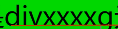
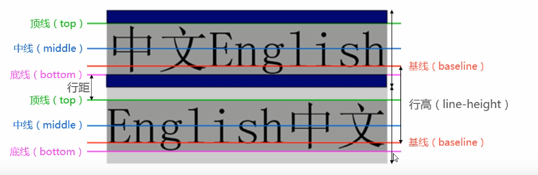

# CSS文本相关属性

## 单位问题

* px(像素): 将像素的值赋予你的文本。这是一个绝对单位， 它导致了在任何情况下，页面上的文本所计算出来的像素值都是一样的。
* em: 1em等于我们设计当前元素的父元素上设计的大小。
* rem：这个单位依赖于根元素HTML标签下的字体大小。

`rem` 不支持 Internet Explorer 8 和以下的版本。


## 一些文本公式

行间距用line-height：设置

line-height 减去 行间距 = 字体大小

所以有字体大小，行间距 就可以设置line-height

所以说设置行间距时 设置下line-height即可


## CSS属性

### **text-decoration**：设置文本装饰线

* none 无装饰线
* overline 上划线
* underline 下划线
* line-through 中划线（删除线）


### text-overflow：设置超出文本的显示效果

* clip: 此值为默认值，标识阶段，超出的文本会被直接截断。例如配合overflow: hidden；如果超出了就只会显示半截文本。
* ellipsis: 此值为用一个省略号`...`替代超出部分。这个省略号被添加在内容区域中，因此会减少显示的文本。如果空间太小到连省略号都容纳不下，那么这个省略号也会被截断。
* string: 用来表示被截断的文本。字符串内容将被添加在内容区域中，所以会减少显示出的文本。如果空间太小到连省略号都容纳不下，那么这个字符串也会被截断。

如果只是单行文本溢出变为省略号，这几个属性混合使用即可

```css
overflow: hidden;
text-overflow: ellipsis;
white-space: nowrap;//规定段落中的文本不进行换行操作
```

多行再webkit内核浏览器中可以得到比较满意的效果，下面代码指定了显示2行，多余2行的部分显示为省略号。

```css
overflow: hidden;
text-overflow: ellipsis;
display: -webkit-box;
-webkit-box-orient: vertical;
-webkit-line-clamp: 2;
```


### text-shadow

**使用时请查文档**，适用于给文字添加阴影

```css
text-shadow: 4px 4px 5px red;
```

这4个属性值如下：box-shadow的值也是这4个

1. **阴影与原始文本的水平偏移**，可以使用大多数的 CSS 单位 [length and size units](https://developer.mozilla.org/en-US/docs/Learn/CSS/Building_blocks/Values_and_units#length_and_size), 但是 px 是比较合适的。这个值必须指定。
2. **阴影与原始文本的垂直偏移**;效果基本上就像水平偏移，除了它向上/向下移动阴影，而不是左/右。这个值必须指定。
3. **模糊半径** - 更高的值意味着阴影分散得更广泛。如果不包含此值，则默认为0，这意味着没有模糊。可以使用大多数的 CSS 单位 [length and size units](https://developer.mozilla.org/en-US/docs/Learn/CSS/Building_blocks/Values_and_units#length_and_size).
4. 阴影的基础颜色，可以使用大多数的 CSS 颜色单位 [CSS color unit](https://developer.mozilla.org/en-US/docs/Learn/CSS/Building_blocks/Values_and_units#colors). 如果没有指定，默认为 `black`.

text-shadow同样适合::first-line和::first-letter（伪元素）


### **text-transform**：设置文字大小写转换

* capitalize：将每个单词首字母变为大写
* uppercase：将所有单词字符转变为大写
* lowercase：将所有单词字符转变为小写
* none：无影响

### **text-indent** ：设置第一行文章缩进


### **word-break**：用来设置单词的断行模式

可以使一个完整的单词进行换行操作（达到范围最大时换行）

```css
word-break: normal;//默认不打断行

word-break: break-all; //断行

//还有别的，别的属性mdn查
```


### white-space:  用来设置如何处理空白符的

```css
white-space: normal;//连续的空白符会被合并，换行符会被当作空白符来处理

white-space: nowrap;//和 normal 一样，连续的空白符会被合并。但文本内的换行无效

white-spacd: pre;//连续的空白符会被保留。在遇到换行符或者<br>元素时才会换行。
```


## 文本布局


### **text-align**：可以设置元素**内容**在元素中的水平对齐方式

注意：只要一个元素时行内元素，都可以通过这个属性让他居中

**让行内元素居中，`text-align`一般设置在行内元素的父元素上**

当想要垂直居中时将**line-height**属性等于height高度就可以

* left：左对齐
* right：右对齐
* center：正中间显示
* justify：两端对齐（对最后一行不起效果，只有一行也是不其效果）如果想要其效果需要加上 text-align-last:justify;

---


### **line-height**：设置文本的最小行高

行高的严格定义：两行文字基线（baseline）之间的距离，字母x最底部对齐一条线叫基线。



行高=行距+文字高度



height和line-height的区别：

* height：元素整体的高度
* line-height：元素每行文字所占据的高度


### **letter-spacing**：设置字母之间间距

`letter-spacing: 2px;`

### **word-spacing**：设置单词之间间距

`word-spacing: 2px`

### writing-mode：设置文字排布

属性定义了文本水平或垂直排布以及在块级元素中文本的行进方向

```
/* 关键值 */
writing-mode: horizontal-tb;
writing-mode: vertical-rl;
writing-mode: vertical-lr;

/* 全局值 */
writing-mode: inherit;
writing-mode: initial;
writing-mode: unset;
```

值：

**horizontal-tb:**

对于左对齐(ltr)脚本，内容从左到右水平流动。对于右对齐(rtr)脚本，内容从右到左水平流动。下一水平行位于上一行下方。

**vertical-rl:**

对于左对齐(ltr)脚本，内容从上到下垂直流动，下一垂直行位于上一行左侧。对于右对齐(rtr)脚本，内容从下到上垂直流动，下一垂直行位于上一行右侧。

**vertical-rl**

对于左对齐(ltr)脚本，内容从上到下垂直流动，下一垂直行位于上一行右侧。对于右对齐(rtr)脚本，内容从下到上垂直流动，下一垂直行位于上一行左侧。

**sideways-rl**

对于左对齐(ltr)脚本，内容从下到上垂直流动。对于右对齐(rtr)脚本，内容从上到下垂直流动。所有字形（即使是垂直脚本中的字形）都朝向右侧。

**sideways-lr**

对于左对齐(ltr)脚本，内容从上到下垂直流动。对于右对齐(rtr)脚本，内容从下到上垂直流动。所有字形（即使是垂直脚本中的字形）都朝向左侧。


## 文本字体设置

### **font-size**：设置字符大小（重点是单位问题px，rem，em）


### **font-family**：设置字体名称（）一般情况英文字体只适合英文，中文字体中文英文都适用。

如果在开发中，希望中英文使用不同字体，**建议**：将英文字体写到前面，将中文字体写到后面。

font-family:'字体名1','字体名2','字体名3';   这样可以设置多个字体，当第一个不能使用时向后推动，从左往右顺序选择字体，直到找到可用字体。（目的：是为了防止操作系统中没有这种字体名称）

#### Web字体(很重要)

首先，在CSS的开始处设置一个`@font-face`块儿，它指定要下载的字体。

```css
@font-face {
  font-family: "myFont";//字符串中不能有空格
  src: url("myFont.ttf");
}
```

之后你就可以使用@font-face中指定的字体种类名称来将你的定制字体应用到你喜欢的任何东西上

```css
html {
  font-family: "myFont", "Bitstream Vera Serif", serif;
  //浏览器会以此匹配这些字体，例如：第一个不能用，就用第二个，以此类推，直到默认字体
}
```

关于网页字体有两件重要的事情要记住：(来自MDN)

1. 浏览器支持不同的字体格式，因此您需要多种字体格式以获得良好的跨浏览器支持。例如,大多数现代浏览器都支持WOFF / WOFF2(Web Open Font Format versions 1 and 2，Web开放字体格式版本1和2)，它是最有效的格式，但是旧版本IE只支持EOT (Embedded Open Type，嵌入式开放类型)的字体,你可能需要包括一个SVG版本的字体支持旧版本的iPhone和Android浏览器。我们将向您展示如何生成所需的代码。
2. 字体一般都不能自由使用。您必须为他们付费，或者遵循其他许可条件，比如在代码中(或者在您的站点上)提供字体创建者。你不应该在没有适当的授权的情况下偷窃字体。


### font-varient可以设定小型大写字母。

```
font-variant:small-caps;
```


### **font-weight**：用于设置文字的粗细。值：100~900

* normal：等于400
* bold：等于700

strong，h，b元素默认都是bold

### **font-style**：用于设置文字的常规、斜体显示

* italic：斜体（前提是font-family字体是支持斜体）
* oblique：让文字倾斜体
* normal：常规


### **font**缩写属性：`font:font-style font-variant font-weigh font-size/line-height font-family` 

* 前三个属性顺序可以随意调整也可省略

* /line-height可以省略，若不省略必须跟在font-size后面 即font-size/

* font-size、font-family不可以调换顺序，不可省略

  

