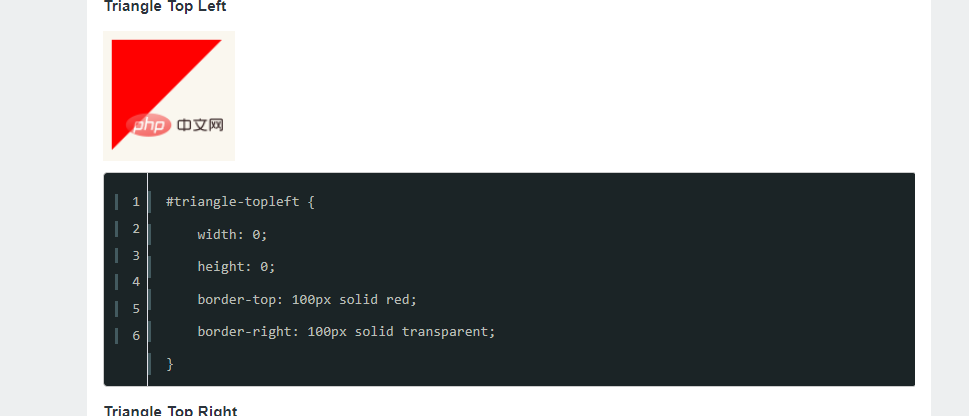

# CSS画三角形

直接上代码：

HTML:

```HMTL
 <div></div>
```

CSS:

```css
   div {
      height: 0;
      width: 0;
      border: 100px solid transparent;
      border-bottom-color: black;

      /* 方向随意挑 */
      /* border-top-color: black;
      border-left-color: black;
      border-right-color: black; */
    }
```


其他方向的三角形：



