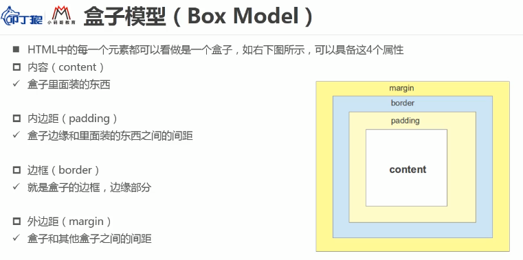
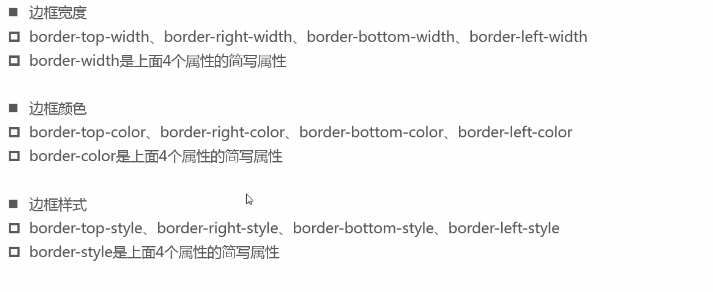
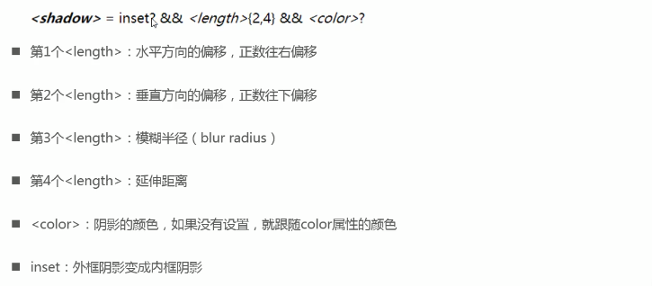

# CSS的盒子模型



## 内容相关属性

宽度相关：

1. width：设置内容宽度
2. min-width：设置最小宽度
3. max-width：设置最大宽度

高度相关：

1. height：设置高度
2. min-height：设置最小高度
3. max-height：设置最大高度

## 盒子内边距两种写法（padding）

属性padding：按照顺时针顺序选择top、right、bottom、left

格式：`padding:top right bottom left;`

**当取两个值时是上和下、左和右**（下跟随上、做跟随右）

格式：`paddding:上下 左右;`

## 盒子外边距（margin）

**外边距写法规则和内边距相同**

**上下margin折叠**：垂直方向上相邻的两个margin（margin-top和margin-bottom）有可能会合并成一个margin，若两个值不相同则取较大的那一个

防止折叠方法：

1. 只设置1个元素的margin

**注意**：外边距会触发折叠效果并且折叠只针对上下


**上下margin传递**：如果块级元素的顶部线和父元素的顶部线重叠，那么这个块级元素的margin-top值会传递给父元素，如果使底部线重叠并且父元素高度为**auto**则margin-bottom会传递给父元素（一般都是用上传递）

防止传递的方法：

1. 给父元素设置上或下的padding
2. 给父元素设置border
3. 触发BFC：设置overflow为非visible

## 边框相关属性(border)

说到border就要出现另一个人

### outline属性

文字的轮廓 (**轮廓有点像边框，唯一的区别是边框占用了盒模型的空间，而轮廓没有； 它只是设置在背景图片的顶部**)


### border-radius简写属性

border-radius是简写属性

```
border-top-left-radius: 10% 15%;
//第一个水平半径，第二个垂直半径
border-top-right-radius:
border-bottom-right-radius:
border-bottom-left-radius:
```

一、没有斜杠的情况下

```
border-radius: 10px; 
//同时设置四个角的水平半径和垂直半径
```

```
border-radius: 10px 10px 15px 15px;
//左上10，右上10，右下15，左下15
```


```
border-radius: 10px 10px 15px;

// 左上10，右上10，右下15，左下10
```


二、有斜杠的情况下

如果在斜杠之前和之后都给出了值，那么斜杠之前的值设置水平半径，斜杠之后的值设置垂直半径。

```
border-radius: 10px/20px;
```


 border-radius 简写设置所有四个 border-*-radius 属性。如果在斜杠之前和之后都给出了值，那么斜杠之前的值设置水平半径，斜杠之后的值设置垂直半径。如果没有斜杠，则两个值相等地设置半径。每个半径的四个值按左上、右上、右下、左下的顺序给出。如果左下角省略了，它就和右上角一样。如果省略了右下角，它与左上角是一样的。如果省略了右上角，它与左上角是一样的。

例如

```
border-radius: 10% / 10% 15% 13%;
// 先补全 得
 border-radius: 10% 10% 10% 10%/ 10% 15% 13% 15%;
// 所以转换为非简写属性如下
border-top-left-radius: 10% 10%;
border-top-right-radius: 10% 15%;
border-bottom-right-radius: 10% 13%;
border-bottom-left-radius: 10% 15%;
```


1边框宽度 2边框颜色 3边框样式



缩写写法：`border:宽度 样式 颜色;`(不区分顺序)


## CSS属性 box-shadow

box-shadow属性可以设置一个或多个阴影



## CSS属性 box-sizing

box-sizing用来设置盒子模型中宽高的行为

box-sizing的相关内容：

* content-box：padding、border都是布置在width、height**外边**

  content-box就是内容宽高固定不变，padding和border都必须在内容的外面

  

* border-box：padding、border都是布置在width、height**里边**

  border-box是边框固定，也就是border定死不动，加上padding只能缩小内容

