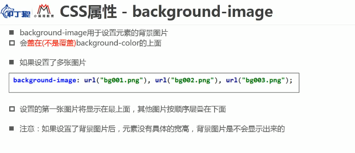
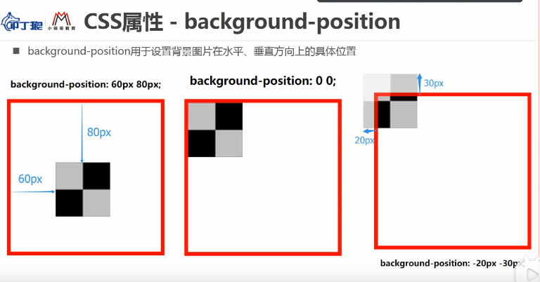
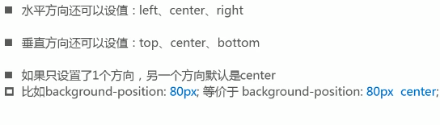
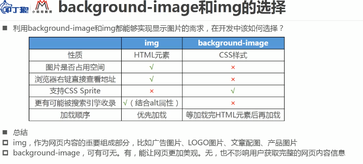

# CSS背景属性background

#### background-color

设置背景颜色

#### background-image：设置背景图片

background-image：设置背景图片

* 此设置会盖在背景颜色上面（2层图层）

#### background-repeat：设置图片的平铺效果

background-repeat：设置图片的平铺效果

* repeat-x：按x轴平铺即水平平铺
* repeat-y：按y轴平铺即垂直平铺
* no-repeat：不平铺

#### background-size：设置背景图片大小默认为auto

* auto：默认值指图片原大小
* cover：覆盖全部大小（是拉伸而不是等比例扩大）
* contain：对背景图片进行拉伸，到宽或高最大值停止拉伸，依然保持背景图片宽高比
* 还可以写百分比：第一个百分比对应宽度，第二个对应高度`background-size:30% 80%;`
* 还可以直接写数值：`background-size:300px 300px`

#### background-position：用于设置背景图片在水平、垂直方向上的具体位置(配合精灵图使用)

#### CSS属性 background-attachment

background-attachment属性的三个值：

* scroll：指图片会根据浏览器滚动条一起滚动
* local：指图片会和图片上的内容一起滚动
* fixed：背景固定，不会随着浏览器滚动

#### CSS sprite

将多个小图片和成一个图片中，再通过css定位技术来引用各个小图片

有人叫：css雪碧、css精灵

优势：减少网页http请求，加快网页响应速度，减轻服务器压力，减少图片总大小

#### background属性的缩写

background是一系列背景相关属性的缩写，常用格式：

background:image position/size repeat attachment color

background-size可以省略，否则必须跟在position后，其他可以随便省略顺序任意

#### CSS background-image属性和image元素的选择

## img 标签

图片和文字是一致的都是基线对齐，所以当设置图片时可以给图片设置vertical-align: bottom;等 

