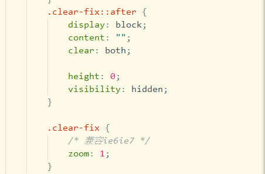
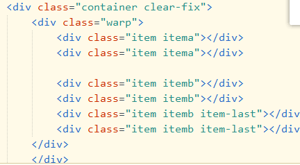
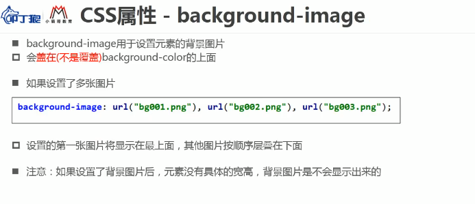
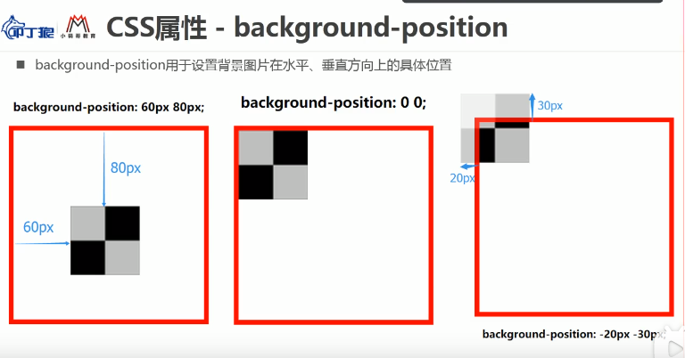
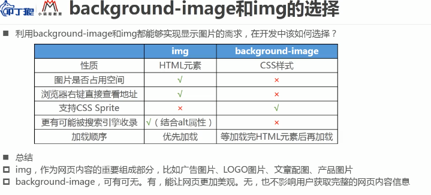

# CSS（Cascading Style Sheets）层叠样式表

css的作用：可以给网页的每一个元素设置样式，让网页更加精美。

css的三种样式应用到元素上：

* 内联样式（inline style）写到body元素中的style属性
* 文档样式表（document style sheet）写到head元素中的style元素中
* 外部样式表（external style sheet）写到css文件中之后链接使用

### 外部样式表

外部样式表可以通过link元素进行引入`<link href="url" />`

也可以通过style元素的@import引入

**当通过link元素引入多个css文件时下面的css文件会层叠上面的css文件**


### @improt url("");（较为重要）

@import url(""); 可以在css文件中引入其他css文件

@import缺点是速度没有link快


### 引入小图标

```html
    <!-- 设置网站的图标（在标题栏和收藏栏中显示） -->
    <link rel="icon" href="./favicon.ico">
```

favicon.ico一般这个小图片就放在更目录下

## CSS特性

### 继承

css中有些属性是可继承的：一个元素如果没有设置某属性的值，就会跟随父元素的值

当遇到不能继承的属性，可以使用inherit值强制继承 `img {width:inherit;}` 

**继承注意点**：css继承的是计算值，而不是初始编码的最初值


### 层叠(选择器优先级)

css中允许多个相同名字的属性层叠到同一个元素上，最后结果就是:只有一个css属性会生效

1 相同选择器时，后面的会将前面的层叠掉

2 当选择器不同是，按照权重层叠

按经验来看(方便记忆)权重:

* !important：10000
* 内联样式：1000
* id：100
* 属性选择器，伪类，class：10
* 元素，伪元素：1

## css选择器

* 通用选择器
* 元素选择器
* 类选择器
* id选择器
* 组合选择器
* 属性选择器
* 伪类
* 伪元素

### 通用选择器

选择所有的元素：

`* {属性名: 属性值;}`

一般用于设置通用设置

### 类选择器(很重要)

`.class {...}` 可以很好的给样式进行分类和使用。

**强调！**：一个元素可以有多个类，每个类通过空格进行分隔，不要用标签名作为类名。

例：`<div class="box1 box2 box3 ...">div内容</div>`

类名规范：

1. 尽量见名知意
2. 当多个单词时候使用的连接方式：
   1. 用中划线 -  例：font-size
   2. 用下划线_ 例：font_size
   3. 驼峰法 例：fontSize(使用较少)

### id选择器

格式 `#id {属性名:属性值;...}`

**强调！**：id名称在同一个页面不要重复。

id名规范与类名规范一致。


### 属性选择器(较少)

格式`[属性名] { : ;}`

```css
/* 存在title属性的<a> 元素 */
a[title] {
  color: purple;
}

/* 存在href属性并且属性值匹配"https://example.org"的<a> 元素 */
a[href="https://example.org"] {
  color: green;
}

/* 存在href属性并且属性值包含"example"的<a> 元素 */
a[href*="example"] {
  font-size: 2em;
}

/* 存在href属性并且属性值结尾是".org"的<a> 元素 */
a[href$=".org"] {
  font-style: italic;
}

/* 存在class属性并且属性值包含以空格分隔的"logo"的<a>元素 */
a[class~="logo"] {
  padding: 2px;
}
```

### 后代选择器

格式 `标签 标签... {属性名:属性值;...}`   标签可以是id可以是类等等

例：div span{属性名:属性值;}表示修改div下面的**所有**span的样式（直接或间接子类都可以）

### 子选择器

格式 `标签>标签 {属性名:属性值;...} `   标签可以是id可以是类等等

例：div>span {}表示div元素里面的直接span子元素（**间接子元素不算**）

### 兄弟选择器

#### 相邻兄弟选择器

格式`标签1+标签2 {属性名:属性值;...}`

是同一个父元素时的元素才使用，并且这两个标签时相邻的。

**还要记住这个选择器，只选中第二标签，不管第一个标签的。**

```
<body>
<h1>This is a heading.</h1>
<p>This is paragraph1.</p>  -->这个p会变为红色
<p>This is paragraph2.</p>
<p>This is paragraph3.</p>
<p>This is paragraph4.</p>
<p>This is paragraph5.</p>
</body>

选中h1 后面紧贴着的p
h1 + p {
  color: red;
}
```

#### 通用兄弟选择器

格式`标签1~标签2 {属性名:属性值;...}`

同一个父元素，并且选择后续所有兄弟元素（可以不相邻）

```
<body>
<h1>This is a heading.</h1>
<p>This is paragraph1.</p>     //所有的p都会变红
<p>This is paragraph2.</p>
<p>This is paragraph3.</p>
<p>This is paragraph4.</p>
<p>This is paragraph5.</p>
</body>

选中h1 后面紧贴着的p
h1 ~ p {
  color: red;//选中h1的兄弟且p元素
}
```


### 交集选择器（重要）

格式 `标签标签 {: ;...}` 标签与标签之间没空格

例 div.one {} 要求通势符合2个条件的元素：div元素和class值有one


### 并集选择器（重要）

格式 `标签,标签 {: ;...}`  标签与标签之间用逗号，分隔

例：div, .one {} 表示所有div，class="one"的元素


### 浮动float（重要很重要非常重要）

浮动曾经最初始的工作是做图文环绕的。

绝对定位和浮动都会让元素脱离标准流，以达到灵活布局地效果

float能让元素产生浮动效果，float常用取值

* none：无
* left：向左浮动
* right：向右浮动


**浮动规则一：**

* 元素一单浮动后
  * 脱离标准流
  * 朝着向左或者向右移动，知道直到自己的边界，紧贴着包含块（一般是父元素）或者其他浮动元素的边界为止
  * 定位元素会层叠在浮动元素上面


**浮动规则二：**

* 浮动元素不能与行内级内容层叠，行内及内容将会被浮动元素推出

  比如行内级元素、inline-block元素、块级元素的文字内容

**浮动规则三**

* 行内级元素、inline-block元素浮动后，其顶部将于所在行的顶部对齐

**浮动规则四**

* 向左或向右不能超出包含块（父元素）的边界

**浮动规则五**

* 浮动元素之间不能层叠

* 如果一个元素浮动，另一个浮动元素已经在那个位置了，后浮动的元素将紧贴着前一个浮动元素（左浮找左浮，右浮找右浮）

* 如果水平方向剩余的空间不够显示浮动元素，浮动元素将向下移动，知道有充足的空间为止

**浮动规则六**

* 浮动元素的顶端不能超过包含块的顶端，也不能超过**之前**所有浮动元素的顶端

一个浮动的问题：在进行布局时同一行多个item（元素块儿）拜访后，设置margin-right让他们之间产生间距，最后一个元素块的margin-right总是会多出来

**解决办法**：

1. 总是给最后一个元素块加一个类，然后设置该类的margin-right为0（操作过于麻烦）
2. 通过伪类选择器选中最后一个元素块（容易出现兼容性问题）
3. **给内容扩充一下大小，给最后一个有一部分空间（最优解决办法）**

解决办法三前提：首先内容.container固定宽度>.wrap设置负margin > item（元素块）

其中.container包含.warp,.warp包含元素块item

### 清除浮动

**浮动出现的问题**：元素一旦被浮动就会变成脱标元素，不再向父元素汇报高度，父元素在计算总高度时，就不会计算浮动子元素的高度，导致了高度坍塌问题，解决此问题的过程一般称为（**清理浮动、清除浮动**）

清除浮动的目的：使父元素计算高度时，把浮动元素计算在内

#### 清除浮动的方法一：

配合伪元素::after生成一个类选择器，在需要清除浮动的包含块中加入该类

怎加类选择器：

在需要的包含块中加如该类：


#### 清除浮动方法二：

```
.news {
  background-color: gray;
  border: solid 1px black;
  }

.news img {
  float: left;
  }

.news p {
  float: right;
  }

.clear {
  clear: both;
  }

<div class="news">

<p>some text</p>
<div class="clear"></div>
</div>

```

就是在容器底部添加一个高度宽度都为0的元素，然后给他清除浮动。


### CSS属性-clear

clear的常用取值：

* left：要求元素的顶部低于之前生成的所有**左浮动元素**的底部
* right：要求元素的顶部低于之前生成的所有**右浮动元素**的底部
* both：要求元素顶部低于之前生成**所有浮动元素**的底部

## CSS常见属性

**color**： 设置前景色

**background-color**： 设置背景色

**font-size** ：设置文字大小

**width/height**：设置宽度和高度


### CSS中的display属性（很重要）

* block：让元素显示为块级元素
* inline：让元素显示为行内级元素
* none：隐藏元素（元素将不在占据空间）
* inline-block：让元素同时具备块级元素和行内级元素的特点
  * 可以和其他内容同一行显示
  * 可以设置高度和宽度


### CSS 的属性visibility

* visible 显示元素
* hidden 隐藏元素

visibility中的hidden隐藏但是原来元素任然占据原来位置


### CSS 的overflow属性

* visible：溢出的内容任然可见
* hidden：超出部分被隐藏

```
overflow: hidden visible
// 第一个是设置的x轴，第二个设置的是y轴
```


* scroll：超出部分会隐藏，但可以通过滚动条查看

```
// x轴，y轴都隐藏并添加滚动条。
overflow: scroll;

// 添加y轴的滚动条
overflow-y: scroll;

// 添加x轴的滚动条
overflow-y: scroll;
```


* auto：有超出就通过滚动查看，无超出不操作(浏览器来判断是否加滚动条)


注意：如果使用了overflow: scroll, 或者overflow: auto会开启BFC（块级格式化上下文）


### 设置颜色

1. 单词 例：red，blue，green等
2. rgb颜色 `rgb(0,0,0)`里面是红、绿、蓝三种数值0~255 
3. rgba颜色`rgba(red,green,blue,alpha)` alpha值是0.0~1.0指透明度
4. 0~255用16进制表示就是0~FF，所以可以用16进制表示颜色`#FFFFFF` 没两位表示r，g，b（较为重要）


### 文本属性

**text-decoration**：设置文本装饰线

* none 无装饰线

* overline 上划线

* underline 下划线

* line-through 中划线（删除线）

  

**letter-spacing**：设置字母之间间距

**word-spacing**：设置单词之间间距


**text-transform**：设置文字大小写转换

* capitalize：将每个单词首字母变为大写
* uppercase：将所有单词字符转变为大写
* lowercase：将所有单词字符转变为小写
* none：无影响

**text-indent** ：设置第一行文章缩进

**word-break**：可以使一个完整的单词进行换行操作（达到范围最大时换行）

**text-align**：可以设置元素**内容**在元素中的水平对齐方式

当想要垂直居中时将**line-height**属性等于height高度就可以

* left：左对齐
* right：右对齐
* center：正中间显示
* justify：两端对齐（对最后一行不起效果，只有一行也是不其效果）如果想要其效果需要加上 text-align-last:justify;

**font-size**：设置字符大小（重点是单位问题px，rem，em）


**font-family**：设置字体名称（）一般情况英文字体只适合英文，中文字体中文英文都适用。

如果在开发中，希望中英文使用不同字体，**建议**：将英文字体写到前面，将中文字体写到后面。

font-family:'字体名1','字体名2','字体名3';   这样可以设置多个字体，当第一个不能使用时向后推动，从左往右顺序选择字体，直到找到可用字体。（目的：是为了防止操作系统中没有这种字体名称）


**font-weight**：用于设置文字的粗细。值：100~900

* normal：等于400
* bold：等于700

strong，h，b元素默认都是bold

**font-style**：用于设置文字的常规、斜体显示

* italic：斜体（前提是font-family字体是支持斜体）
* oblique：让文字倾斜体
* normal：常规


**line-height**：设置文本的最小行高

行高的严格定义：两行文字基线（baseline）之间的距离，字母x最底部对齐一条线叫基线。


行高=行距+文字高度


height和line-height的区别：

* height：元素整体的高度
* line-height：元素每行文字所占据的高度


**font**缩写属性：`font:font-style font-variant font-weigh font-size/line-height font-family` 

* 前三个属性顺序可以随意调整也可省略

* /line-height可以省略，若不省略必须跟在font-size后面 即font-size/

* font-size、font-family不可以调换顺序，不可省略

  

### 表单相关的属性

#### label标签

利用label可以将输入框前面的文字与输入框绑定起来，当点击文字时，输入框也能获取焦点

```html
<label for="demo">账号：</label>
<input type="text" id="demo">
```

#### 单选中(radio)的name

单选按钮一次只能选择一个，可以利用input中的name属性实现，将要单选的按钮中的name分为同一组即可

```html
性别：
男<input type="radio" name="sex">
女<input type="radio" name="sex">
```


### 列表相关的css属性

4个css相关属性：list-style-type、list-style-image、list-style-position、list-style

list-style-type：设置li元素前面标记的样式

* disc（实心圆）
* circle（空心圆）
* square（方块）
* decimal（数字）
* none（无）

list-style-image：可以设置li元素前面的图片（使用很少）


list-style-position：设置前面的原点是否属于内容

两个值：

* outside不属于
* inside属于

list-style：缩写属性

### 设置圆角(border-?-?-radius)

设置圆角的属性:（单独设置）

缩写：`border-radius:6px;`(指四个角都是6px)


### CSS属性 position（非常究极重要）

利用position可以对元素进行定位，常用取值有4个：

* static：静态定位（默认值）

  * 元素按照normal flow布局
  * left、right、top、bottom都没有效果

* relative：相对定位

  * 相对于当前位置定位

    

* absolute：绝对定位

  * 元素脱离normal flow（脱标）
  * **一层一层往上找父元素，一直找到一个父元素的position是非static时相对于这个父元素定位，若都没有则相对于视口**（很重要）
  * **大多数情况下采取：子绝父相（子元素为absolute父元素为relative）**
  * 图片想要处于居中位置可以先移动图片的一半再往回移动父元素的50%

* fixed：固定定位

  * 元素会脱离normal flow（不会占空间了）（脱标）
  * 能够通过left、right、top、bottom进行定位
  * 相对于视口（网页能看到的），并且不会根据浏览器的滚动条滚动

**脱标元素的特点：**

1. 可以设置宽度和高度
2. 宽高默认由内容决定
3. 不再受标准流约束
4. 不再给父元素汇报高度数据（可以说成不占原来位置了）


### 绝对定位技巧

绝对定位元素：position值为absolute或fixed的元素

对绝对定位元素来说：

​	**定位参照对象的宽度=left+ margin-left +right+ margin-right +内容实际宽度**

​	**定位参照对象的高度=top+ margin-top +bottom+ margin-bottom +内容实际高度**


垂直居中：top：0；bottom：0；margin：auto 0；

水平居中：left：0；right：0；margin：0 auto；


### 元素的层叠


### CSS属性-transform

css transform属性允许你旋转，缩放，倾斜或者平移给定元素

常见的函数transform function：

* translate(x,y)：平移
* scale(x,y)：缩放
* rotate(deg)：旋转
* skew(deg,deg)：倾斜

**平移translate(x,y)函数：**

* 值个数：
  * 一个值x，设置x轴上的位移
  * 两个值x，y，设置x轴和y轴上的位移

* 值类型：
  * 数字：100px
  * 百分比：擦按照元素本身

**缩放scale(x,y)函数：**

* 值个数：
  * 一个值x，设置x轴和y轴相同的缩放
  * 二个值x，y，设置x轴的缩放和y轴上的缩放

* 值类型：
  * 数字：1：保持不变 2：放大一倍 0.5：缩小1倍
  * 不支持百分比


**旋转rotate(deg)函数**：rotate（45deg）；

* 值个数：
  * 一个值表示旋转角度

* 值类型：
  * deg：旋转角度
  * 正数为顺时针
  * 负数为你是在

**旋转角度受到transform-orgin影响**


**倾斜skew(x,y)函数：**

* 值个数：
  * 一个值时，表示x轴上的倾斜
  * 两个值时，表示x轴和y轴上的倾斜

* 值类型：

  * deg：倾斜角度

    

### CSS属性transform-orgin

transform-orgin：设置变形的原点

* 一个值：设置x轴的原点
* 两个值：设置x轴和y轴的原点
* 必须是<length>,<percentage>,或者left，center，right，top，bottom关键字中的一个
  * length：从左上角开始计算
  * 百分比：参考元素本身大小


### CSS 属性transition过渡动画属性

transition css属性是transition-property，transition-duration，transition-timing-function和transition-delay的一个简写属性。

**transition-property：**指定应用过渡属性的名称

* 可以写all表示所有可动画属性
* 属性是否支持查mdn

**transition-duration**：指定过渡动画所需要的时间

* 单位可以时秒(s)或者毫秒(ms)

**transition-timing-function**：指定动画的变化曲线

* [transition-timing-function - CSS（层叠样式表） | MDN (mozilla.org)](https://developer.mozilla.org/zh-CN/docs/Web/CSS/transition-timing-function)

**transition-delay**：指定过渡动画执行之前的等待时间


### CSS属性vertical-align

vertical-align会影响**行内级元素**在一个**行盒**中垂直方向的位置

vertical-align默认值：baseline（基线）

baseline：

* 文本的baseline时字符x的下方
* inline-block默认的baseline时margin-bottom的底部（没有就是盒子底部）
* inline-block有文本时，baseline时最后一行文本的x的下方

**vertical-align的取值**：

* baseline(默认值)：基线对齐
* top：把行内级盒子的顶部跟line boxes顶部对齐
* middle


### CSS属性 z-index

z-index属性用来设置定位元素的层叠顺序（只针对定位元素）

取值可以时正整数、负整数、0

**比较规则**：


### CSS属性outline

outline表示元素的快轮廓 优势：不占用空间

outline相关属性：

* outline-width
* outline-style：样式和border一样如solid等
* outline-color
* 缩写属性outline:width style color;


### CSS属性text-shadow

**使用时请查文档**，适用于给文字添加阴影

text-shadow同样适合::first-line和::first-letter（伪元素）


### CSS属性 cursor（光标）

cursor可以设置鼠标光标的显示样式

cursor属性的值有：

* auto：由浏览器自动决定样式
* default：由系统浏览器决定，一般就是默认箭头样式
* pointer：小手样式
* text：文本样式（一个竖线）
* none：无


### CSS水平居中的方式（重要）

文本、行内元素、行内块级元素、图片都可以在元素中使用text-align:center;来居中


当用有高度的块级元素时在自己和盒子中使用margin:0 auto;来居中


### 垂直居中(重要)

第一种：line-height属性。

让line-height属性等于包含块高度，可以让文字居中。

缺点：必须使用绝对值(固定数值)，不能使用百分比。

第二种利用定位：absolute,relative等

top: 50%;

translate:tranform(0, -50%);

第三种利用flex布局：

display:flex;

align-items:center; 水平居中

justify-content:center; 垂直居中

### CSS背景属性

#### background-color

设置背景颜色


#### background-image：设置背景图片

background-image：设置背景图片

* 此设置会盖在背景颜色上面（2层图层）



#### background-repeat：设置图片的平铺效果

background-repeat：设置图片的平铺效果

* repeat-x：按x轴平铺即水平平铺
* repeat-y：按y轴平铺即垂直平铺
* no-repeat：不平铺


#### background-size：设置背景图片大小默认为auto

* auto：默认值指图片原大小
* cover：覆盖全部大小（是拉伸而不是等比例扩大）
* contain：对背景图片进行拉伸，到宽或高最大值停止拉伸，依然保持背景图片宽高比
* 还可以写百分比：第一个百分比对应宽度，第二个对应高度`background-size:30% 80%;`
* 还可以直接写数值：`background-size:300px 300px`


#### background-position：用于设置背景图片在水平、垂直方向上的具体位置(配合精灵图使用)




#### CSS属性 background-attachment

background-attachment属性的三个值：

* scroll：指图片会根据浏览器滚动条一起滚动
* local：指图片会和图片上的内容一起滚动
* fixed：背景固定，不会随着浏览器滚动


#### CSS sprite

将多个小图片和成一个图片中，再通过css定位技术来引用各个小图片

有人叫：css雪碧、css精灵

优势：减少网页http请求，加快网页响应速度，减轻服务器压力，减少图片总大小


#### background属性的缩写

background是一系列背景相关属性的缩写，常用格式：

background:image position/size repeat attachment color

background-size可以省略，否则必须跟在position后，其他可以随便省略顺序任意

#### CSS background-image属性和image元素的选择




## 伪类

常见的伪类：

1**动态伪类**

* :link 未访问连接
* :visited 已访问链接
* :hover 鼠标移动到链接上（必须放在link和visited后才生效）
* :active 激活的链接（鼠标在链接上长按住未松开，必须放在hover后才生效）
* :focus 获取焦点

**:hover不会把margin计算在内，只包含内容**

当用a元素拥有上面5个状态时编写顺序：link->visited->focus->hover->active

例：a:link {},strong:hover {}

2目标伪类

:target

3语言伪类

:lang()

4元素状态伪类

:enable、 :disabled、:checked

**5结构伪类**

:nth-child()、:nth-last-child()、:nth-of-type()、:nth-last-of-type()


:nth-child(),:nth-last-child()

* 选中资源中的第几个
* 数字
* n，2n，2n+1，-n+3
* p:nth-child(2n+1)

:nth-last-child()

* 从后往前选中


:nth-of-type()

* 同类型资源中选中
* p:nth-of-type(3)指p类型的第三个

:nth-last-of-type()

* 从后往前选中
* 同类型资源

nth-of-type规则和nt-child类似，不国nth-of-type只计算同类型的


:first-child等同于nth-child(1)、:last-child等同于nth-last-child(1)、:first-of-type等同于nth-of-type(1)、:last-of-type等同于nth-last-of-type(1)


:root、:only-child（父元素只有1个子类）、:only-of-type、:empty（选中元素内容为空的元素）


6否定伪类

:not(x) x可以是一个简单的选择器(只支持简单选择器)

### 伪元素(伪元素不是选择器)

常用伪元素

* ::first-line选中第一行
* ::first-letter选中第一个字母或文字
* ::before
* ::after

格式 `标签::before {content:"内容（content: url(链接);）";...}` **content属性不可缺少 **

**伪元素可以看成行内级元素**

 **伪元素的父元素就是该类**


## CSS的盒子模型（重中之重）


### 内容相关属性

宽度相关：

1. width：设置内容宽度
2. min-width：设置最小宽度
3. max-width：设置最大宽度

高度相关：

1. height：设置高度
2. min-height：设置最小高度
3. max-height：设置最大高度


### 盒子内边距两种写法（padding）

属性padding：按照顺时针顺序选择top、right、bottom、left

格式：`padding:top right bottom left;`

**当取两个值时是上和下、左和右**（下跟随上、做跟随右）

格式：`paddding:上下 左右;`

### 盒子外边距（margin）

**外边距写法规则和内边距相同**

**上下margin折叠**：垂直方向上相邻的两个margin（margin-top和margin-bottom）有可能会合并成一个margin，若两个值不相同则取较大的那一个

防止折叠方法：

1. 只设置1个元素的margin

**注意**：外边距会触发折叠效果并且折叠只针对上下


**上下margin传递**：如果块级元素的顶部线和父元素的顶部线重叠，那么这个块级元素的margin-top值会传递给父元素，如果使底部线重叠并且父元素高度为**auto**则margin-bottom会传递给父元素（一般都是用上传递）

防止传递的方法：

1. 给父元素设置上或下的padding
2. 给父元素设置border
3. 触发BFC：设置overflow为非visible

### 边框相关属性

1边框宽度 2边框颜色 3边框样式


缩写写法：`border:宽度 样式 颜色;`(不区分顺序)

### CSS属性 box-shadow

box-shadow属性可以设置一个或多个阴影


### CSS属性 box-sizing

box-sizing用来设置盒子模型中宽高的行为

box-sizing的相关内容：

* content-box：padding、border都是布置在width、height**外边**

  content-box就是内容宽高固定不变，padding和border都必须在内容的外面

  

* border-box：padding、border都是布置在width、height**里边**

  border-box是边框固定，也就是border定死不动，加上padding只能缩小内容


## 行内非替换元素注意点

以下属性对行内非替换元素不起作用：

width、height、margin-top、margin-bottom

一下属性对行内非替换元素的效果比较特殊：

padding-top、padding-bottom、上下方向的border

### 一些CSS样式网站


