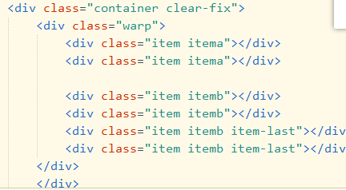
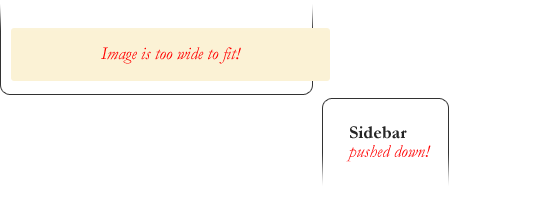

# 浮动

## 浮动float（重要很重要非常重要）

浮动曾经最初始的工作是做图文环绕的。

绝对定位和浮动都会让元素脱离标准流，以达到灵活布局地效果

float能让元素产生浮动效果，float常用取值

* none：无
* left：向左浮动
* right：向右浮动


**浮动规则一：**

* 元素一单浮动后
  * 脱离标准流
  * 朝着向左或者向右移动，知道直到自己的边界，紧贴着包含块（一般是父元素）或者其他浮动元素的边界为止
  * 定位元素会层叠在浮动元素上面


**浮动规则二：**

* 浮动元素不能与行内级内容层叠，行内及内容将会被浮动元素推出

  比如行内级元素、inline-block元素、块级元素的文字内容

**浮动规则三**

* 行内级元素、inline-block元素浮动后，其顶部将于所在行的顶部对齐

**浮动规则四**

* 向左或向右不能超出包含块（父元素）的边界

**浮动规则五**

* 浮动元素之间不能层叠

* 如果一个元素浮动，另一个浮动元素已经在那个位置了，后浮动的元素将紧贴着前一个浮动元素（左浮找左浮，右浮找右浮）

* 如果水平方向剩余的空间不够显示浮动元素，浮动元素将向下移动，知道有充足的空间为止

**浮动规则六**

* 浮动元素的顶端不能超过包含块的顶端，也不能超过**之前**所有浮动元素的顶端

一个浮动的问题：在进行布局时同一行多个item（元素块儿）拜访后，设置margin-right让他们之间产生间距，最后一个元素块的margin-right总是会多出来

**解决办法**：

1. 总是给最后一个元素块加一个类，然后设置该类的margin-right为0（操作过于麻烦）
2. 通过伪类选择器选中最后一个元素块（容易出现兼容性问题）
3. **给内容扩充一下大小，给最后一个有一部分空间（最优解决办法）**

解决办法三前提：首先内容.container固定宽度>.wrap设置负margin > item（元素块）

其中.container包含.warp,.warp包含元素块item


## 清除浮动

**浮动出现的问题**：元素一旦被浮动就会变成脱标元素，不再向父元素汇报高度，父元素在计算总高度时，就不会计算浮动子元素的高度，导致了高度坍塌问题，解决此问题的过程一般称为（**清理浮动、清除浮动**）

**清除浮动的目的之一**：使父元素计算高度时，把浮动元素计算在内


### 方法一：添加一个空的div

在容器底部添加一个空div，关键是这个属性`clear: both;`

```
<div style="clear: both;"></div>
//也可以

<div class="clearfix"></div>

.clearfix {
  clear: both;
}
```

### 方法二：利用overflow属性

可以利用overflow属性来清除浮动

可以设置容器的overflow属性为：`auto`或者`hidden`。

**但是注意**：overflow并不是用来清除浮动的，使用的时候要小心。**不要让容器的内容被隐藏或这生成滚动条了**

### 方法三：利伪元素after，before

可以利用伪元素像clearfix一样添加一个类，不过是添加在元素自身的伪元素上的。

配合伪元素::after生成一个类选择器，在需要清除浮动的包含块中加入该类

```css
.clearfix:after { 
   content: "."; 
   visibility: hidden; 
   display: block; 
   height: 0; 
   clear: both;
}

.clearfix {
  zoom: 1;
}


//直接应用到要清除浮动的元素上即可

<div class="container  clearfix">
```


怎加类选择器：

在需要的包含块中加如该类：


## 使用浮动时的一些小问题

### 问题一：Pushdown

当一个图片超出浮动元素后，会将同一排的浮动元素向下压，导致布局出错了。

例如以下：



解决方式： 确保不会出现以上的这种的布局，如果出现了用`overflow`属性进行剪裁，把超出的`image`减裁掉

### 问题二：Double Margin Bug

在处理ie6时要记住的另一件事是，如果你在与浮动相同的方向上应用边距，会出现2倍`margin`的情况。

解决方式：设置`display: inline`在浮动上，元素还是块元素


### 问题三：3px 的margin

靠近浮动元素的文本被3px神秘地踢开，就像围绕浮动的一个奇怪的力场。

**快速修复:在受影响的文本上设置宽度或高度。**


### 问题四：

在IE 7中，当一个浮动的父元素在它内部浮动了子元素时，这些子元素的底边距会被父元素忽略。快速修复:使用底部填充的父代

在父元素底部使用`padding bottom`进行填充

