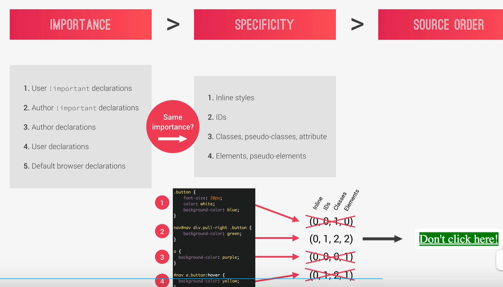

# 浏览器解析CSS过程

## 第一步：解决冲突的CSS声明

解决方式：级联

重要程度>特殊>来源

注意：**计算特异值时，伪类也算作类来计算**

我们需要理解的东西：

## 第二步：处理最终的CSS值

先看一个小李子：

重点：

>一：百分比

字体：当字体的单位是百分比时(`font-size: 150%;`)，计算会根据它**父元素的字体大小**进行计算（父的字体大小*百分比 = 当前元素字体大小）

长度(`padding`、`margin`)：当一些长度使用百分比时，计算会依据它**父元素的宽度**(`width`)进行计算（父的宽度 * 百分比 = 当前元素的一些长度）

>二：em单位

字体：当字体的单位是`em`时(`font-size: 1.5em;`)，计算会根据它**父元素的字体大小**进行计算（父的字体大小 * 1.5 = 当前元素字体大小）

长度（`padding`、`margin`）：当长度使用`em`（`1.5em`）时，计算会依据当**前元素的字体大小**(`1.5` * 当前元素`font-size` = 长度)

>三：rem单位

rem单位比较好用，不用区分字体和长度

所有：当单位是`rem`时(`font-size: 2rem`)，当前元素会依赖于<strong style="color: red;">根元素(<html>)</strong>的字体大小（根元素字体大小 * 2 = 当前大小）

>四：`vh`和`vw`

`vh`：使用`vh`作为单位时（`90vh`）是依据当前<strong style="color: red;">视口高度</strong>作为依据(`90%` * 视口高度 = 当前大小)

`vw`：使用`vw`作为单位时（`90vw`）是依据当前<strong style="color: red;">视口宽度</strong>作为依据(`90%` * 视口宽度 = 当前大小)