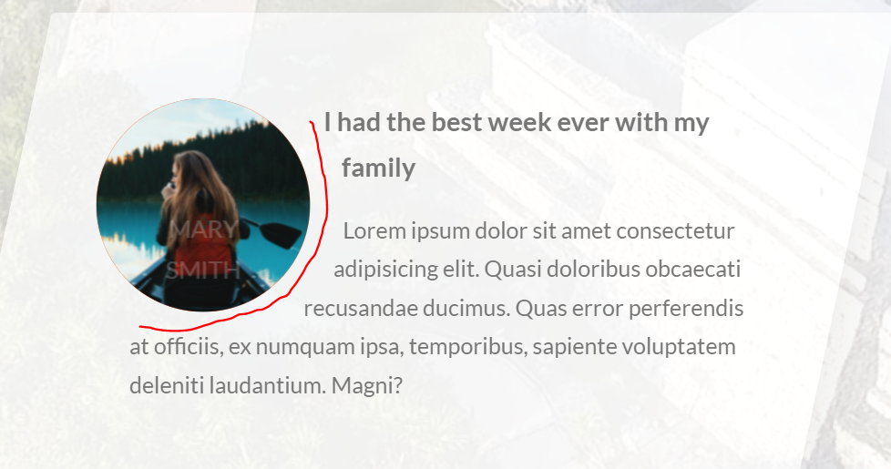

# shape-outside属性，文字环绕

作用：**`shape-outside`** 的 [CSS](https://developer.mozilla.org/zh-CN/docs/Web/CSS) 属性定义了一个可以是非矩形的形状，相邻的内联内容应围绕该形状进行包装。默认情况下，内联内容包围其边距框; `shape-outside`提供了一种自定义此包装的方法，可以将文本包装在复杂对象周围而不是简单的框中。（来自MDN）

注意：**如果要使用这个属性，一定要让元素浮动，该属性有一个前置条件，就是使用float**

加上：`-webkit-`

语法：

```css
shape-outside: none;
shape-outside: margin-box;
shape-outside: content-box;
shape-outside: border-box;
shape-outside: padding-box;

/* 函数值 */
shape-outside: circle(); /*这个圆形用过*/
shape-outside: ellipse();
shape-outside: inset(10px 10px 10px 10px);
shape-outside: polygon(10px 10px, 20px 20px, 30px 30px);

/* <url> 值 */
shape-outside: url(image.png);

/* 渐变值 */
shape-outside: linear-gradient(45deg, rgba(255, 255, 255, 0) 150px, red 150px);

/* 全局值 */
shape-outside: initial;
shape-outside: inherit;
shape-outside: unset;
```


## 环形文字效果

首先把元素设置成一个圆圈，然后再用shape-outside指定外面包裹文字的样式，然后这些文字就会有一个弧度一样的效果

像这样：



示例：

```scss
.div__shape {
  width: 15rem;
  height: 15rem;
  background-color: orangered;
  float: left;
  // 第一个是半径,50%是当前元素高度或宽度的一半儿
  // 第二个是圆心的位置，50%,50%就是水平垂直中间
  -webkit-shape-outside: circle(50% at 50% 50%);
  shape-outside: circle(50% at 50% 50%);
  -webkit-clip-path: circle(50% at 50% 50%);
  clip-path: circle(50% at 50% 50%);

  transform: translateX(-3rem) skewX(12deg);

  position: relative;
}
```

