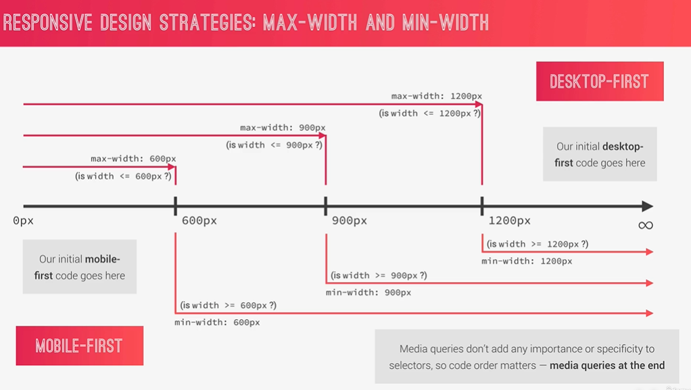

# 媒体查询@media（针对不同宽度的屏幕）

一般项目我们有两种书写方式：

1. 客户端优先
2. 移动端优先

这两种方式使用的属性也不一样。


注意点一：**最好给媒体查询添加上一个条件`only screen`，让媒体查询只作用在屏幕上**

注意点二：**html页面的和head标签中必须要有下面这行代码，否则不会生效**

```html
<meta name="viewport" content="width=device-width, initial-scale=1.0">
```


## 客户端优先 max-width

客户端优先：指的是，我们首先写好客户端的css样式，然后通过`@media`来去适配其他端的样式。


客户端优先使用的是`max-width`，`max-width: 600px`指的是，最大是600px，超过600px的将使用另外的css属性

示例：

```css
div {
	color: blue;
}


@media only screen and (max-width: 600px) {
  div {
  color: red; 
  /*当div的宽度小于600px时，字体就时红色的，超过600px用外面的蓝色*/
  }
}
```


这时候有机智的小伙伴就要提问了，那要出现`max-width: 600px`和`max-width: 1200px`，我是500px时改用哪一个样式呢？

答案是：两个都用，因为500px既小于600px也小于1200px所以2个的css样式都会应用


注意点：**媒体查询是不会增加选择器的权重的，所以写在下面的媒体查询会覆盖掉上面的（在出现两个相同媒体查询时出现的问题）**


规则：**`max-width`值越小，放在越下面**


示例：

```scss
html {
  /* 浏览器默认16px， 我们要10px，并且计算为百分比 */
  font-size: 62.5%;
}
@media only screen and (max-width: 56.25em) { // 56.25em  = 15*56.25 = 600px
  html {
    font-size: 50%; 
  } 
}

@media only screen and (max-width: 75em) { // 75em = 16*75=900px
  html {
    font-size: 56.25%; // 这时，如果小于900px，600px的和900px的媒体查询都会触发，但是最后应用75em的，就是上面的注意点
  } 
}

@media only screen and (max-width: 112.5em) {
  html {
    font-size: 75%; 
  } 
}


// 一般我们就会颠倒一下，让600px在900px下面，防止被覆盖
html {
  /* 浏览器默认16px， 我们要10px，并且计算为百分比 */
  font-size: 62.5%;
}

@media only screen and (max-width: 75em) { // 75em = 16*75=900px
  html {
    font-size: 56.25%;
  } 
}
// 让600px和900px颠倒一下
@media only screen and (max-width: 56.25em) { // 56.25em  = 15*56.25 = 600px
  html {
    font-size: 50%; 
  } 
}

@media only screen and (max-width: 112.5em) {
  html {
    font-size: 75%; 
  } 
}
```


## 移动端优先 min-width

移动端优先：指的是先写好移动端的`css`样式，再通过媒体查询方式，去适配其他端的样式

使用`min-width`，这个属性的意思是，最小宽度是多少，不能小于这个宽度。

示例：

```css
div {
  color: blue;
}

div @media only screen and (min-width: 600px) {
  div {
  color: red;
  /*
		最小是600px，大于600px时使用red
  	小于600px的使用外面的blue
  */
  }

}
```





## 设计断点的方式

断点：指的是你从哪里分开（移动端和桌面端）。

例如：`max-width: 100px`，这里的`100px`就是一个断点。


断点的设计方式：

1. 坏的方式：根据一套设备宽度进行设计，例如根据苹果的进行断点设计，给iPhone设计一个断点，给iPad设计一个断点，给mac设计一个。这种方式
2. **好一些的方式**：多个设备进行设计，例如移动端，我们取多部手机的屏幕，然后设计成一个范围，当处于该范围内我们使用一个媒体查询。（**一般都采用这种方式**）
3. 最优秀的方式：最优秀的方式，就是直接不考虑设备。先设计好客户端，然后手动一点一点缩小(或者扩大)客户端，发现到一个值时，样式已经错乱不堪了，那么就将这个宽度设计为一个断点，然后不断重复（非常困难，且麻烦）


一份提供参考的数据（具体的有时效性的数据还是得自己查）：

| 设备 | 手机      | 纵向平板  | 横向平板   | 笔记本电脑台式 | 大屏       |
| ---- | --------- | --------- | ---------- | -------------- | ---------- |
| 大小 | 小于600px | 小于900px | 小于1200px | 小于1800px     | 大于1800px |


## 媒体查询中使用相对单位注意点(em,rem)

媒体查询中，我们也是建议使用相对单位，我们想在修改字体大小时也带动着整个媒体查询的修改，但是媒体查询又有一个特殊的注意点。

注意：**媒体查询的em和rem不受根元素(html标签)字体大小的影响**

在普通的rem和em中，它们的大小一个是受到根元素的字体大小影响，一个是收到父元素的字体大小影响，但是在媒体查询中，它们都不会被影响到。**默认情况下，1em和1rem就是等于浏览器默认的16px，如果用户手动修改的浏览器字体大小变成20px，那么1em和1rem也会随之改变**


建议：**建议媒体查询和em配合使用，因为rem兼容性不太好,一些浏览器可能还用不了**


示例：

```scss
/*
$breakpoint的值为：
- phone
- tab-port
- tab-land
- big-desktop

  1em = 16px
*/
@mixin respond($breakpoint) {
  @if $breakpoint == phone {
    @media (max-width: 37.5em) {    // 600px
      @content
    }
  };

  @if $breakpoint == tab-port {
    @media (max-width: 56.25em) {     // 900px
      @content
    }
  };

  @if $breakpoint == tab-land {     // 1200px
    @media (max-width: 75em) {
      @content
    }
  };

  @if $breakpoint == big-desktop {
    @media (max-width: 112.5em) {     // 1800px
      @content
    }
  };
}
```


注意：**html中的媒体查询也是适用这个规则的**

示例：

```html
```


# sass编写响应管理器

前提：

1. 网站利用rem作为单位进行编写
2. 知道sass的@if和@content的作用


respond管理器：

一般都会将respond写在`mixins.scss`中：

```scss
// 媒体查询
/*
  0 ~ 600px:  手机
  600px ~ 900px:  纵向平板
  900px ~ 1200px:  横向平板

  1200px ~ 1800px:  正常显示屏，笔记本

  1800px + :  大屏
*/

/*
$breakpoint的选择：
- phone
- tab-port
- tab-land
- big-desktop

  1em = 16px
*/
@mixin respond($breakpoint) {
  @if $breakpoint == phone {
    @media only screen and (max-width: 37.5em) {    // 600px
      @content // 其实这个@content是专门用在html标签上的，应为我们想要把不同的font-size传递过来
    }
  };

  @if $breakpoint == tab-port {
    @media only screen and (max-width: 56.25em) {     // 900px
      @content
    }
  };

  @if $breakpoint == tab-land {     // 1200px
    @media only screen and (max-width: 75em) {
      @content
    }
  };

  @if $breakpoint == big-desktop {
    @media only screen and (max-width: 112.5em) {     // 1800px
      @content
    }
  };
}
```


使用时：

直接根据想要的结果调用respond传递不同参数即可：

示例：

```scss
html {
	/* 浏览器默认16px， 我们要10px，并且计算为百分比 */
	font-size: 62.5%;
  
 
  // @include respond(phone) {
  //   font-size: 50%;  // 传入@content
  // }

  // 修改顺序：base + typography => general layout + grid > page layout > components


  // 一个规则：max-width小的，放下面
  @include respond(big-desktop) {  // < 1800px
    font-size: 75%;  // 1rem = 12px, 12/16 = 75%
  }


  @include respond(tab-land) {  // < 1200px
    font-size: 56.25%;  // 1rem = 9px, 9/16 = 56.25%
  }

  @include respond(tab-port) {  // < 900px
    font-size: 50%;  // 1rem = 8px, 8/16 = 50%
  }

}
```


# 分辨率媒体查询(针对不同分辨率的屏幕)

上面说的这些媒体查询，都是根据屏幕宽度来进行写的，但是媒体查询还可以根据分辨率进行断点（牛逼！）


示例：

```scss
.header {
	position: relative;
	/* 视口的95% */
	height: 95vh;
	/* 设置2个背景图片:1线性渐变，2hero图片 */
	/* linear-gradient线性渐变,参数一渐变方向,剩下参数为渐变颜色 */
	background-image: linear-gradient(
			to right bottom,
			rgba($color-primary-light, 0.8),
			rgba($color-primary-dark, 0.8)
		),
		url(../img/hero-small.jpg); // small的分辨率低一些

  @media only screen and (min-resolution: 192dpi), (-webkit-min-device-pixel-ratio: 2) { // 每英寸点数大于192时
    // safari中是这样的 (-webkit-min-device-pixel-ratio: 2)
    
    // 使用高分辨率图片
    background-image: linear-gradient(
			to right bottom,
			rgba($color-secondary-light, 0.8),
			rgba($color-secondary-dark, 0.8)
		),
		url(../img/hero.jpg);
  }
}
```


## 使用and关键字

这个and关键字类似于**且**

还可以使用and关键字将**分辨率媒体查询**和**宽度媒体查询**结合起来（哇靠，绝了！）。

示例：

```scss
.header {
	position: relative;
	/* 视口的95% */
	height: 95vh;
	/* 设置2个背景图片:1线性渐变，2hero图片 */
	/* linear-gradient线性渐变,参数一渐变方向,剩下参数为渐变颜色 */
	background-image: linear-gradient(
			to right bottom,
			rgba($color-primary-light, 0.8),
			rgba($color-primary-dark, 0.8)
		),
		url(../img/hero-small.jpg); // small的分辨率低一些
	
  @media only screen and (min-resolution: 192dpi) and (min-width: 600px) { // 每英寸点数大于192时,且宽度不能小于600px
    // 使用高分辨率图片
    background-image: linear-gradient(
			to right bottom,
			rgba($color-secondary-light, 0.8),
			rgba($color-secondary-dark, 0.8)
		),
		url(../img/hero.jpg);
  }
}
```


## 使用逗号，

在@media媒体查询中，逗号标识的是**或**的意思，注意奥，是或。

示例：

```scss
.header {
	position: relative;
	/* 视口的95% */
	height: 95vh;
	/* 设置2个背景图片:1线性渐变，2hero图片 */
	/* linear-gradient线性渐变,参数一渐变方向,剩下参数为渐变颜色 */
	background-image: linear-gradient(
			to right bottom,
			rgba($color-primary-light, 0.8),
			rgba($color-primary-dark, 0.8)
		),
		url(../img/hero-small.jpg);

	// 1.
  @media only screen and (min-resolution: 192dpi) and (min-width: 600px) { // 每英寸点数大于192时
    // 使用高分辨率图片
    background-image: linear-gradient(
			to right bottom,
			rgba($color-secondary-light, 0.8),
			rgba($color-secondary-dark, 0.8)
		),
		url(../img/hero.jpg);
  }
	// 2.
  @media only screen and (min-width: 2000px) {
    background-image: linear-gradient(
			to right bottom,
			rgba($color-secondary-light, 0.8),
			rgba($color-secondary-dark, 0.8)
		),
		url(../img/hero.jpg);
  }
  
  
  // 利用,将上面1和2写在一起
    @media only screen and (min-resolution: 192dpi) and (min-width: 600px),
    			 (min-width: 2000px) { // 每英寸点数大于192时
      background-image: linear-gradient(
        to right bottom,
        rgba($color-secondary-light, 0.8),
        rgba($color-secondary-dark, 0.8)
      ),
      url(../img/hero.jpg);
  }
}
```


# 针对移动端不能hover的媒体查询

有时候，我们想要判断当前打开网站的设备，是否能够进行hover（其实就是移动端不能hover），如果可以我们才展示一些能够hover的元素，如果不行，那我们就直接修改样式。

所以上面的这个想法该如何实现？

媒体查询的又一个条件可以实现：

```scss
// 当设备不能进行hover时，颜色变为黑色
@media only screen and (hover:none) {
  color: black;
}
```

