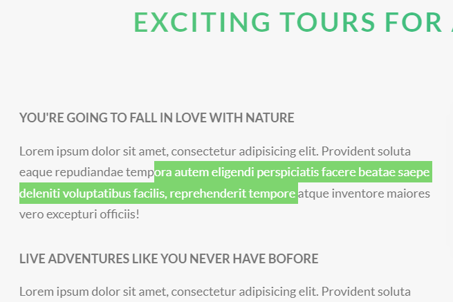

# ::selection伪类，控制选中时的样式

这个伪类的作用：**可以修改我们选中文字时候的样式**，例如我们点住鼠标左键，在屏幕上选择一些文字，然后选择文字的样式就可以通过这个伪类来进行修改。


注意：**这个伪类挺特殊的，可以直接使用**


示例：

```scss
/*设置选中时的样式，选中时背景颜色是红色，字体是白色*/

::selection {
  background-color: $color-primary; //这个是绿色
  color: $color-white; // 这个是白色
}
```


效果：(用鼠标左键选中文字时是绿底百字)

