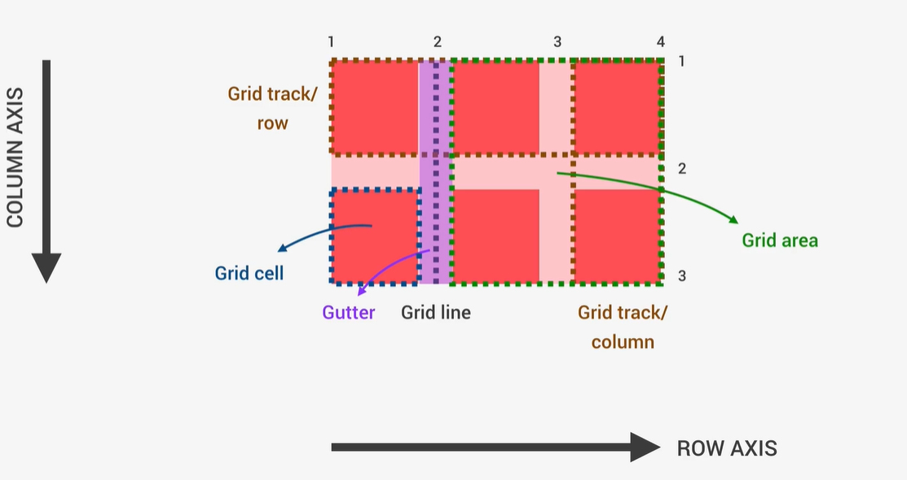
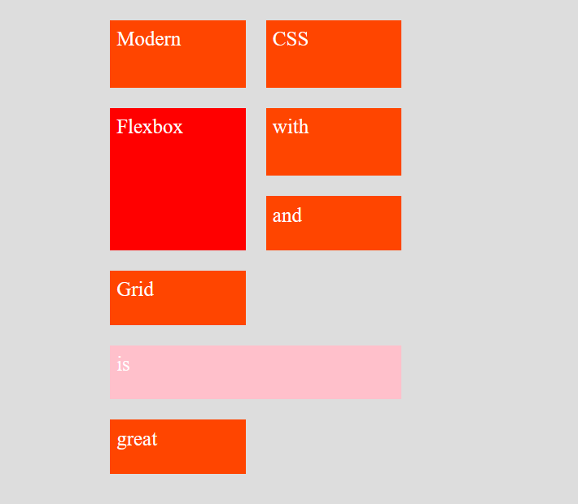
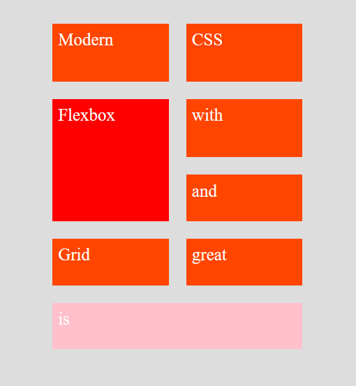
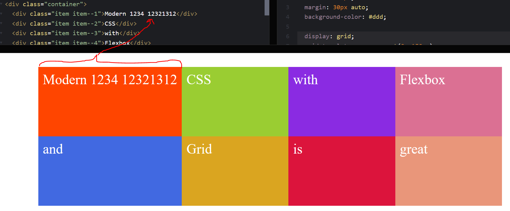
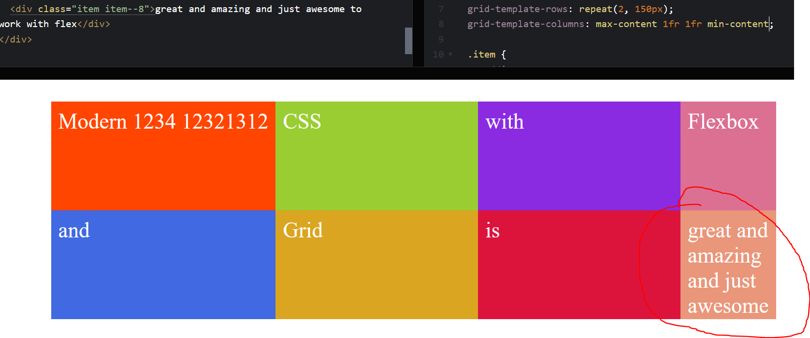
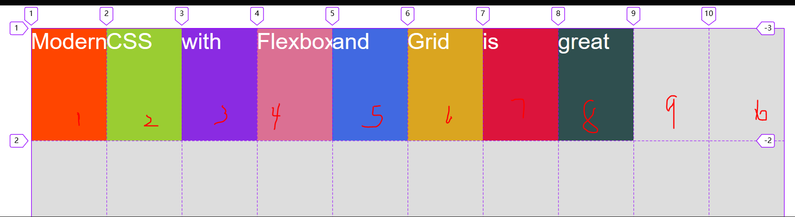
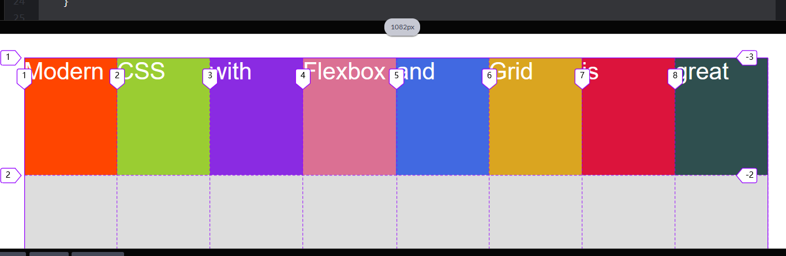
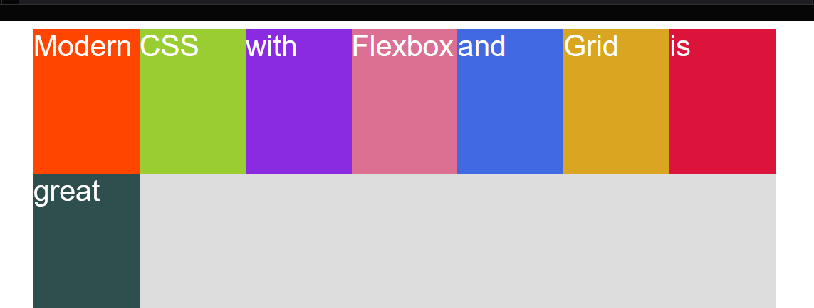
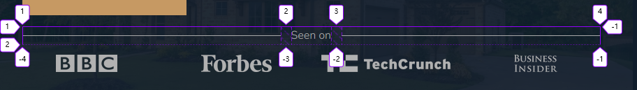

# grid布局

这里只记录一些`grid`布局比较特殊的小部分，具体的使用可以看阮大佬的博客。


概念：




## grid布局是可以叠加在一起的

注意，grid布局中的元素，在我们利用行号列号将一些元素，可以丢在同一个区域(area)中，它们是**会叠加在一起的！**，可以使用**z-index来改变层级**


## 基础grid-template-columns、grid-template-rows

这两个一个设置列宽，一个设置行高！

示例：

```scss
grid-template-rows: 1fr 50% 80vh 40vw 100px 5rem calc(100vh - 6rem); 
// 注意很多单位都能使用，不要因为它设置行高而限制了自己的思想

// grid-template-columns	一样
```


**缩写语法**：

```scss
grid-template-rows: 1fr 400px;
grid-template-columns: 100px 1fr;

// 简写后的结果，先行后列
grid-template: 1fr 400px / 100px 1fr;
```


**特殊写法1：**

```scss
grid-template-columns: repeat(3, min-content max-content);
// 这样写实际生成6列，1  3  5是min-content， 2 4 6 是max-content
```


## grid布局的三种方式

可以有三种方式：

1. 行号和列号来控制area位置
2. 自定义行号和列号名称，再通过这些名称来控制area位置
3. 直接自定义grid布局中的area名称


### 1. grid-row、grid-column、grid-area

注意：和行号，列号有关，设置在cell上

`grid-row`：是`grid-row-start`和`grid-row-end`的缩写，是用来确定一个area的位置的

示例：

```scss
grid-row-start: 2;    // 第二行行号开始
grid-row-end: 3;    // 第三行行号结束
//  简写
grid-row: 2 / 3;  // 开始 / 结束
```


几个特殊的写法：

```scss
grid-row: 1 / -1; // 这里-1代表的是最后一个行号。

grid-row: 1 / span 2; // span的意思是跨越， 1 跨越 2个就是 3，所以是1 / 3
```


注意：**-1的写法，必须是显式网格才行，隐式网格的话这样写不生效**

`grid-column`和上面的一样，就是将`row`改为`column`然后确定的是列号。


**grid-area**可以将上面`grid-row`和`grid-column`进行简写：

```scss
grid-row: 2 / 3;  // 开始 / 结束
grid-column: 3 / 4; // 开始 / 结束

grid-area: 2 / 3 / 3 / 4; // 行开始 / 列开始 / 行结束 / 列结束
```


### 2. 自命名行号列号名称（大型项目的写法）

我们除了可以直接使用1，2这类的数字来代表行号，我们还能够自定义行号列号的名称来供我们使用。

**一般一些大型项目我们才会自己来命名行号列号名称。**


它最大的优势，是在做媒体查询时：**想象一下，如果我们都用的行号列号，进行的布局，在进行媒体查询时，我们会删除列或增加行等一些列操作，后果是什么？那就是我们会影响到行号，列号，从而影响到整个布局，但是如果我们用命名行号列号，就不会出现这样的问题**


自定义名称：

```scss
// 利用[]给每个行号命名
grid-template-rows: [header-start] 100px [header-end box-start] 200px [box-end main-start] 400px [main-end footer-start] 100px [footer-end];


// 注意：这个有repeat的比较特殊，它会自动帮我们生成col-start 1 col-start 2 col-start 3 这三个 加上col-end 1 col-end 2 col-end 3总共6个行号名儿

grid-template-columns: repeat(3, [col-start] 1fr [col-end]) 200px [grid-end];

/*
	// 是这样子的五列，[]是同一列，有两个名称

	col-start 1  [col-start 2 col-end 1]  [col-start 3 col-end 2]  col-end 3  grid-end

*/
```


注意：**`[box-end main-start] `这样写，是这个行号(或列号)有两个名称，指的是同一个**

注意点2：有`repeat`函数时，grid布局会自动帮我们加上数字后缀儿


使用：

```scss
.header {
  grid-column: col-start 1 / grid-end;
  // grid-column: 1 / span 4;
}

.siderbar {
  // grid-column: 4 / 5;
  grid-column: col-end 3 / grid-end;
  grid-row: box-start / main-end;
}

.main-content {
  // grid-column: 1 / span 3;

  grid-column: col-start 1 / col-end 3;
}

.footer {
  grid-column: col-start 1 / grid-end;
}
```


小问题：**为什么总是命名列号，而从不命名行号呢？**

因为布局时，我们总是重点关注列的位置，而不太在意行，所以我们常常只命名列号。


### 3. 自定义area名称grid-template-areas

可以利用`grid-template-areas`直接给一块儿区域命名，然后直接使用名称即可

会发现，这个使用起来好方便呀!这种方式常常用在小型布局上面（4 x 4...）。

命名示例：

```scss
grid-template-areas: 
"head head head head"
"box  box  box  side"
"main main main side"
"foot foot foot foot";
```


使用：

```scss
.header {
  grid-area: head;
}

.siderbar {
  grid-area: side;
}

.main-content {
  grid-area: main;
}

.footer {
  grid-area: foot;
}
```


### 三种方式示例代码

 `html`部分：

```html
<div class="challenge">
  <div class="header">
    Header
  </div>
  <div class="small-box-1">Small box1</div>
  <div class="small-box-2">Small box2</div>
  <div class="small-box-3">Small box3</div>
  
  <div class="main-content">
    Main content
  </div>
  
  <div class="siderbar">
    SiderBar
  </div>
  
  <div class="footer">
    Footer
  </div>
</div>
```


`css`部分：(这里用的sass)

```scss
// 方式一：直接通过行号

/*
.challenge {
  width: 1000px;
  margin: 30px auto;
  
  display: grid;
  
  grid-template-rows: 100px 200px 400px 100px;
  grid-template-columns: repeat(3, 1fr) 200px;
  grid-gap: 30px;
  & > * { // 选中所有子元素 这个特别重要！！
    background-color: #eee;
    padding: 20px;
    font-size: 30px;
    font-family: sans-serif;
  }
  
  
  .header {
    grid-column: 1 / -1;
    // grid-column: 1 / span 4;
  }
  
  .siderbar {
    grid-column: 4 / 5;
    grid-row: 2 / span 2;
  }
  
  .main-content {
   grid-column: 1 / span 3;
  }
  
  .footer {
    grid-column: 1 / -1;
  }
}
*/

// 方式二：通过命名行号
/*
.challenge {
  width: 1000px;
  margin: 30px auto;
  
  display: grid;
  
  // 利用[]给每个行号命名
  grid-template-rows: [header-start] 100px [header-end box-start] 200px [box-end main-start] 400px [main-end footer-start] 100px [footer-end];
  
  // 注意：这个有repeat的比较特殊，它会自动帮我们生成col-start 1 col-start 2 col-start 3 这三个 加上col-end 1 col-end 2 col-end 3总共6个行号名儿
  grid-template-columns: repeat(3, [col-start] 1fr [col-end]) 200px [grid-end];
  
  grid-gap: 30px;
  & > * { // 选中所有子元素 这个特别重要！！
    background-color: #eee;
    padding: 20px;
    font-size: 30px;
    font-family: sans-serif;
  }
  
  
  .header {
    grid-column: col-start 1 / grid-end;
    // grid-column: 1 / span 4;
  }
  
  .siderbar {
    // grid-column: 4 / 5;
    grid-column: col-end 3 / grid-end;
    grid-row: box-start / main-end;
  }
  
  .main-content {
   // grid-column: 1 / span 3;
    
    grid-column: col-start 1 / col-end 3;
  }
  
  .footer {
    grid-column: col-start 1 / grid-end;
  }
}

*/

// 方式3：直接命名grid布局的area

.challenge {
  width: 1000px;
  margin: 30px auto;
  
  display: grid;
  
  grid-template-rows: 100px 200px 400px 100px;
  grid-template-columns: repeat(3, 1fr) 200px;
  grid-gap: 30px;
  
  grid-template-areas: 
    "head head head head"
    "box  box  box  side"
    "main main main side"
    "foot foot foot foot";
  
  & > * { // 选中所有子元素 这个特别重要！！
    background-color: #eee;
    padding: 20px;
    font-size: 30px;
    font-family: sans-serif;
  }
  
  
  .header {
    grid-area: head;
  }
  
  .siderbar {
    grid-area: side;
  }
  
  .main-content {
   grid-area: main;
  }
  
  .footer {
    grid-area: foot;
  }
}
```


## 显式网格与隐式网格

在grid布局中有这么两种类型的网格。

显示网格：一开始我们就已经布局好的位置，称为显式网格

隐式网格：**元素要比我们预定的位置多**，那么多出来的元素，grid会帮助我们**自动创建一些轨道**（track）来放多出来的元素。


隐式网格的作用：**乍一看好像感觉隐式网格没啥用，其实他主要用在你不知道这个页面要多少行或者多少列时，我们可以设置隐式网格的宽度或者高度（例如懒加载，我需要从数据库中拿数据，这样你不知道有多少数据）**


示例：

`html`部分：

```html
<div class="container">
  <div class="item item--1">1</div>
  <div class="item item--2">2</div>
  <div class="item item--3">3</div>
  <div class="item item--4">4</div>
  <div class="item item--5">5</div>
  <div class="item item--6">6</div>
  <div class="item item--7">7</div>
  <div class="item item--8">8</div>
</div>
```


`css`部分：

```scss
.container {
  width: 1000px;
  margin: 30px auto;
  background-color: #ccc;
  
  display: grid;
  // 我们这里设置了2行2列，只能放下前4个item这4个是显式网格，那么后面5、6、7、8这4个item就放不下，就是隐式网格
  grid-template-rows: repeat(2, 150px);
  grid-template-columns: repeat(2, 1fr);
  grid-gap: 30px;
  
  .item {
    padding: 20px;
    color: white;
    font-family: sans-serif;
    font-size: 30px;
    
    background-color: orangered;
  }
}
```


### 隐式网格相关的grid属性

### 1.	grid-auto-flow

`grid-auto-flow`：是用来规定隐式网格出现的位置的，默认值是`row`意思是当有隐式网格时，**额外添加行**来放它们

可取值：`row`、`column`

示例：
```scss
grid-auto-flow: row;	// 添加行
grid-auto-flow: column;		// 添加列
```


注意：**这个属性还有第二个值(挺重要的一个值)**

示例：

```scss
grid-auto-flow: row dense;
// 这样设置，会让整个container紧凑起来，会将空出的格子直接用可以使用的aera填补
```


例如：

没有设置dense时，元素会应为自动排序算法，导致一些位置可能会空出来




这时，我们设置：

```scss
grid-auto-flow: row dense;
// 会紧凑起来
```

效果：把多出来的补过去，尽量将空位补齐




### 2.	grid-auto-rows

`grid-auto-rows`：来规定隐式网格的行高的。

示例：

```scss
grid-auto-flow: row
grid-auto-rows: 80px;
// 那么出现的隐式网格行高就是80px
```

注意：该属性只有`grid-auto-flow: row`时生效


### 3.	grid-auto-columns

`grid-auto-columns`：来设置隐式网格的列宽

示例：

```scss
grid-auto-flow: column;
grid-auto-columns: 100px;
```

注意：该属性只有设置`grid-auto-flow: column`时生效


## align-items、justify-items

作用：这两个值，用来设置cell在area中的表现。如果分不清什么是area和cell请看上面图例。

注意：**该值设置在container身上**

`align-items`：默认值`stretch`可取`start`、`center`、`end`...

`justify-items`：默认值`stretch`可取`start`、`center`、`end`...


### align-self与justify-self

和flex一样中的self一样，grid布局中也带有self相关属性。

注意：**这两个值设置在cell上**

作用：用来单独修改一个cell在当前area中的表现。设置了self属性，就会直接覆盖掉items相关属性


## justify-content、align-content

作用：这两个值使用来设置整个container在标签中的表现形式的。


`justify-content`：用来设置container在标签中整个行轴上的表现形式，取值和flex中的`justify-content`一致（注意：功能不太一致）

`align-content`：用来设置container在标签中整个交叉轴(列轴)上的表现形式，取值和flex中的` align-content属一致


# grid布局中的计算值

这三个值我们一般都是在`grid-template-rows`、`grid-template-columns`中使用哒。


## max-content

作用：让area尽可能的宽或高，来适应内容

示例：

```scss
display: grid;
grid-template-rows: repeat(2, 150px);
grid-template-columns: max-content 1fr 1fr 1fr;
// 这里我们让第一列，宽度为max-content
```


效果：



注意：**它会让元素尽可能的宽，以至于都不会让文字换行**。

还要注意：它不仅仅是使用在文字上，文字只是一个演示工具奥


## min-content

作用：会采取area需要的**最适合的宽度。**

示例：

```scss
display: grid;
grid-template-rows: repeat(2, 150px);
grid-template-columns: max-content 1fr 1fr min-content;
// 我们让最后一列设置为min-content
```

效果：



注意：该值会让文字进行换行，并且选出一个最长的文字作为当前area的宽度

还要注意：它不仅仅是使用在文字上，文字只是一个演示工具奥


## minmax函数(最重要（究极重要）)

语法：

```scss
minmax(参数一, 参数二)
// 参数一 < 参数二
```


作用：**让宽度(或高度)，处于参数一与参数二之间，刚开始为参数二，不断缩小时，最小为参数一**


示例：

```scss
grid-template-columns: minmax(200px, 1fr) 1fr 1fr 1fr;

// 这个意思是：第一列列宽为1fr，最小为200px

grid-template-columns: minmax(200px, 300px) 1fr ;
// 第一列宽度默认为300px 如果宽度放不下300px会不断缩小，最小为200px，之后不会再减小
```


注意：这个函数是非常重要的一个函数，它可以说是赋予grid布局无比强大的功能了。


# 自动填充和自动适应(很重要)

首先，这两个属性也常常用在`grid-template-columns`和`grid-template-rows`上的**repeat函数上**，并且**结合`minmax`函数使用**

下面属性讲解时使用的代码：可以打开codepen.io去查看效果

html部分：

```html
<div class="container">
  <div class="item item--1">Modern</div>
  <div class="item item--2">CSS</div>
  <div class="item item--3">with</div>
  <div class="item item--4">Flexbox</div>
  <div class="item item--5">and</div>
  <div class="item item--6">Grid</div>
  <div class="item item--7">is</div>
  <div class="item item--8">great</div>
</div>
```

scss部分：

```scss
.container {
  width: 1000px;
  margin: 30px auto;
  background-color: #ddd;
  width: 90%;
  
  display: grid;
  grid-template-rows: repeat(2, minmax(150px, min-content));
  // grid-template-columns: repeat(4, 1fr);
  // grid-template-columns: repeat(auto-fill, 100px);
  grid-template-columns: repeat(auto-fit, minmax(100px, 1fr));
  .item {
    color: white;
    font-size: 30px;
    font-family: sans-serif;
    background-color: orangered;
    
    &--1 {
      background-color:orangered;
    }
    
    &--2 {
      background-color: yellowgreen;
    }
    
    &--3 {
      background-color: blueviolet;
    }
    
    &--4 {
      background-color: palevioletred;
    }
    
    &--5 {
      background-color: royalblue;
    }
    
    &--6 {
      background-color: goldenrod;
    }
    
    &--7 {
      background-color: crimson;
    }
    
    &--8 {
      background-color: darkslategray;
    }
  }
}
```


## auto-fill

作用：自动填充，当设置repeat第一个参数是auto-fill后，会自动根据整个元素的宽度或高度，结合repeat的第二个参数来创建列数或行数。

语法：

```scss
grid-template-columns: repeat(auto-fill, 100px);
```


示例：

```scss
.container {
  width: 1000px; // 1.元素宽度为1000px
  margin: 30px auto;
  background-color: #ddd;
  
  display: grid;
  grid-template-rows: repeat(2, minmax(150px, min-content));
  // grid-template-columns: repeat(4, 1fr);
  grid-template-columns: repeat(auto-fill, 100px);	// 2.设置列宽为100px并且自动填充
}

// 3、结果就是：会创建10列每列为100px， => 1000px / 100px = 10
```


图例：



注意：**这个元素，即使我们cell数量不够，也会直接创建，如图，我只有8个cell，也创建出10列出来**


## auto-fit

作用：这个关键字的作用，和上面的auto-fill差不多，但是有一个差别，就是它也会更具元素宽度，和列宽度来创建对于的列数，但是**它会将用不到的area折叠起来**

语法：

```scss
grid-template-columns: repeat(auto-fit, 100px);
```


示例：

```scss
.container {
  width: 1000px; // 1.宽度为1000px
  margin: 30px auto;
  background-color: #ddd;
  
  display: grid;
  grid-template-rows: repeat(2, minmax(150px, min-content));
  // grid-template-columns: repeat(4, 1fr);
  // grid-template-columns: repeat(auto-fill, 100px);
  grid-template-columns: repeat(auto-fit, 100px);	// 2.每列为100px
}

// 3、也会创建10列出来
```


效果图：


注意：**注意看最后一列列号，还是11，说明我们任然创建出来10列，但是我们只有8个cell，就会把后面2个折叠起来**


## auto-fit结合minmax函数实现响应式（这里很重要）

让两者结合，我们就可以实现一种响应式的布局效果，会根据视窗大小自动来进行换行。

自动实现响应式布局，**媒体查询都不用写(●'◡'●)👍**

示例：

```scss
.container {
  width: 1000px;
  margin: 30px auto;
  background-color: #ddd;
  width: 90%;
  
  display: grid;
  grid-template-rows: repeat(2, minmax(150px, min-content));
  
  grid-template-columns: repeat(auto-fit, minmax(100px, 1fr));
  // 这里我们让列默认为1fr最小为100px，我超，无敌
  
}
```

效果：



我们现在宽度为1082px，足够我们8cell最小宽度来分(8 x 100px = 800px < 1082px)，所以会将8个元素放在第一行。

接下来我们减小宽度试试看：



随着宽度慢慢减小，当宽度小于800px时，就会直接将最后末尾元素**自动**换行到下一行


# 内容是文字，伪元素同样能够开启网格布局

加如，这时我们只有一个标签，并且标签内容是文字。这时我们任然可以`display: grid`

并且**它的::before、::after同样能作为网格**

示例：

```html
<div class="header__seenon-text">Seen on</div>
```


示例样式：

```scss
header__seenon-text {
  // 注意文本也是够设置成grid网格的，并且它的伪元素也都是可以设置为网格的
  display: grid;
	// 设置为3列，没有设置行，默认就是一行
  grid-template-columns: 1fr max-content 1fr;
  grid-column-gap: 1.5rem;
  align-items: center;
  font-size: 1.6rem;
  color: $color-grey-light-2;

  // 这里的两个伪元素也都设置为网格了
  &::before,
  &::after {
    content: "";
    height: 1px;
    display: block;
    background-color: currentColor;
  }
}
```


效果：




注意：仔细看图，会发现行线是有4条的，这说明什么，除了我们**文字内容之外**，我们设置的伪元素**`::before、::after`**也都被当作grid网格来处理了。真的牛批
