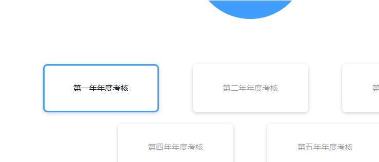

# css来封装一个按钮

两个核心关键点：

1. 使用a标签
2. 配合使用a标签相关的伪类


## 一个按钮封装案例


```scss
// button组件样式（组件时全局都有，公共的模块）
.btn {
  /* :link伪类指链接未访问时 */
  &, // &代表.btn
  &:link,
  &:visited {
    position: relative;
    display: inline-block;
    text-transform: uppercase;
    text-decoration: none;
    padding: 1.5rem 4rem;
    border-radius: 10rem;
    transition: all 0.2s;
    font-size: $default-font-size;

    // 修改button标签的外边框
    border: none;
    cursor: pointer;
  }

  &:hover {
    transform: translateY(-0.3rem);
    box-shadow: 0 1rem 2rem rgba($color-black, 0.2);
    /* 注意这个，这个时hover后伪元素的变化，这个很重要！ */
    &::after {
      transform: scaleX(1.4) scaleY(1.6);
      opacity: 0;
    }
  }
  /* active是激活时 */
  &:active,
  &:focus {
    outline: none;
    transform: translateY(-0.1rem);
    box-shadow: 0 0.5rem 1rem rgba($color-black, 0.2);
  }

  &--white {
    background-color: $color-white;
    color: $color-gray-dark;
      /* 设置通用伪元素的bgc */
    &::after {
      background-color: $color-white;
    }
  }

  &--green {
    background-color: $color-primary-light;
    color: $color-gray-dark;
      /* 设置通用伪元素的bgc */
    &::after {
      background-color: $color-primary-light;
    }
  }

  &::after {
    content: '';
    /* 一般和父元素一致 */
    display: inline-block;
    height: 100%;
    width: 100%;
    border-radius: 10rem;
    /* 使用绝对定位把它放在按钮后面 */
    position: absolute;
    top: 0;
    left: 0;
    z-index: -1;
    transition: all 0.4s;
  }

  &--animated {
    animation: moveInBottom 0.5s ease-out 0.75s;
    animation-fill-mode: backwards;
  }
}

.btn-text {
  &:link,
  &:visited {
    font-size: $default-font-size;
    color: $color-primary;
    display: inline-block;
    text-decoration: none;
    border-bottom: 1px solid $color-primary;
    padding: 3px;
    transition: all .2s;
  }

  &:hover {
    background-color: $color-primary;
    color: white;
    box-shadow: 0 1rem 2rem rgba($color-black, .15);
    transform: translateY(-2px);
  }

  &:active {
    box-shadow: 0 .5rem 1rem rgba($color-black, .15);
    transform: translateY(0);
  }
}
```


## 禁用样式

我们也可以使用`css`属性来对禁用样式进行设置，一般是下面这两个值

1. `cursor: not-allowed;`（禁用效果，鼠标放入后会有一个禁用标志）
2. `pointer-events: none;`（该css属性设置为none时，当前元素永远不会成为鼠标事件的target）


>注意：

这两个属性不能同时使用在一个标签上，如果同时使用在一个标签上时，`cursor: not-allowed`样式会失效，所以一般我们会这样使用：

**用两个标签进行嵌套，外层设置`cursor: not-allowed`属性，内层使用`pointer-events: none`来禁用点击事件**


下面来看一个封装案例

## `vue`封装一个通用按钮

效果：



代码：

```vue
<template>
	<!-- 外层用来设置cursor样式 -->
	<div :class="[{'is-disabled--cursor': disabled}]">
    <!-- 内层用来禁用点击事件样式，注意.prevent是为了取消a标签的默认事件 -->
		<a
			class="btn "
			:class="[{'is-disabled': disabled}, {'is-border': border}]"
			v-on.prevent="$listeners"
		>
			<slot></slot>
		</a>
	</div>
</template>
<script>
export default {
	name: 'qButton',
	props: {
		disabled: {
			type: Boolean,
			default: false
		},
		border: {
			type: Boolean,
			default: false
		}
	}
};
</script>

<style lang="scss" scoped>
.btn {
	position: relative;
	display: flex;
	justify-content: center;
	align-items: center;
	width: 205px;
	height: 85px;
	border-radius: 8px;
	box-shadow: 0 2px 6px rgba(0, 0, 0, 0.2);
	&,
	&:link,
	&:visited {
		text-transform: uppercase;
		text-decoration: none;
		transition: all 0.2s;

		// 修改button标签的外边框
		border: none;
		cursor: pointer;
		color: #000;
	}
	&:hover {
		// transform: translateY();
		box-shadow: 0 2px 6px rgba(0, 0, 0, 0.3);
	}

	&:active,
	&:focus {
		outline: none;
		transform: translateY(2px);
	}
}

.is-disabled {
	background: rgba(255, 255, 255, 0.8);
	color: rgba(0, 0, 0, 0.4);
	pointer-events: none;
}
.is-disabled--cursor {
	cursor: not-allowed;
}
.is-border {
	border: 3px solid #409eff;
}
</style>

```

