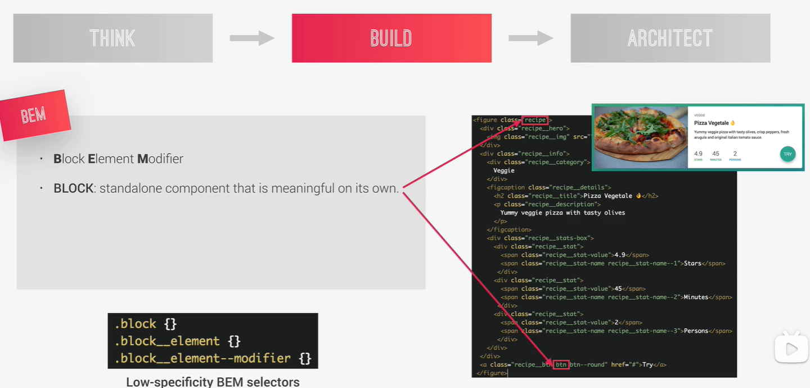

# 构建CSS的类名选择

我们采用`BEM`方式编写`CSS`

`Block Element Modiifier`

`Block`：指的是独立的有意义的组件 ，是一个块

---

注意：**这个案例中`recipe`和`btn`都是一个独立的组件，不仅能到这个案例中，也可以用到别的案例上**

`Element`：元素是`Block`的一部分，本身没有意义，意思是：如果我们把这些元素从块中取出，他们不会有任何的意义

注意：注意`Block`要出现在所有的类身上（`recipe`出现次数很多），这样可以降低`CSS`选择器的特异性

---

`Modifier`：是一个标识，放到`element`或者`block`身上都会让他们有变化，像做一个不同版本的按钮

注意：上面这个案例就是有一个圆形的按钮

