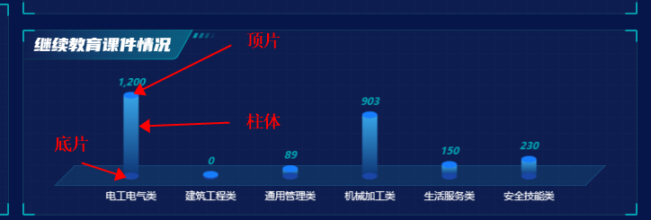

# echarts实现柱状图

先看效果：




核心：就如上图所示，一个圆柱体是由三部分组成的。最下面的底座是自己定位画上去的


## 代码实现


```js
coursewareSituationBar() {
			let chart = this.$echarts.init(document.getElementById('coursewareSituation__bar'));
			var xData = [
				'电工电气类',
				'建筑工程类',
				'通用管理类',
				'机械加工类',
				'生活服务类',
				'安全技能类'
			];
  		
  		// 这一块儿是为了拿接口的数据
			let {id, arg1, ...data} = this.dataList.courseware; 
			var line = Object.values(data);

			let option = {
				grid: {
					left: '5%',
					top: '15%',
					right: '5%',
					bottom: '22%'
				},

				xAxis: [
					{
						data: xData,
						axisLabel: {
							textStyle: {
								color: '#fff',
								fontSize: 12
							},
							margin: 20 //刻度标签与轴线之间的距离。
						},

						axisLine: {
							show: false //不显示x轴
						},
						axisTick: {
							show: false //不显示刻度
						},
						boundaryGap: true,
						splitLine: {
							show: false
						}
					}
				],
				yAxis: [
					{
						splitLine: {
							show: false,
							lineStyle: {
								color: '#eee',
								type: 'solid'
							}
						},
						axisTick: {
							show: false
						},
						axisLine: {
							show: false
						},
						axisLabel: {
							show: false,
							textStyle: {
								color: '#888'
							}
						}
					}
				],
				series: [
         	// 核心就在这个series中，有三块
          
					//柱底圆片
					{
						name: '',
						type: 'pictorialBar',
						symbolSize: [18, 8],
						symbolOffset: [0, 5],
						z: 12,
						itemStyle: {
							normal: {
								color: '#1a46a7'
							}
						},
						data: line
					},

					//柱体
					{
						name: '',
						type: 'bar',
						barWidth: 18,
						barGap: '0%',
						itemStyle: {
							normal: {
								color: {
									x: 0,
									y: 0,
									x2: 0,
									y2: 1,
									type: 'linear',
									global: false,
									colorStops: [
										{
											//第一节下面
											offset: 0,
											color: '#37a4e7'
										},
										{
											offset: 1,
											color: '#0e3676' //37a4e7
										}
									]
								}
							}
						},

						data: line
					},

					//柱顶圆片
					{
						name: '',
						type: 'pictorialBar',
						symbolSize: [18, 8],
						symbolOffset: [0, -5],
						z: 12,
						symbolPosition: 'end',
						itemStyle: {
							normal: {
								color: '#177dff'
							}
						},
						data: line,
						label: {
							show: true,
							position: 'top',
							color: '#02A6B5',
							fontFamily: 'Barlow, Barlow-Bold',
							fontWeight: 600,
							fontStyle: 'italic',
							formatter: params => {
								return `${this.formatNumber(params.data)}`;
							}
						}
					}
				]
			};
			chart.setOption(option);
		},
```

