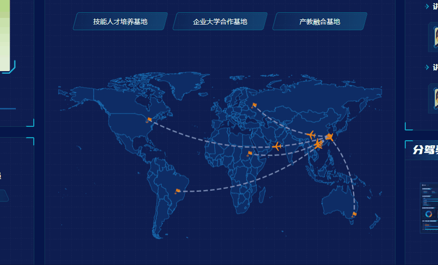
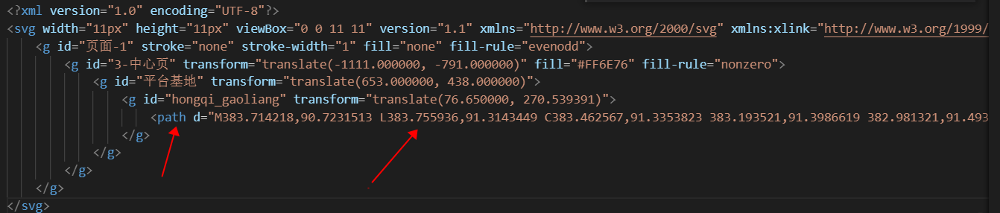

# echarts的飞线图

还是先看看效果：




核心：

1. 地图从哪里拿？地图可以从低版本的echarts中去拿，低版本的echarts(指5.0版本以下的)，自带两个地图，一个全球地图，一个中国地图，如果是其他的则需要去生成以下
2. 主要用到geo、lines、scatter或effectScatter这几个，可以去官网看一看
3. 图标的路径是怎么获取的？在一个svg图标中，会有一个path标签，用`path://`拼接上里面的内容，就可以做路径了，用这个path的好处，官网里面已经讲了，可以颜色，大小都通过echarts的配置来设置很方便




## 上代码


```js
// 注意这里需要引入地图，这个地图可以在老版本echarts去找
import world from '@/assets/map/json/world.json';

platformBaseMap() {
			this.$echarts.registerMap('world', world);
			let chart = this.$echarts.init(document.getElementById('platformBase__map'));

			// 小飞机图标
			let planePath =
				'path://M1705.06,1318.313v-89.254l-319.9-221.799l0.073-208.063c0.521-84.662-26.629-121.796-63.961-121.491c-37.332-0.305-64.482,36.829-63.961,121.491l0.073,208.063l-319.9,221.799v89.254l330.343-157.288l12.238,241.308l-134.449,92.931l0.531,42.034l175.125-42.917l175.125,42.917l0.531-42.034l-134.449-92.931l12.238-241.308L1705.06,1318.313z';
  		// 起点和终点的path
			let markerPath =
				'path://M383.714218,90.7231513 L383.755936,91.3143449 C383.462567,91.3353823 383.193521,91.3986619 382.981321,91.4930703 C382.717293,91.6105366 382.587941,91.7519267 382.587941,91.8569599 C382.587941,92.105072 383.187582,92.4073125 383.973803,92.4073125 C384.760025,92.4073125 385.359665,92.105072 385.359665,91.8569599 C385.359665,91.7729525 385.27653,91.6632769 385.094217,91.5578762 C384.949762,91.4743624 384.76142,91.4064098 384.546264,91.3624353 L384.66309,90.7815663 C384.9371,90.8375696 385.184486,90.9268249 385.386714,91.0437392 C385.733998,91.2445148 385.947607,91.5263155 385.947607,91.8569599 C385.947607,92.5440827 385.043074,93 383.973803,93 C382.904533,93 382,92.5440827 382,91.8569599 C382,91.4696662 382.289813,91.1528799 382.743931,90.9508424 C383.020831,90.8276489 383.355867,90.7488486 383.714218,90.7231513 Z M385.902548,83.0058963 C386.046758,83.0367966 386.139669,83.1810215 386.109016,83.326396 L386.022631,83.7360877 L386.059604,83.7322937 C386.676583,83.6714096 387.92838,83.6688109 388.906121,84.4874653 C389.523856,85.0019874 391.151864,85.0791696 391.725053,85.0684629 C391.807428,85.0676964 391.886743,85.1031087 391.937706,85.164676 C391.988668,85.2262434 392.011278,85.313966 391.994559,85.3932611 L391.136279,89.4637467 C391.114915,89.5650683 391.033299,89.6488754 390.93224,89.6732644 L390.767426,89.7040901 C390.480392,89.7503052 389.862162,89.8169261 389.209507,89.6770802 C388.811836,89.5918703 388.398987,89.4293794 388.04258,89.1401783 L387.893499,89.0083332 C387.095621,88.2434128 385.500653,88.3344612 385.043597,88.3792606 L384.385954,91.4982041 C384.355301,91.6435786 384.212231,91.7372393 384.068021,91.706339 C383.92381,91.6754387 383.8309,91.5312138 383.861553,91.3858394 L385.584615,83.2140312 C385.615268,83.0686567 385.758338,82.974996 385.902548,83.0058963 Z';
			// 线路坐标（模拟数据）
			let LineData = [
				{
					fromName: '宁波',
					toName: '加拿大多伦多',
					coords: [
						[121.619921, 29.867823],
						[-79.384334, 43.653435]
					],
					value: 0
				},
				{
					fromName: '宁波',
					toName: '俄罗斯莫斯科',
					coords: [
						[121.619921, 29.867823],
						[37.618459, 55.761661]
					],
					value: 0
				},
				{
					fromName: '宁波市',
					toName: '苏丹喀土穆',
					coords: [
						[121.619921, 29.867823],
						[32.579446, 15.587886]
					],
					value: 0
				},
				{
					fromName: '宁波',
					toName: '巴西巴西利亚',
					coords: [
						[121.619921, 29.867823],
						[-47.865984, -15.780379]
					],
					value: 0
				},
				{
					fromName: '宁波',
					toName: '澳大利亚堪培拉',
					coords: [
						[121.619921, 29.867823],
						[149.127663, -35.30604]
					],
					value: 0
				}
			];
			// 线路起点坐标
			let LineEffectScatterData = [];
			// 线路终点坐标
			let effectScatterData = [];
			LineData.map(item => {
				// 线路起点坐标
				let objStart = {
					name: item.fromName,
					value: item.coords[0]
				};
				LineEffectScatterData.push(objStart);
				// 线路终点坐标
				let objEnd = {
					name: item.toName,
					value: item.coords[1]
				};
				effectScatterData.push(objEnd);
			});

			// 这是整个series
			let series = [];
			series.push(
				{
					type: 'lines',
					zlevel: 2,
					effect: {
						show: true,
						//飞机的速度  这里是s单位
						period: 6,
						trailLength: 0,
						symbol: planePath, // 小飞机图标的svg路径
						// 飞机大小
						symbolSize: 16,
						color: '#ff8800'
					},
					lineStyle: {
						normal: {
							color: '#8A91BA',
							type: 'dashed', // 虚线
							// 线条宽度
							width: 2,
							opacity: 1,
							curveness: 0.2 // 弯曲度
						},
						emphasis: {
							color: '#FF9600' //飞线悬浮颜色
						}
					},
					label: {
						normal: {
							show: false,
							position: 'middle',
							formatter: '{b}'
						}
					},
					data: LineData
				},
				{
					// 这个是起点（看data的数据）
					type: 'scatter',
					coordinateSystem: 'geo',
					zlevel: 2,
					rippleEffect: {
						//涟漪特效
						period: 4, //动画时间，值越小速度越快
						brushType: 'stroke', //波纹绘制方式 stroke, fill
						scale: 4 //波纹圆环最大限制，值越大波纹越大
					},
					label: {
						normal: {
							show: false,
							position: 'right', //显示位置
							offset: [5, 0], //偏移设置
							formatter: '{b}', //圆环显示文字
							textStyle: {
								color: 'red'
							}
						}
						// emphasis: {
						//     show: true
						// }
					},
					symbol: markerPath,
					symbolSize: function(val) {
						return 10; //圆环大小
					},
					itemStyle: {
						normal: {
							show: false,
							color: 'red'
						}
					},
					data: LineEffectScatterData
				},

				{
					// 这个是终点（看data的数据）
					type: 'scatter',
					coordinateSystem: 'geo',
					zlevel: 2,
					rippleEffect: {
						period: 4,
						brushType: 'stroke',
						scale: 4
					},
					label: {
						normal: {
							show: false,
							position: 'right', //显示位置
							offset: [5, 0], //偏移设置
							formatter: '' //圆环显示文字
						},
						emphasis: {
							show: true
						}
					},
					symbol: markerPath,
					symbolSize: function(val) {
						return 10; //圆环大小
					},
					itemStyle: {
						normal: {
							show: true,
							color: '#FF9300'
						}
					},
					data: effectScatterData
				}
			);
			let option = {
				backgroundColor: 'rgba(0,0,0,0)',
				tooltip: {
					trigger: 'item',
					// backgroundColor: 'rgba(0,0,0,0)',
					// borderColor: 'rgba(0,0,0,0)',
					padding: 5,
					formatter: function(params, ticket, callback) {
						// 注意这里的判断 条件，是通过type来判断的
						if (params.seriesType == 'effectScatter') {
							// 这里可根据自己需要自定义
							// 起点/终点悬浮效果
							return params.marker + params.data.name;
						} else if (params.seriesType == 'lines') {
							// 这里可根据自己需要自定义
							// 飞线悬浮效果
							return params.data.fromName + ' -> ' + params.data.toName + '<br />';
						}
						return params.name;
					}
				},
				geo: {
					map: 'world',
					zoom: 1.15, // 同比例放大1.15倍
					label: {
						emphasis: {
							show: false
						}
					},
					// scaleLimit: {
					// 	//滚轮缩放的极限控制
					// 	min: 1,
					// 	max: 3
					// },
					// layoutCenter: ['50%', '52%'], //地图位置
					// layoutSize: '130%',
					itemStyle: {
						normal: {
							color: '#0e2c65', //地图背景色
							borderColor: '#1b81ca' //省市边界线
						},
						emphasis: {
							color: '#6073ae' //悬浮背景
						}
					},
					// 设置中国地图边界线
					regions: [
						{
							name: 'China',
							itemStyle: {
								normal: {
									borderColor: '#fedc70',
									borderWidth: 1,
									areaColor: '#6073ae',
									// shadowColor: 'rgba(128, 217, 248, 1)',
									// shadowColor: 'rgba(255, 255, 255, 1)',
									shadowOffsetX: 0,
									shadowOffsetY: 0,
									shadowBlur: 0
								},
								emphasis: {
									color: '#6073ae' //悬浮背景
								}
							}
						}
					],
					nameMap: {
						// 这个是名字映射，地图里默认都是英文的，可以写映射
						China: '中国'
					}
				},

				series: series
			};

			chart.setOption(option);
		}
```

