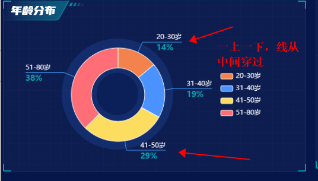

# echarts各种各样的label


## 指示线穿过label

先看效果：




核心：

1. 要用到一个labelLayout函数，来控制第三个点的位置，然后线会自动连接起来


### 代码实现

```js
ageDistributionPie() {
			let chart = this.$echarts.init(document.getElementById('ageDistribution__pie'));
			let pieData = [
				{
					value: this.dataList.ageDistribution.twentyToThirty,
					name: '20-30岁'
				},
				{
					value: this.dataList.ageDistribution.thirtyOneToForty,
					name: '31-40岁'
				},
				{
					value: this.dataList.ageDistribution.fortyOneToFifty,
					name: '41-50岁'
				},
				{
					value: this.dataList.ageDistribution.fiftyOneToEighty,
					name: '51-80岁'
				}
			];
			let option = {
				legend: {
					show: true,
					orient: 'vertical',
					right: 56,
					y: 'center',
					textStyle: {
						color: '#fff',
						fontSize: 12,
						fontFamily: 'Microsoft YaHei, Microsoft YaHei-Regular'
					},
					itemWidth: 22,
					itemHeight: 10,
					itemStyle: {
						borderWidth: '1'
					},
					icon: 'roundRect'
				},
				series: [
					{
						type: 'pie',
						center: ['37%', '50%'],
						radius: ['40%', '70%'],
						data: pieData,
						itemStyle: {
							borderColor: '#fff',
							borderWidth: 1
						},
						label: {
							show: true,
							position: 'outside', // 这里outside就不用讲了吧
							// 1.首先我们要设置label是一上一下的那种
							formatter: function(val) {
								return '{title|' + val.name + '}\n{per|' + val.percent.toFixed(0) + '%}';
							},
							
              // 这个rich是自定义样式
							rich: {
								title: {
									color: '#fff',
									fontSize: 12,
									lineHeight: 14
								},
								per: {
									color: '#02A6B5',
									fontSize: 14,
									fontFamily: 'Barlow, Barlow-Medium',
									lineHeight: 17,
									padding: [8, 0, 0, 0],
									align: 'left',
									fontWeight: 600
								}
							}
						},
						labelLine: {
							length: '20',
							length2: '20',
							maxSurfaceAngle: 80,
							lineStyle: {
								color: '#3FA4FF'
							}
						},
            // 2.核心关键是这里，通过这个函数来调整
						labelLayout: function(params) {
							// 判断标签是在左边还是在右边
							const isLeft = params.labelRect.x < chart.getWidth() * 0.35;
							const points = params.labelLinePoints;
							// Update the end point. 修改第三个点的位置
							points[2][0] = isLeft
								? params.labelRect.x
								: params.labelRect.x + params.labelRect.width;
							return {
								labelLinePoints: points
							};
						},
						color: ['#f4824d', '#4992ff', '#fddd60', '#ff6e76', '#58d9f9', '#05c091']
					}
				]
			};
			chart.setOption(option);
		}
```

