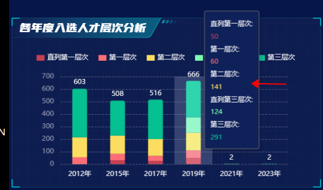

# echarts各种各样的tooltip


## 一：堆叠柱状图的tooltip

先看效果：




核心：

1. 首先要把堆叠的柱状图给搞出来
2. 核心就是tooltip的formatter函数，是可以返回HTML代码片段的，所以我们就可以自己写html标签(●'◡'●)


### 上代码

```js
talentLevelBar() {
			let chart = this.$echarts.init(document.getElementById('talentLevel__bar'));
			let nameData = ['直列第一层次', '第一层次', '第二层次', '直列第三层次', '第三层次'];
			let xData = [];
			let yData = [[], [], [], [], []];

			// 填充数据
			this.dataList.talentLevel.forEach(item => {
				xData.push(item.year + '年');

				yData[0].push(item.level.lineFirst);
				yData[1].push(item.level.first);
				yData[2].push(item.level.second);
				yData[3].push(item.level.lineThird);
				yData[4].push(item.level.third);
					
        // 这个是用来，通过后端返回数据，来自动获取nameData和yData的
				// let index = 0;
				// for (let key in item.level) {
				// 	if (!item.level.hasOwnProperty(key)) {
				// 		return; // 防止遍历到原型链上
				// 	}
				// 	// 如果不存在创建一个新的容器
				// 	yData[index] ? '' : (yData[index] = []);
				// 	yData[index].push(item.level[key]);
				// 	if (nameData.indexOf(nameMap[key]) === -1) {
				// 		nameData.push(nameMap[key]); // 添加名称
				// 	}
				// 	index++;
				// }
			});

			// 计算最上层label数据(把每一列数据加起来)
			let labelData = [];
			yData.forEach((item1, index1) => {
				item1.forEach((item2, index2) => {
					// 判断是否是number，如果不是，就先赋值成0再加，否则直接加
					typeof labelData[index2] == 'number'
						? (labelData[index2] += item2)
						: ((labelData[index2] = 0), (labelData[index2] += item2));
				});
			});

			let option = {
				grid: {
					top: '20%',
					left: '11%',
					right: '5%',
					bottom: '10%'
				},
				tooltip: {
					trigger: 'axis',
					axisPointer: {
						type: 'shadow'
					},
					backgroundColor: '#0f2159',
					borderColor: 'rgba(#00A6FF, 0.26)',
					position: 'left',
					formatter: function(params) {
						let str = '';
						params.forEach((item, index) => {
							// 关键就是这里，写了一个标签，
							str += `<span style=\"color: #fff; font-size: 12px;\">${item.seriesName}:</span> <br /><span style=\"color:${item.color}; font-size: 12px;\">${item.value}</span> <br />`;
						});
						return str;
					}
				},
				legend: {
					left: 5,
					itemGap: 18,
					textStyle: {
						color: '#ffffff',
						fontSize: 12,
						fontFamily: 'Microsoft YaHei'
					},
					itemWidth: 14,
					itemHeight: 10,
					icon: 'rect'
				},
				xAxis: [
					{
						type: 'category',
						data: xData,
						axisTick: {show: false},
						axisLine: {show: false},
						axisLabel: {
							color: '#fff',
							margin: 12,
							fontFamily: 'Microsoft YaHei'
						}
					}
				],
				yAxis: [
					{
						type: 'value',
						splitLine: {
							show: true,
							lineStyle: {
								color: '#e8e8e8',
								opacity: 0.3,
								type: 'dashed'
							}
						},
						axisLabel: {
							color: '#fff',
							margin: 12,
							fontFamily: 'Roboto, Roboto-Regular',
							opacity: 0.5
						}
					}
				],
				series: [
          // 注意这里，他是一层一层的，所以我们要写多个，每一个有一个data，data是[0,1,2]这样的数组，第二个是要把stack这个给加上，不加就会是多个柱状图的效果
					{
						name: nameData[0],
						type: 'bar',
						stack: 'total',
						data: yData[0]
					},
					{
						name: nameData[1],
						type: 'bar',
						stack: 'total',
						data: yData[1]
					},
					{
						name: nameData[2],
						type: 'bar',
						stack: 'total',
						data: yData[2]
					},
					{
						name: nameData[3],
						type: 'bar',
						stack: 'total',
						data: yData[3]
					},
					{
						name: nameData[4],
						type: 'bar',
						stack: 'total',
						label: {
							show: true,
							position: 'top',
							color: '#fff',
							fontFamily: 'Roboto, Roboto-Medium;',
							fontWeight: 500,
							formatter: params => {
								return `${this.formatNumber(labelData[params.dataIndex])}`;
							}
						},
						data: yData[4],
						barWidth: 26,
						itemStyle: {
							borderRadius: [4, 4, 0, 0]
						}
					}
				],
				color: ['#c54151', '#ff6e76', '#fddd60', '#7cffb2', '#05c091']
			};
			chart.setOption(option);
		}
```


