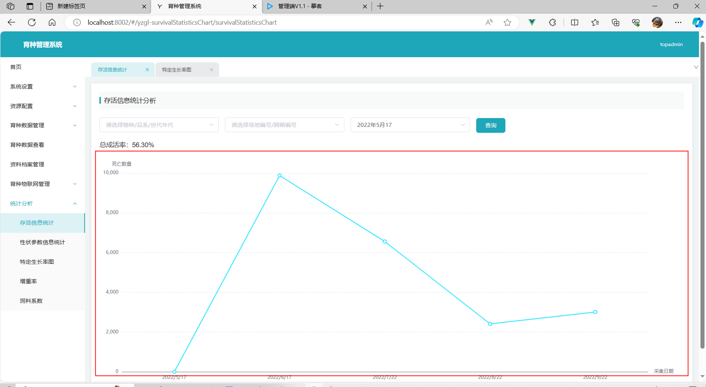
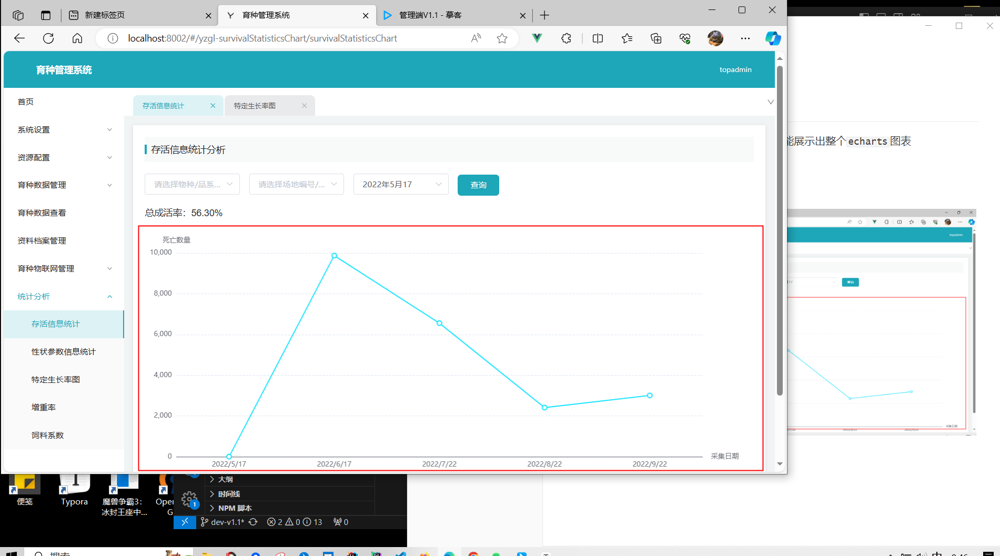
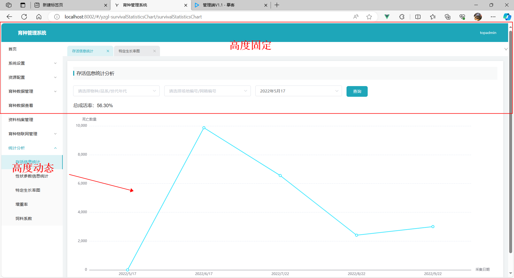

# 动态高度的`echarts`

前置指是echart的响应式图表，可以看03-响应式


## 问题：

我们在开发管理系统时，常常会有一些数据分析的模块，数据分析模块就会用到echarts图表，我们从echarts的官网知道，echarts的图表需要提供一个外壳，这个外壳需要有一个**高度**，有时候，我们为了简便往往去给定一个**固定的高度**，但是其实从用户的角度来看，这样是不太合理的，因为用户的屏幕往往会有各种各样的有的屏幕大，有得屏幕小，然而我们得图表高度固定，从而就会带来一些不良得体验。


## 需求：

我们现在想要，无论用户得屏幕大，还是小，都能展示出整个`echarts`图表


全屏时：



缩小浏览器时：




**无论是扩大，还是缩小都能展示出整个图表**


## 解决办法

### 解决办法一：

动态获取浏览器高度，计算展示内容

分析需求：

1. 如何计算高度？
2. 如何让高度动态变化，浏览器缩小，高度缩小，浏览器扩大高度扩大


我们先看下图：



常规的管理系统，整体的布局都是这个样子，我们会发现，上面的高度是固定的(指浏览器扩大缩小，给定的高度是定死的)，而下面的图表是动态的。

结合上述，现在我们就有一个思路了，我们只需要知道浏览器的整体高度(`window.innerHeight`)，减去固定的高度，就能够得到`echarts`的高度了，这样我们就解决了第一个问题，如何计算高度？


第二个问题，如何动态控制高度，这里我们需要介绍一个方法window上的`resize`方法，算了还是不介绍了，具体内容请自行MDN搜索查看，具体的功能，就是能够监听浏览器的变化。


结合上面两个我们就能只要浏览器`resize`，我们就重新执行一遍（浏览器高度-固定高度）获取到echarts图表高度，进而就能体现出动态效果了


具体实现：

获取浏览器高度：

```js
/**
 * 获取浏览器高度
 */
export function getClientHeight () {
  let winHeight = 0
  if (window.innerHeight) {
    winHeight = window.innerHeight
  } else if ((document.body) && (document.body.clientHeight)) {
    winHeight = document.body.clientHeight
  }
  return winHeight
}
```


页面代码（**只有关键代码**）：

```vue
<template>
	<div>
			<div class="chart-line" :style="`height: ${chartHeight}px`">
				<q-chart ref="survivalStatisticsChart" :options="chartOptions"></q-chart>
			</div>
		</div>
	</div>
</template>

<script>
import qChart from '../components/qChart/qChart.vue';
import {getClientHeight} from '@/utils/index.js';
export default {
	components: {qChart},
	data() {
		return {
			chartHeight: getClientHeight() - 245
		};
	},
	mounted() {
		this.setChartHeight();
    // 这里监听resize事件，只要浏览器resize了，就会调用后面的方法
		window.addEventListener('resize', this.setChartHeight);
	},
	methods: {
		setChartHeight() {
			this.$nextTick(() => {
        // 不断重复获取浏览器高度，并减去固定高度245计算出动态高度
				this.chartHeight = getClientHeight() - 245;
			});
		}
	}
};
</script>
<style lang="scss" scoped>
.chart {
	&-head {
		display: flex;
		align-items: center;
		justify-content: space-between;
		.num {
			font-size: 16px;
		}
	}

	&-line {
		width: 100%;
	}
}
</style>

```

