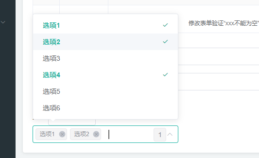

# el-select扩展


## 扩展一：多选超出指定数目隐藏，并展示隐藏数

具体效果如图：



>效果：指定只展示两个，选中三个及以上时候，在末尾会有个数字的展示


具体实现思路：

1. 通过`css`方式，控制展示数量，如nth-child(n+3)然后将display设置为none
2. 通过原生`dom`在el-select后面添加一个专门展示数字的标签


核心代码：

`css`部分：

```scss
.el-select {
	/* width: 70% !important; */

	/deep/ .el-tag.el-tag--info:nth-child(n + 3) {
    /*
    	这个来控制展示数量
    */
		display: none;
	}

	/deep/ .moreNumber {
		display: inline-block;
		position: absolute;
		background-color: #f4f4f5;
		border-color: #e9e9eb;
		color: #909399;
		padding: 5px 8px;
		top: 5px;
		right: 25px;
		border-width: 1px;
		border-style: solid;
		border-radius: 4px;
		transform: scale(0);
		transition: all 0.2s;
	}
}
```


`js`部分：

```vue
<template>
	<div>
    <el-select @change="changeValue"></el-select>
  </div>
</template>
<script>
const span = document.createElement('span');
span.setAttribute('class', 'moreNumber');
export default {
	
  mounted() {
    // 将我们自己的span给放到select中
		let select = document.querySelector('.el-select');
		select.appendChild(span);
  },
  changeValue(val) {
    if (val.length > 2) {
      span.style.transform = 'scale(1)';
      span.innerHTML = val.length - 2;
    } else {
      span.style.transform = 'scale(0)';
    }
  }
}
</script>
```

>注意点：
>
>1.注意操作dom的时机，要么放到mounted生命周期里，要么丢进$nextTick函数中

