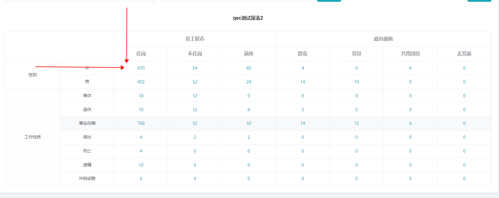
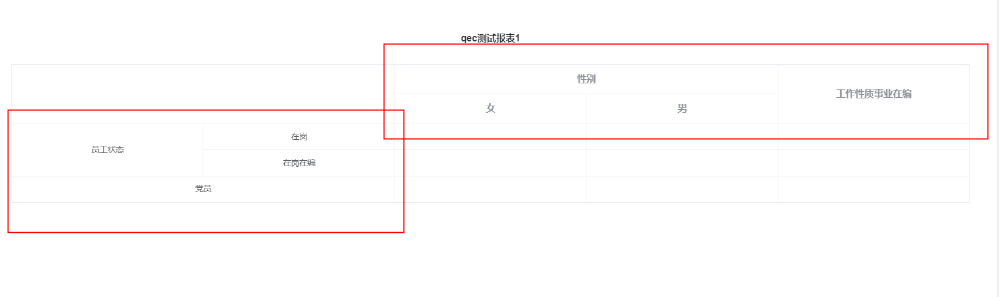

# 03-表格合并

el-table中，很细心的提供了合并列表的功能


示例：

```vue
<template>
  <div>
    <el-table
      :data="tableData"
      :span-method="arraySpanMethod"
      border
      style="width: 100%">
      <el-table-column
        prop="id"
        label="ID"
        width="180">
      </el-table-column>
      <el-table-column
        prop="name"
        label="姓名">
      </el-table-column>
      <el-table-column
        prop="amount1"
        sortable
        label="数值 1">
      </el-table-column>
      <el-table-column
        prop="amount2"
        sortable
        label="数值 2">
      </el-table-column>
      <el-table-column
        prop="amount3"
        sortable
        label="数值 3">
      </el-table-column>
    </el-table>

    <el-table
      :data="tableData"
      :span-method="objectSpanMethod"
      border
      style="width: 100%; margin-top: 20px">
      <el-table-column
        prop="id"
        label="ID"
        width="180">
      </el-table-column>
      <el-table-column
        prop="name"
        label="姓名">
      </el-table-column>
      <el-table-column
        prop="amount1"
        label="数值 1（元）">
      </el-table-column>
      <el-table-column
        prop="amount2"
        label="数值 2（元）">
      </el-table-column>
      <el-table-column
        prop="amount3"
        label="数值 3（元）">
      </el-table-column>
    </el-table>
  </div>
</template>

<script>
  export default {
    data() {
      return {
        tableData: [{
          id: '12987122',
          name: '王小虎',
          amount1: '234',
          amount2: '3.2',
          amount3: 10
        }, {
          id: '12987123',
          name: '王小虎',
          amount1: '165',
          amount2: '4.43',
          amount3: 12
        }, {
          id: '12987124',
          name: '王小虎',
          amount1: '324',
          amount2: '1.9',
          amount3: 9
        }, {
          id: '12987125',
          name: '王小虎',
          amount1: '621',
          amount2: '2.2',
          amount3: 17
        }, {
          id: '12987126',
          name: '王小虎',
          amount1: '539',
          amount2: '4.1',
          amount3: 15
        }]
      };
    },
    methods: {
      // 返回数组方式
      /*
      	讲解：
      	rowIndex，和columnIndex都是定位用的，具体怎么合并，关键在return上
      */
      arraySpanMethod({ row, column, rowIndex, columnIndex }) {
        if (rowIndex % 2 === 0) {
          if (columnIndex === 0) {
            return [1, 2];
          } else if (columnIndex === 1) {
            return [0, 0];
          }
        }
      },
			
      // 返回对象方式
      objectSpanMethod({ row, column, rowIndex, columnIndex }) {
        if (columnIndex === 0) {
          if (rowIndex % 2 === 0) {
            return {
              rowspan: 2, // //rowspan:单元格可横跨的行数
              colspan: 1 // //colspan:单元格可横跨的列数
            };
          } else {
            return {
              rowspan: 0, // 0就是跨越0个单元格，其实就是在表格上就是被合并项
              colspan: 0
            };
          }
        }
      }
    }
  };
</script>
```


## 更具指定项合并数据

例如现在有这样的数据格式：

```js
let data = [
  {
    name: '水果'
  },
  {
    name: '水果'
  },
  {
    name: '蔬菜'
  },
  {
    name: '蔬菜'
  },
  {
    name:'啥都不是'
  }
]
```


目标：我们想让表格把指定属性名相同的项按行合并起来（这里示例数据指定相同name）

核心：首先我们要写一个函数来帮助我们计算那行数据要合并，那行数据被合并，那行数据不合并

>记住element-ui中的跨越，0代表被不跨越意味着被合并，1代表跨越1个单元格(本身就占1个单元格，标识不合并)，大于1的其他数字表示具体合并了多少


代码：

```vue
<template>
	<el-table :span-method="objectSpanMethod">
  	....
  </el-table>
</template>

<script>
export default {
  data() {
    return {
      tableData: [
        {
          name: 'q',
          value: 123
        },
        {
          name: 'q',
          value: 123
        },
        {
          name: 'w',
          value: 456
        },
        {
          name: 'w',
          value: 1123
        },{
          name: 'c',
          value: 12312
        },
      ]
    }
  },
  methods: {
    // 核心函数，计算要被合并的行
    mergeArr(data, name) {
			let arr = [];
			let position = 0;
			for (let i = 0; i < data.length; i++) {
				if (i === 0) {
					arr.push(1);
					continue;
				}

				if (data[i][name] === data[i - 1][name]) {
					arr[position] += 1;
					arr.push(0); // 放个0表示当前数据被合并了
				} else {
					// 如果上一个值和现在值不相等
					arr.push(1); // 直接放一个1标识不合并
					position = i; // 并将position往前移动(指向i)
				}
			}
			return arr;
		},
    
    
    // 改进版（带有索引的表格，需要手动加一列在表格中）
    mergeArr(data, name) {
			let arr = [];
			let position = 0;
			let index = 1;
			for (let i = 0; i < data.length; i++) {
				if (i === 0) {
					arr.push(1);
					this.tableData[i].no = index;
					continue;
				}

				if (data[i][name] === data[i - 1][name]) {
					arr[position] += 1;
					arr.push(0); // 放个0表示当前数据被合并了

					this.tableData[i].no = index; // 如果相等，当前位置和上一个index一致
				} else {
					// 如果上一个值和现在值不相等
					arr.push(1); // 直接放一个1标识不合并
					position = i; // 并将position往前移动(指向i)
					// 让index++
					index++;
					this.tableData[i].no = index;
				}
			}
			return arr;
		},
    
		objectSpanMethod({row, column, rowIndex, columnIndex}) {
      
      // 注意，这里还能优化，这个函数会被重复调用多次，
			let spanArr = this.mergeArr(this.tableData, 'name');
      
      // 这里确定位置，在第一列
			if (columnIndex === 0) {
				return {
					rowspan: spanArr[rowIndex],
					colspan: 1
				};
			}
		}
  }
}
</script>
```


## X轴Y轴指定数据合并


先看效果图：




首先分析：

1. 这个表格的数据是通过x轴，和y轴来看，然后来确定一个格子内的数值
2. 数据中一行的前两列，水平会居中，第一列的垂直方向也会居中
3. 表头中，可能是2级表头，也可能是一级表头
4. 表头中，前两列合并

示例图如下：




核心思路：

1. 表格主体(不包括表头)的**行合并**，我们可以通过自定义两列，然后判断两列数据数据值是否一致，来判断是否要合并，**列合并**也是一样的，判断前两列数据是否一致，一致就合并起来
2. 表头，采用多级表头方式，表头的prop属性，采用id来动态存储


组件示例：

```vue
<template>
	<div class="custom-table">
		<h4 class="head">{{ tableTitle }}</h4>
		<div class="table">
			<el-table
				:span-method="objectSpanMethod"
				:data="tableData"
				style="width: 100%"
				:stripe="false"
				:header-cell-style="hideMethod"
			>
        <!-- 前两列自定义，我们到时候格式化数据时，要把这两列自己补充上 -->
				<el-table-column prop="xName1" label=""> </el-table-column>
				<el-table-column prop="xName2" label=""></el-table-column>

				<el-table-column
					v-for="(item, index) in tableColumn"
					:key="item.id"
					:label="item.name"
					:prop="item.id"
				>
					<!-- y轴没有二级统计项时 -->
					<template slot-scope="scope">
						<el-button v-if="isClick" type="text" @click="clickCell(scope)">
							{{ scope.row[item.id] }}
						</el-button>
						<div v-else style="display:flex; justify-content: center;">
							<span>{{ scope.row[item.id] }}</span>
						</div>
					</template>

					<el-table-column
						v-for="(child, childIndex) in item.childrenList"
						:prop="child.id"
						:label="child.name"
						:key="child.id"
						align="center"
					>
						<!-- y轴有二级统计项时 -->
						<template slot-scope="scope">
							<el-button v-if="isClick" type="text" @click="clickCell(scope)">
								{{ scope.row[child.id] }}
							</el-button>
							<div v-else style="display:flex; justify-content: center;">
								<span>{{ scope.row[child.id] }}</span>
							</div>
						</template>
					</el-table-column>
				</el-table-column>
			</el-table>
		</div>
	</div>
</template>

<script>
export default {
	name: 'qTable',
	props: {
		tableTitle: {
			type: String,
			default: ''
		},
		tableColumn: {
			type: Array,
			default: () => []
		},
		tableData: {
			type: Array,
			default: () => []
		},
		isClick: {
			type: Boolean,
			default: true
		}
	},

	methods: {
		clickCell(row) {
			if (!this.isClick) {
				return;
			}

			this.$emit('clickCell', row);
		},
		// 表格合并方法
		objectSpanMethod({row, column, rowIndex, columnIndex}) {
			let spanArr = this.rowMergeArr(this.tableData, 'xName1');
			// console.log('合并表格', spanArr);
			let col = this.colMerge(row.xName1, row.xName2);

			// 相同行合并
			if (columnIndex === 0) {
				return {
					rowspan: spanArr[rowIndex],
					colspan: col
				};
			}

			// 如果等于2说明要被合并，我们第二列对应位置标识为要被合并0
			if (col === 2) {
				if (columnIndex === 1) {
					return {
						rowspan: 1,
						colspan: 0
					};
				}
			}
		},
		rowMergeArr(data, name) {
			let arr = [];
			let position = 0;
			for (let i = 0; i < data.length; i++) {
				if (i === 0) {
					arr.push(1);
					continue;
				}

				if (data[i][name] === data[i - 1][name]) {
					arr[position] += 1;
					arr.push(0); // 放个0表示当前数据被合并了
				} else {
					// 如果上一个值和现在值不相等
					arr.push(1); // 直接放一个1标识不合并
					position = i; // 并将position往前移动(指向i)
				}
			}

			return arr;
		},
		colMerge(params1, params2) {
			let result = 1;
			if (params1 === params2) {
				result = 2;
			}
			return result;
		},

		hideMethod({row, column, rowIndex, columnIndex}) {
			let headCss = {
				backgroundColor: '#fff'
			};
			if (columnIndex === 0 && rowIndex === 0) {
				//这里为了是将最左上角，第一列第一行的表头的右边框给隐藏掉，给人一种合并的感觉
				headCss = {
					borderRight: 'none',
					backgroundColor: '#fff'
				};
			}
			return headCss;
		}
	}
};
</script>

<style lang="scss" scoped>
.custom-table {
	.head {
		display: flex;
		justify-content: center;
		margin-bottom: 30px;
	}
}
</style>

```


传递的数据介绍：

```js
// tableColumn 参数格式
// 首先要是一个层级的结构，第一层代表一级表头，第二层childrenList是二级表头
[
    {
        "id": "1684024283065888769",
        "name": "性别",
        "sndItemRmk": 1,
        "childrenList": [
            {
                "id": "1684024283091054593", // 这个id就是绑定到prop中的
                "name": "女"
            },
            {
                "id": "1684024283091054594",
                "name": "男"
            }
        ]
    },
    {
        "id": "1684046156214448130",
        "name": "工作性质事业在编",
        "sndItemRmk": 0,
        "childrenList": []
    }
]


// tableData数据的格式
[
  {
    "1684024094309625857": 0, // 这些是数据
    "1684024094355763201": 0,
    "1684024175289053185": 0,
    xId: "1684024094309625857",
    xName1: "员工状态", // 这个是前两列
    xName2: "在岗"		 // 这个是前两列
  },
  {
    "1684024094309625857": 0,
    "1684024094355763201": 0,
    "1684024175289053185": 0,
    xId: "1684024094355763201",
    xName1: "员工状态",
    xName2: "在岗在编"
  },
    {
    "1684024094309625857": 0,
    "1684024094355763201": 0,
    "1684024175289053185": 0,
    xId: "1684024175289053185",
    xName1: "党员",
    xName2: "党员"
  }
]
```


