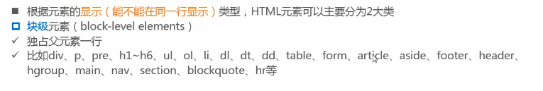
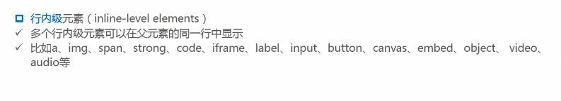
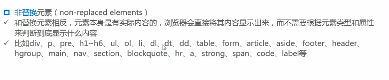
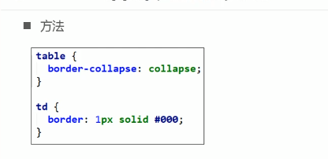
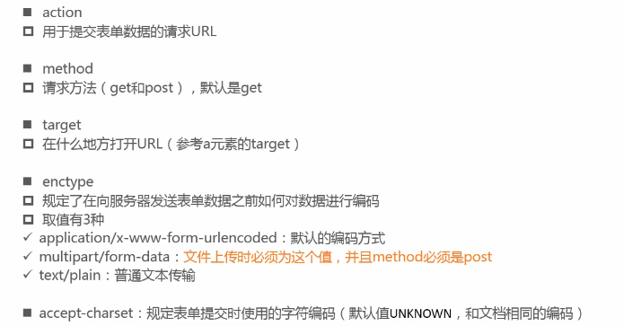
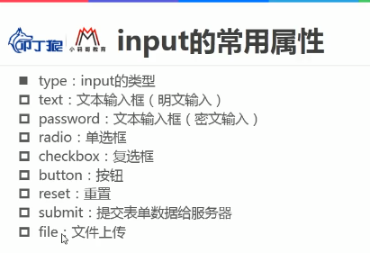
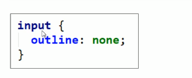
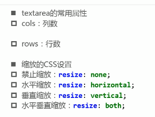

# 一个网站的基本结构

```html
<!DOCTYPE html>
<html lang="">

    <head>
        <title></title>
        <meta charset = "utf-8">
        <style></style>
        <link>
    </head> 
    <body>
           
    </body>
</html> 
```


## head 元素中的大多数内部元素

* meta 单标签 ：设置元数据

* title 双标签：设置标题内容

* style 双标签：设置样式

* link 单标签：链接

* base

* script

* noscript

  

## 块级元素，行内级元素

### 块级元素（block-level elements）



### 行内级元素（inline-level elements）



**注意点** :

1. 一般情况下块级元素和行内块级元素（inline-block），可以嵌套任意的元素，特殊情况p元素不能包含其他块级元素

2. 行内元素（a、span、strong等）里面不要嵌套块级元素

   

## 替换元素与非替换元素

根据浏览器是否会替换元素而进行分类

### 替换元素（replace elements）


### 非替换元素（non-replace elements）



## 标签语义化

语义化在任何地方都有存在：例如js，css都需要语义化。

html的标签语义化，就是合适的内容使用合适的标签对内容进行包裹。一方面利于阅读和日后维护，一方面利于浏览器的优化(例如：seo优化)

### 语义化的一些元标签(语义化元素)

### article元素

**HTML `<article>`**元素表示文档、页面、应用或网站中的独立结构，其意在成为可独立分配的或可复用的结构，如在发布中，它可能是论坛帖子、杂志或新闻文章、博客、用户提交的评论、交互式组件，或者其他独立的内容项目

用在文章上非常合适。


### section元素

**HTML <section>元素**表示一个包含在HTML文档中的独立部分，它没有更具体的语义元素来表示，一般来说会有包含一个标题。

如果元素的内容作为一个独立的有意义的集合，`<article>`元素可能是更好的选择。


不要把section元素作为一个容器去使用，这是div的工作。


### aside元素

**HTML `<aside>` 元素**表示一个和其余页面内容几乎无关的部分，被认为是独立于该内容的一部分并且可以被单独的拆分出来而不会使整体受影响。其通常表现为侧边栏或者标注框（call-out boxes）。


### figure元素

**HTML `<figure>` 元素**代表一段独立的内容, 经常与说明（caption） [``](https://developer.mozilla.org/zh-CN/docs/Web/HTML/Element/figcaption) 配合使用, 并且作为一个独立的引用单元。**当它属于主内容流（main flow）时，它的位置独立于主体。**（就是脱离标准流）这个标签经常是在主文中引用的图片，插图，表格，代码段等等，当这部分转移到附录中或者其他页面时不会影响到主体。


### footer元素

**HTML <footer> 元素**表示最近一个[章节内容](https://developer.mozilla.org/en-US/docs/Web/Guide/HTML/Sections_and_Outlines_of_an_HTML5_document#Defining_Sections_in_HTML5)或者[根节点](https://developer.mozilla.org/en-US/docs/Web/Guide/HTML/Sections_and_Outlines_of_an_HTML5_document#Sectioning_root)（sectioning root ）元素的页脚。一个页脚通常包含该章节作者、版权数据或者与文档相关的链接等信息。

页脚部分

### header元素

**HTML `<header>` 元素**用于展示介绍性内容，通常包含一组介绍性的或是辅助导航的实用元素。它可能包含一些标题元素，但也可能包含其他元素，比如 Logo、搜索框、作者名称，等等。

标题部分

### main元素

HTML **`<main>` 元素**呈现了文档的 `body`或应用的主体部分。主体部分由与文档直接相关，或者扩展于文档的中心主题、应用的主要功能部分的内容组成。

就是主体部分。

**基本使用规则**：在文档中，`<main>` 元素的内容应当是独一无二的。任何同时存在于任意一系列文档中的相同、重复内容，比如侧边栏、导航栏链接、版权信息、网站 Logo，搜索框（除非搜索框为文档的主要功能），都不应当被包含在其内。


### nav元素

**HTML `<nav>`元素**表示页面的一部分，其目的是在当前文档或其他文档中提供导航链接。导航部分的常见示例是菜单，目录和索引。


---

## html元素

* 根元素：只能存在一个
* 设置lang：lang=en，lang=zh

## body 元素

body元素是一个网站页面的主题部分，在网站页面中能看到的内容基本都是在body元素中。

##### h元素

`<h1><h1>~<h6>~<h6>`设置文档标题有1到6个大小，1级最显著。注意：一个网页最好只有一个h1标签。h元素有利于SEO（Search Engine Optimization）优化

##### p元素

`<p></p>`设置段落内容

##### br元素

`<br />`换行 （很少使用）

##### hr元素

`<hr />`添加一行分割线 （很少使用）

##### pre标签

`<pre></pre>`预处理标签（很少使用）

##### span元素（非常重要）

默认情况下和普通文本无区别，用于区分特殊文本和普通文本*是一个行内元素* 

##### div元素（非常重要）

一般作为其他元素的父容器，把其他元素包住代表一个整体，可以将网页分割为多个独立的部分。

##### img元素

``img元素专门用于显示图片(单标签)少用绝对路径，多用相对路径。alt属性是当图片加载不出来的时候需要展示的文字。

绝对路径：从根路径开始查找，一旦位置发生改变，那么图片就会出现找不到的问题

相对路径：

规则：

* . 表示当前路径（目录）
* .. 表示上一层路径（目录）

##### a元素 （非常重要）

`<a href="" target=""></a>` a元素是用来定义超链接

target属性的内容（一部分）：

* _self（默认值）：指自己
* _blank：空白，新打开一个窗口
* 下面这写需要和**iframe元素**一起使用
* _parent：
* _top：
* 具体的name

a元素还有锚点链接 `<a href="#id"></a>`点击之后可以直接跳到对面的id位置，并且还可以和img标签嵌套

a元素中有tabindex属性，tabindex是为了确定选择顺序，设置tabindex="-1"就可以让a不被选中

##### base元素

 `<base href="" target=""/ >`和元素a配合使用用于简写一些a元素重复的内容如网址，target属性等（在head元素中申明）


##### iframe元素 （很少使用）

`<iframe src="" width="" height="" frameborder=""></iframe>` iframe元素是用来显示嵌套网页的

### table元素 (表格)

`<table><tr><td></td></tr></table>`

* tr（table row）:表格的行
* td（table data）:行中单元格
* tbody：表格主体（内容）
* caption：表格标题
* thead：表格头部
* th：表格的表头单元格
* tfoot：表尾

想要细线表格需要在css属性中加如**border-collapse**：两个值1 separate（分离） 2 collapse（合并）



单元格之间的间距用css属性border-spacing

单元格合并：

* colspan
* rowspan


### 列表

#### 1有序列表 ol、li

`<ol><li></li></ol>`

ol（ordered list）有序列表，直接子元素只能是li


#### 2 无序列表

`<ul><li></li></ul>`

ul（unorderd list）无序列表，直接子元素只能是li


#### 3 定义(描述列表)列表

`<dl><dt></dt><dd></dd></dl>`

dl（definition list）定义列表，直接子元素是dt，dd

* dt：列表中每一项的项目名
* dd：列表中每一项的具体描述，事对dt的描述、解释、补充

```html
<dl>
  <dt>内心独白</dt>
    <dd>戏剧中，某个角色对自己的内心活动或感受进行念白表演，这些台词只面向观众，而其他角色不会听到。</dd>
  <dt>语言独白</dt>
    <dd>戏剧中，某个角色把自己的想法直接进行念白表演，观众和其他角色都可以听到。</dd>
  <dt>旁白</dt>
    <dd>戏剧中，为渲染幽默或戏剧性效果而进行的场景之外的补充注释念白，只面向观众，内容一般都是角色的感受、想法、以及一些背景信息等。</dd>
</dl>
```


### 表单

格式：`<form>内容</form>`

**form的常用属性**




表单内元素：

* input：单行文本输入框，单选框，复选框，按钮
* textarea：多行文本框
* select、option：下拉选择框（组合元素）
* button：按钮
* label：表单元素的标题（常常和input一起使用）
* fieldset：表单元素组
* legend：fieldset的标题

input中的type属性：



去除input选中时候的选框：


textarea中的选框设置：


表单提交的值是一组一组的键值对，而表单中的name和value就是键和值，当用户能够输入时，用户输入的数据就是value。当用户不能输入时value值需要自己填写例如radio、checkbox等。

**表单的两种请求方式GET和POST**

get和post的区别：

（1）get提交数据加在地址栏的后面，而post不会，如果这些数据时中文数据而且是非敏感数据，那么使用get；如果用户输入的数据不是中文字符而且包含敏感数据，那么久使用post
（2）get提交相对不安全；post提交相对安全
（3）get提交有大小限制最多只有1024字节，根据浏览器的不同而不同，post不限制大小
（4）get是从服务器上获取数据，post是向服务器传送数据
（5）在客户端，get方式在通过URL提交数据，数据在URL中可以看到；post方式，数据放置在HTML HEADER内提交
（6）对于get方式，服务器Request.QueryString 获取变量的值，post方式，服务器端用Request.Form获取提交的数据。
（7）get限制form表单的数据集必须为ASCII字符，post支持整个ISO10646字符集。默认是SO-8859-1编码

### 表单验证

表单的验证可以利用jQuery-validate来验证表单输入的格式

jq-validate详情操作请自行查找(●'◡'●)


### JavaScript标签 `<script>`

格式：`<script src="url"></script>`

此标签可以引入JavaScript代码是自己的网页更加生动

可以通过src引入外部脚本文件，若需要多个脚本需要使用多个标签

## 字符实体（简单的）

当要显示一些特殊的消息，并不希望浏览器要解析的时候就可以使用字符实体例如双引号嵌套

”&quot；&quot；“

* 空格：&nbsp；
* 小于号：&lt；（less than）
* 大于号：&gt；（great than）

书写格式

1. &entity_name;
2. &#entity_number;

## URL

url完整的语法格式：

`protocol://hostname[:port]/path/[;parameters][?query]#fragment`

例：http://www.baidu.com:80/s?wd=ios#page

以后查看接口文档需要。

## 标签语义化

虽然各个标签都可以相互转化，但尽量使用正确的标签去实现正确的内容，让每一个标签都有正确的语义。

