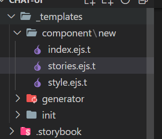

# Hygen

Hygen是一个模板工具，就是我们


>安装：

```
npm i -g hygen
```


>第一步：初始化，会生成一个_templates文件夹

```
hygen init self
```


>第二步：生成模板组件

```
hygen generator new component
```


>第三步：在创建的component/new/index.ejs.t

```
---
to: src/components/<%= name %>/index.js
---

import React from 'react';
import PropTypes from 'prop-types';
import Styled<%= name %> from './style';

function <%= name %>({ children, ...rest }) {
	return (
		<Styled<%= name %> {...rest}>

		</Styled<%= name %>>
	);
}

<%= name %>.propTypes = {
	children: PropTypes.any
};

export default <%= name %>;

```

`<%= name %>`：是一个变量，等于你在命令行输入的一个内容

前三行代码解释：to表示将模板代码生成的位置。


>最后一步：根据模板生成代码

```
hygen component new Icon
```

`Icon`：就是之前的`<%= name %>`


## _templates文件夹解释

其实_templates文件夹下的每一个文件夹就是一个生成器，可以通过生成器来生成模板



generator：就是生成器

new：是action，是动作


## 第三步创建模板

创建stories.ejs.t模板

```
---
to: src/components/<%= name %>/<% h.changeCase.lcFirst(name) %>.stories.js
---

import React from 'react';
import <%= name %> from '.';

export default {
  title: "<%= name %>",
  component: <%= name %>
}

export const Default = () => <<%= name %>>默认</<%= name %>>
```


创建`style.ejs.t`模板

```
---
to: src/components/<%= name %>/style.js
---

import styled from 'styled-components';

const Styled<%= name %> = styled.div``;

export default Styled<%= name %>;
```

