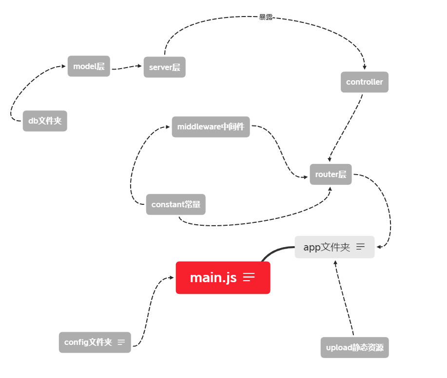

# Node后端项目目录划分


## 1、main.js

首先main.js作为项目入口文件，只需要配置简单的http服务。引入项目对象app，然后监听app即可

## 2、config文件夹

`config`文件夹一般是配置项目的公共信息，例如数据库名，数据库用户名，数据库密码，监听端口号等，这里我们一般结合了`dotenv`插件（可以将`.env`文件的配置写入process.env文件）

```js
const dotenv = require('dotenv');
const path = require('path');
// path.join拿到.env的路径
dotenv.config({ path: path.join(__dirname, '../../.env') });

console.log(process.env.APP_PORT);

module.exports = process.env;
```

还要在项目根目录下创建一个`.env`文件

功能：

1. 配置所有连接信息

服务：整体项目中需要固定配置信息的文件夹

## 3、app文件夹

app文件夹，是单独和main.js划分出来的框架层，例如我使用的是`Koa`框架，`koa`的引入，和`app`对象的创建都会在这个文件夹下进行，并暴露出去。

功能：

1. 引入`Koa`框架
2. 使用`Koa`系列统一使用的中间件例如,`koa-body`，`koa-static`等
3. 统一错误处理函数`app.on()`错误统一处理函数也会放在这里


## 4、router文件夹

`router`文件夹下一般会分装各个模块的路由（按路由区分模块），是`koa-router`的核心层，里面会设置接口的名称，接口的请求方式等

功能：

1. 撰写接口（接口请求方式，接口名称，引入接口使用所使用的中间件）

服务：`app`

### middleware文件夹

middleware中存放着，自己编写的处理中间件，这里的中间件一般都是给`router`服务的，例如验证中间件，加密中间件

功能：

1. 根据不同模块创建的处理中间件，并服务`router`层
2. 创建所有模块统一使用的中间件(例如验证`token`中间件)

服务：`router`

### controller文件夹

首先确定`controller`是服务`router`层的，接口的处理函数就放在这里例如`app.post('/user', register)`中的`register`函数就放在这里。这里是接口功能的函数。

```js
class userController {
	async register(ctx, next) {
    // 1.解析，接口传递函数
    
    // 2.操作数据库
    
    // 3.返回调用接口的结果
  }
}
```

功能：

1. 不同接口的处理函数
2. 处理函数的错误处理也在这里

服务：`router`

#### service文件夹

为了减轻和复用数据库的操作，我们把`controller`中的第二步，操作数据库也封装起来。

功能：

1. 各个接口所对应的操作数据库的函数

服务：`controller`

#### model文件夹

model文件夹根据不同模块创建不同的模型（模型是orm的概念）

orm：就是对象关系映射，将数据库的中表映射成我们可操作的对象，一个`model`对应一张表

功能：

1. 建立表对应的`model`

服务：`service`

#### db文件夹

db文件夹就是连接数据库的配置文件

其中配置者orm

功能：

1. 配置数据库连接信息
2. 定义`orm`

服务：`model`

## 5、constant文件夹

该文件夹存放公共变量，例如错误处理的公共变量

```js
module.exports = {
	// 用户模块 code 100
	userFormatError: {
		code: '10001',
		message: '用户名或密码为空',
		result: ''
	},
	userExisted: {
		code: '10002',
		message: '用户已经存在',
		result: ''
	},
	userRegisterError: {
		code: '10003',
		message: '用户注册错误',
		result: ''
	},
	userNotExist: {
		code: '10004',
		message: '用户不存在',
		result: ''
	},
	userLoginError: {
		code: '10005',
		message: '用户登录失败',
		result: ''
	}
};

```

功能：

1. 存储各种公共变量

服务：服务需要公共变量的文件夹


## 6、uploads

该文件夹一般放置静态变量，例如前端调用接口上传的图片等等

功能：

1. 存储静态资源