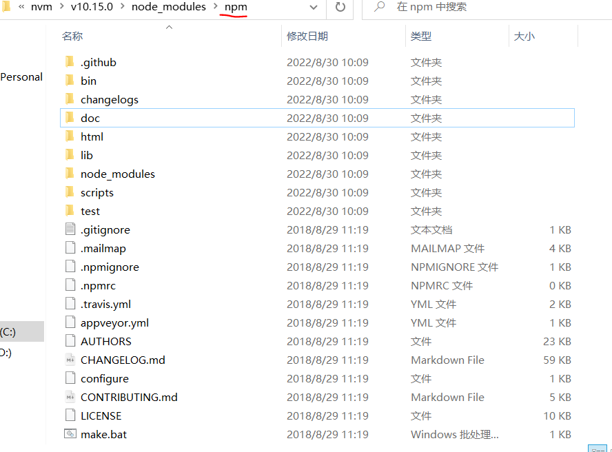
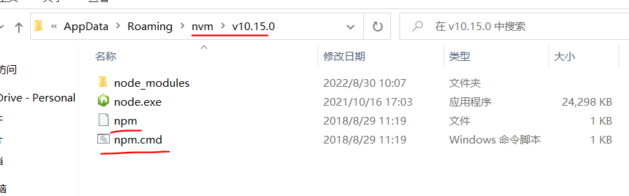
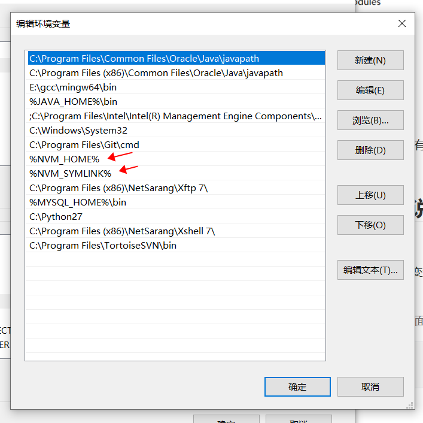

# Nvm的安装和初步使用

nvm可以用来更好管理不同版本的本地node存储在我们的电脑中。

nvm（node.js version manager 的简写）翻译过来nodsjs版本管理器。

## 安装

下载：[Releases · coreybutler/nvm-windows · GitHub](https://github.com/coreybutler/nvm-windows/releases)


注意！！！：**如果电脑有node.js首先卸责node.js再进行安装**

nvm的路径：C:\Users\10854\AppData\Roaming\nvm

node.js的路径：C:\Program Files\nodejs


监测nvm是否安装成功

重新打开cmd：nvm -v


配置nvm：复制下面两行代码到（C:\Users\xxx\AppData\Roaming\nvm）路径下的settings.txt中

加快下载罢了(●ˇ∀ˇ●)

```
node_mirror:https://npm.taobao.org/mirrors/node/
npm_mirror:https//npm.taobao.org/mirrors/npm/
```


## 操作

nvm ls-remote：查看所有node版本

nvm version：查看当前nvm版本

**nvm list：查看当前安装那些版本的node.js（常用）**

**nvm install 版本号：安装指定版本的node.js（常用）**

**nvm uninstall 版本号：卸载指定版本的node.js（常用）***

**nvm use 版本号：选择指定版本的node.js（常用）**

```
# 安装指定版本
nvm install 10.15.0

# 安装最新版本
nvm install latest

# 使用该版本10.15.0
nvm use 10.15.0

# 清屏
cls
```

**注意：**如果使用那条命令失败了，记得以管理员身份运行。


## nvm安装nodejs没有npm的问题

nvm安装的node默认是不带npm的，需要你自己去下载，并配置到nvm文件夹下对应的nodejs版本文件中。

npm下载地址：http://npm.taobao.org/mirrors/npm/ 

node版本对应npm版本：https://nodejs.org/zh-cn/download/releases/


**第一步：**下载完成后将zip文件解压到nvm安装目录中对应的node版本中的node_modules目录下

>注意：如果node_modules是空的自己创建一个npm文件夹




**第二步：**将bin文件夹下的npm、npm.cmd复制一份到对应node版本的根目录下




之后，在cmd中允许npm -v看看是否有版本号，如果有就成功了


## cmd中使用nvm list说nvm不是操作命令问题


**系统变量需要下面这样配置，用户变量一模一样配置一遍即可。**

这个需要配置一下环境变量，

通过安装包安装好`nvm`后，会在系统变量中多两个变量：`NVM_HOME`和`NVM_SYMLINK`之后需要把这两个变量加到`Path`变量后面

>点击Path编辑，把下面俩跟到最后面

```
%NVM_HOME%
%NVM_SYMLINK%
```


`Path`变量：


