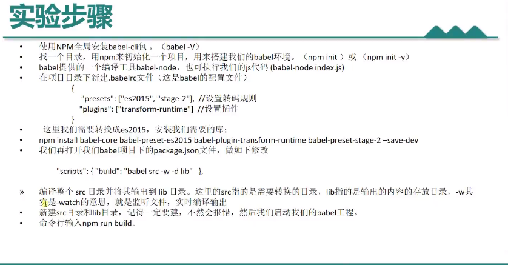

# npm包管理器

npm（全程Node package Manager，即node包管理器），是Node.js默认的、以JavaScript编写的软件包管理系统。

---

**npm就像是一个应用商店一样，想要什么就安装什么(前提是商店中有的)**

## 安装

下载并安装node.js可以直接安装上npm包管理器

## 下载配置

可以将下载网址配置成国内网站，这样下载速度较快。

使用淘宝镜像：`npm config set registry https://registry.npm.taobao.org`

上面那个镜像已经老了，**用新版本**:`npm config set registry https://registry.npmmirror.com/`


## 项目初始化

如果想要一个项目被npm管理

在项目文件中可以利用`npm init`初始化以下项目

然后就会出现一个`package.json`文件，然后在打开项目终端运行`npm`安装的指令即可

```
//安装md5
npm install md5
```

之后就会在项目文件夹下产生一个`node_modules`文件夹，放着安装好的模块

## npm的使用指令

npx xxx：**npx指令比较特殊，npx指令首先会在当前node_modules文件夹下寻找xxx，如果没有就执行全局安装的xxx，如果还没有就需要安装**

例如：

```
npx nodemon
```

npm -v：查看版本，判断npm是否安装成功

npm install <Module Name@版本号>：使用npm命令安装模块（不加版本号直接安装最新版本）

npm install <Module Name@版本号> -g：全局安装 可以直接在命令行中使用（不加版本号直接安装最新版本）

npm update <Module Name>：更新到最新版本

npm list -g：查看所有全局安装模块

npm list <Module Name>：查看某个模块的版本号

npm uninstall <Module Name>：卸载模块

npm run <指令名>：运行指令

npm help ：可以查看很多指令

---

npm install -save <modul Name>：#-save在package文件的**dependencies**节点写入依赖。

npm install -save-dev <modul Name>：#-save-dev是在package文件的**devDependencies**节点写入依赖

**dependencies**：运行时的依赖，发布后，即生产环境下任然需要使用的模块

**devDependencies**：开发时的依赖，里面的模块是开发时使用的，发布时用不到，比如项目中使用的gulp，压缩css，js的模块。这些模块是我们项目部署后不需要的


## npm命令的一些简写

install：i

-save：-S

-dev：-D

global：g

## package.json配置文件

npm init ：声明配置文件

---


---

script：下边的命令可以执行，执行方式npm run 命令名

当在项目中时不会直接将node_modules这个大的文件夹传给你，只会将package.json配置文件发送给你。

接下来直接运行：npm install

该命令会按照package.json配置文件安装里面所有的module


**注意：在npm5.0版本后，会强制锁定版本，所以右上角的`~,^`这两个符号在npm中都不会生效，还是会下载后面指定的版本号内容，但是cnpm还是会遵循的(7.1.1版本的cnpm还是会遵循更高版本目前还不清楚)，^5.0.3下载5.x.x最新版本**

## babel代码转换



## npm管理的项目共享

一般npm管理的项目想要共享给别人时，会将项目下的`node_modules`文件夹删除。

在别人得到你的项目之后，**优先执行`npm install`**。

`npm`会自动执行在`package.json`下的`dependences`字段下所对应的包继续安装。

然后想要启动，就看`package.json`下`script`字段下对应的启动命令（一般是start）,`npm run start`

```
// 在package.json中添加以下 代码
"scripts": {
	// 后面写的是node启动文件的命令，前面名字自己起
	"start": "node app.js"
}


// 之后启动时直接，npm run start 就行了
```


# npm的配置文件（直接配置，一劳永逸）

在npm文件夹下有一个`.npmrc`文件，这个是npm的配置文件。

这个配置文件是我从网上cv的：

文章地址：https://blog.csdn.net/EverRose/article/details/122846767

里面包含着各种镜像地址

```
registry=https://registry.npmmirror.com

disturl=https://registry.npmmirror.com/-/binary/node/
# node-sass预编译二进制文件下载地址
sass_binary_site=https://registry.npmmirror.com/-/binary/node-sass
# sharp预编译共享库, 截止2022-09-20 sharp@0.31.0的预编译共享库并未同步到镜像, 入安装失败可切换到sharp@0.30.7使用
sharp_libvips_binary_host=https://registry.npmmirror.com/-/binary/sharp-libvips
python_mirror=https://registry.npmmirror.com/-/binary/python/
electron_mirror=https://registry.npmmirror.com/-/binary/electron/
electron_builder_binaries_mirror=https://registry.npmmirror.com/-/binary/electron-builder-binaries/
# 无特殊配置参考{pkg-name}_binary_host_mirror={mirror}
canvas_binary_host_mirror=https://registry.npmmirror.com/-/binary/canvas
node_sqlite3_binary_host_mirror=https://registry.npmmirror.com/-/binary/sqlite3
better_sqlite3_binary_host_mirror=https://registry.npmmirror.com/-/binary/better-sqlite3

```


## 全局位置

**这个位置一般就是使用`-g`的安装路径（除非你安装了nvm），如果有nvm了一般情况下是会安装进对应node版本文件夹下的node_modules中**

`C:\Windows\System32\node_modules`

还会把系统变量中添加一条为`C:\Windows\System32\node_modules\.bin`


这个位置就是可以自己手动下载一些包，然后解压后丢进这里然后就可以使用啦，例如cnpm，去官网下一个包解压下来，然后放进来就行了


## 如何查看使用的npm使用路径

有时候我们使用了nvm版本管理器，很容易机会将npm搞混乱，我们想检查当前到底使用的是那个文件夹下的版本，可以使用`npm -help`来检查

