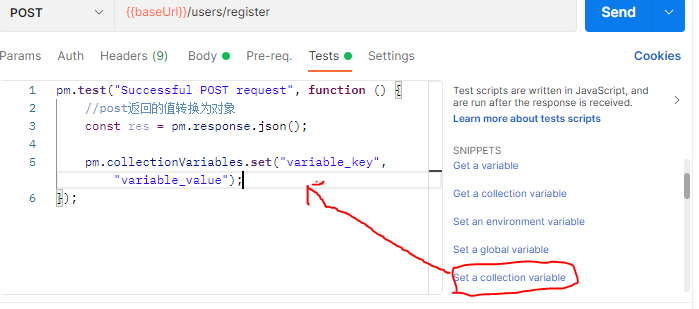
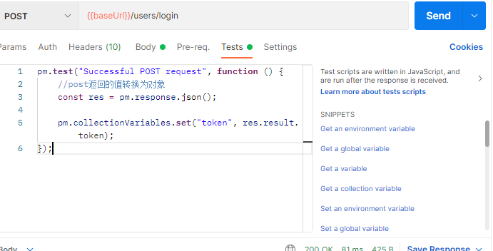

# postman操作

## postman发送post请求

一：选中post请求

二：点击body选择传递参数方式，一般都是选择`raw`然后以`JSON`方式传递

三：点击send

## postman发送get请求

一：选中get请求

二：输入指定`params`参数

三：点击send

## postman发送文件

一：选中post

二：选中body中的form-data

三：输入key，并选择file

四：选择文件，并点击send

## 创建一组和项目有关的接口

点击`Collections`可以创建一组和项目有关的接口，方便管理

## 创建环境变量

可以将接口相同的部分创建成为一个环境变量，供所有接口使用，

例如将接口的`http://localhost:3000`创建为`baseUrl`,之后直接选中环境变量，直接插值语法使用`{{baseUrl}}`即可

第一步：点击Enviromments创建一个环境变量

第二步：使用环境变量，点击到发送接口界面，点击右上角`No Environment`选中保存好的环境变量，之后就可以在输入框用插值语法输入创建好的环境变量

## 编写脚本

postman强大的一批，还能够编写脚本来帮助我们在请求接口之前（`Pre-req`），或者之后干(`Tests`)一些事情

例如我们现在编写一个脚本，在发送用户登录请求后，将`token`信息保存在这个项目的集合中，供以后所有需要发送`token`的请求使用的脚本

一：点击`Tests`，因为我们要在发起请求后调用脚本

二：选中`Status Code: Successful POST request`，表示在`post`请求成功后，调用中间的脚本

三：修改里面内容,点击`Set a collection variable`创建一个集合变量（这个集合作用域就是在我们创建的这个项目接口内）

修改一下里面的属性值即可`variable_key`改为`token`

`variable_value`改为`res.result.token");});`（应为我们只要res.token）

四：点击我们创建好的项目，根据数字填入指定内容

五：之后我们点击用户登录就会在`Variabies`中创建好一个`token`变量，然后在以后的接口中我们都在选中`Auth`中的`inherit...`就会集成我们刚刚创建好的`token`，之后就可以直接点击`send`了，以后的每个接口都这样创建，不必复制粘贴`token`了(●'◡'●)

