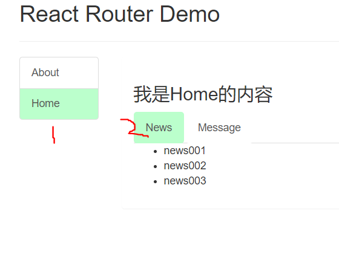

# React路由（究极无敌重要二）

## SPA的理解

概念：单页Web应用(single page web application)单页面应用，整个应用就只有**一个完整的页面**。

效果：点击页面中的链接**不会刷新页面**，只会做**页面的局部刷新**，数据需要通过`ajax`请求获取，并在前端异步展示出来


## 路由的理解

概念：一个路由就是一个映射关系(`key`:`value`)，`key`为路径, `value`可能是`function`或`component`

### 后端路由

1) 理解：` value`是`function,` 用来处理客户端提交的请求。

2) 注册路由： `router.get(path, function(req, res))`

3) 工作过程：当`node`接收到一个请求时, 根据请求路径找到匹配的路由, 调用路由中的函数来处理请求, 返回响应数据


### 前端路由

1) 浏览器端路由，`value`是`component`，用于展示页面内容。

2) 注册路由: <Route path="/test" component={Test}>

3) 工作过程：当浏览器的`path`变为`/test`时, 当前路由组件就会变为`Test`组件


## react-router-dom的理解

react-router下面还分三个

1. web的
2. react native的
3. any

这里写的是wbe的。

简介：`react-router-dom`作为`react`的一个插件库，专门用于实现`SPA`应用。

## react-router-dom@5.0基本使用

>一：安装

```
npm install react-router-dom
yarn add react-router-dom
```


>二：基本使用

1）首先要明确好界面中的导航区、展示区

2）导航区的a标签改为Link标签

​	<Link to="/xxx">demo</Link>

3）展示区标签进行路径匹配

```jsx
import Demo from './components/Demo'
<Route path="/xxx" component={Demo}>
```


4）<App>的最外层包裹一个<BrowserRouter></BrowserRouter>或者<HashRouter>

```jsx
	<BrowserRouter>
		<App></App>
	</BrowserRouter>
```


## 路由组件与一般组件

1）写法不同：

​	一般组件：<Demo />

​	路由组件：<Route path="/home" component={Demo}></Route>

2）存放位置不同：

​	一般组件：components文件夹

​	路由组件：pages文件夹

3）接收到的props不同

​	一般组件：根据传递的类容决定，如果标签属性中有传递的属性就有否则没有

​	路由组件：默认就会接收**三个固定的属性**

```js
// 三个固定属性的部分内容
history:
  go: ƒ go(n)
  goBack: ƒ goBack()
  goForward: ƒ goForward()
  length: 19
  push: ƒ push(path, state)
  replace: ƒ replace(path, state)
  
location
  pathname: "/about"
  search: ""
  state: undefined

match:
  params: {}
  path: "/about"
  url: "/about"
```


## 模糊匹配与严格匹配

`Link`中的`to`，与`Route`的`path`属性之间的匹配方式，默认是模糊匹配。

注意：**不要随开启严格模式，必要时再开，有些时候开启会导致二级路由无法匹配的问题**

示例：

```jsx
<MyNavLink to="/home">Home</MyNavLink>
/*
	匹配的过程是，to中的内容 path必须有，且顺序要一致
	例如：
	可以匹配：
	to="/home/a/c/d"
	paht="/home"
	
	反之不行
*/
<Route path="/home" component={Home}></Route>
```

开启严格匹配:

```jsx
<Route exact={true} path="/home" component={Home}></Route>
// 等同于
<Route exact path="/home" component={Home}></Route>
```


## 二级路由

首先书写二级路由时，要分清嵌套关系。

这里我们嵌套关系为：Home组件下有News组件与Message组件

嵌套组件中书写时要注意：**要带上所有父级组件的路由地址。**

核心：**路由路径的比较方式，每次都是从第一个注册的路由开始比较，是按照注册顺序进行比对的**





## 编程时路由导航

路由跳转不一定非要使用`<NavLink>和<Link>`标签，路由组件的props.history身上有5个方法：

```jsx
history:
  go: ƒ go(n)
  goBack: ƒ goBack()
  goForward: ƒ goForward()
  push: ƒ push(path, state)
  replace: ƒ replace(path, state)
```

这个5个方法都可以进行路由跳转操作，并且可以携带参数（**接收参数方式一致**）

示例：

```jsx
import React, { Component } from 'react';
import { Link, Route } from 'react-router-dom';
import Detail from './Detail';
export default class Message extends Component {
	state = {
		messageArr: [
			{ id: '01', title: '消息1' },
			{ id: '02', title: '消息2' },
			{ id: '03', title: '消息3' }
		]
	};

	// push方法跳转界面
	pushShow = (id, title) => {
		return () => {
			// push跳转+携带params参数
			// this.props.history.push(`/home/message/detail/${id}/${title}`);

			// push跳转+携带search参数
			// this.props.history.push(`/home/message/detail/?id=${id}&title=${title}`);

			// push跳转+携带state参数
			this.props.history.push('/home/message/detail', { id, title });
		};
	};

	// replace方法跳转界面
	replaceShow = (id, title) => {
		return () => {
			// replace跳转+携带params参数
			// this.props.history.replace(`/home/message/detail/${id}/${title}`);

			// replace跳转+携带search参数
			this.props.history.replace(`/home/message/detail/?id=${id}&title=${title}`);

			// replace跳转+携带state参数
			this.props.history.replace('/home/message/detail', { id, title });
		};
	};
	render() {
		const { messageArr } = this.state;
		return (
			<div>
				<ul>
					{messageArr.map(msgObj => {
						return (
							<li key={msgObj.id}>
								{/* 向路由组件传递params参数 */}
								<Link to={`/home/message/detail/${msgObj.id}/${msgObj.title}`}>{msgObj.title}</Link>
								&nbsp;<button onClick={this.pushShow(msgObj.id, msgObj.title)}>push查看</button>
								&nbsp; &nbsp;
								<button onClick={this.replaceShow(msgObj.id, msgObj.title)}>replace查看</button>
								&nbsp;
								{/* 向路由组件传递search参数 */}
								{/* <Link to={`/home/message/detail/?id=${msgObj.id}&title=${msgObj.title}`}>
									{msgObj.title}
								</Link> */}
								{/* 向路由组件传递state参数 */}
								{/* <Link
									to={{
										pathname: '/home/message/detail',
										state: { id: msgObj.id, title: msgObj.title }
									}}
								>
									{msgObj.title}
								</Link> */}
							</li>
						);
					})}
				</ul>
				<hr />
				{/* 声明接收params参数 */}
				{/* <Route path="/home/message/detail/:id/:title" component={Detail}></Route> */}

				{/* search参数无需声明接收，正常注册路由 */}
				{/* <Route path="/home/message/detail" component={Detail}></Route> */}

				{/* state参数无需声明接收，正常注册路由 */}
				<Route path="/home/message/detail" component={Detail}></Route>
			</div>
		);
	}
}

```


## BrowserRouter与HashRouter的区别

1）底层原理不同：

​		BrowserRouter使用的是H5的history API，不兼容IE9及以上浏览器

​		HashRouter使用的是URL的哈希值

2）url表现不一致：

​		BrowserRouter中路径没有#，例如：`localhost:3000/demo/test`

​		HashRouter路径中包含#，例如：`localhost:3000/#/demo/test`

3）**刷新后对state的影响（这里是路由组件上的state）**：

​		BrowserRouter对路由组件身上的state无影响

​		**HashRouter会导致路由组件身上的state丢失**


## 路由懒加载

直接看代码：（从sgg白嫖来的）

```jsx
	//1.通过React的lazy函数配合import()函数动态加载路由组件 ===> 路由组件代码会被分开打包
	import React, { Component, lazy, Suspense } from 'react';
	const Login = lazy(()=>import('@/pages/Login'))
	
	//2.通过<Suspense>指定在加载得到路由打包文件前显示一个自定义loading界面
	<Suspense fallback={<h1>loading.....</h1>}>
        <Switch>
            <Route path="/xxx" component={Xxxx}/>
            <Redirect to="/login"/>
        </Switch>
    </Suspense>

// 一般我们可以自定义一个loading组件，然后放在fallback上，但是注意loading组件不能使用懒加载
```


## react-router-dom@5.0版本的API

示例：

`Home`组件：

```jsx
import React, { Component } from 'react';
import { Route, Switch } from 'react-router-dom';

import News from './News';
import Message from './Message';
import MyNavLink from '../../components/MyNavLink';
export default class Home extends Component {
	render() {
		return (
			<div>
				<h3>我是Home的内容</h3>
				<div>
					<ul className="nav nav-tabs">
						<li>
							<MyNavLink to="/home/news">News</MyNavLink>
						</li>
            {/*要携带父组件/home的路由*/}
						<li>
							<MyNavLink to="/home/message">Message</MyNavLink>
						</li>
					</ul>
				</div>
				{/* 注册路由 */}
				<Switch>
					<Route path="/home/news" component={News}></Route>
					<Route path="/home/message" component={Message}></Route>
				</Switch>
			</div>
		);
	}
}

```


`Home`组件下的`News`组件：

```jsx
import React, { Component } from 'react';

export default class News extends Component {
	render() {
		return (
			<ul>
				<li>news001</li>
				<li>news002</li>
				<li>news003</li>
			</ul>
		);
	}
}

```

`Home`组件下的`Message`组件：

```jsx
import React, { Component } from 'react';

export default class Message extends Component {
	render() {
		return (
			<div>
				<ul>
					<li>
						<a href="/message1">message001</a>&nbsp;&nbsp;
					</li>
					<li>
						<a href="/message2">message002</a>&nbsp;&nbsp;
					</li>
					<li>
						<a href="/message/3">message003</a>&nbsp;&nbsp;
					</li>
				</ul>
			</div>
		);
	}
}

```


### `<Link>`

Link基本上是充当a的作用

语法：

```jsx
// to 
<Link clasName="xxx" to="/home"></Link>
```


### `<NavLink>`

一个特殊版本的 [`Link`]，当它与当前` URL` 匹配时，为其渲染元素添加样式属性。

语法：

```jsx
// activeClassName 是点击之后添加的类名
<NavLink activeClassName="active2" className="list-group-item" to="/about">About</NavLink>
```

作用：导航栏的路由功能，若没设置`activeClassName`，默认点击之后添加一个`active`类

#### `NavLink`的分装

原因：不断的书写NavLink有大量重复性代码，可以进行封装简化代码

创建`components/MyNavLink/index.jsx`

```jsx
import React, { Component } from 'react';
import { NavLink } from 'react-router-dom';

export default class MyNavLink extends Component {
	render() {
		console.log('MyNavLink中props', this.props);
		return (
			// 通过...在标签体中直接展开this.props 将传过来的所有属性展开
			<NavLink activeClassName="active2" className="list-group-item" {...this.props}></NavLink>
		);
	}
}

```


### `<Switch>`

渲染与该地址匹配的第一个子节点 `<Route>` 或者 `<Redirect>`。

作用：可以提高一定的效率

1. 通常情况下，path和component是一一对应的关系。
2. Switch可以提高路由匹配效率

示例：

```jsx
	// 如果这样写，当匹配到/home后还会一直往下匹配，直至匹配全部，这时会将两个匹配到的组件都展示出来
	<Route path="/about" component={About}></Route>
  <Route path="/home" component={Home}></Route>
  <Route path="/home" component={Test}></Route>

// 而用Switch组件包裹后，只会渲染第一个匹配到的路径的组件
<Switch>
  <Route path="/about" component={About}></Route>
  <Route path="/home" component={Home}></Route>
  <Route path="/home" component={Test}></Route>
</Switch>
```

### `<Redirect>`

渲染 `<Redirect>` 将使导航到一个新的地址。这个新的地址会覆盖` history `栈中的当前地址，类似服务器端（HTTP 3xx）的重定向。

一般都是把它放到路由最下面进行兜底，当所有路由都无法进行匹配时，就跳转到`Redirect`指定的路由。


示例：

```jsx
<Switch>
  <Route path="/about" component={About}></Route>
  <Route path="/home" component={Home}></Route>
  {/*当访问路径上面俩个都没匹配上时，就是走下面Redirect，并且到/home下*/}
  <Redirect to="/home"></Redirect>
</Switch>
```


### `withRouter`

注意：**withRouter是一个函数，不是一个组件**

作用：当路由渲染时， `withRouter` 会将已经更新的 `match` ， `location` 和 `history` 属性传递给被包裹的组件。

示例：

`Header`组件是一个一般组件：

```jsx
import React, { Component } from 'react';
import { withRouter } from 'react-router-dom';

class Header extends Component {
	back = () => {
		console.log(this.props);
		this.props.history.goBack();
	};

	forward = () => {
		this.props.history.goForward();
	};
	render() {
		return (
			<h2>
				React Router Demo
				<button onClick={this.back}>回退</button>
				<button onClick={this.forward}>前进</button>
				<button>go</button>
			</h2>
		);
	}
}

// 包裹后，拥有路由组件身上的history、location、match三个属性
export default withRouter(Header);
```


